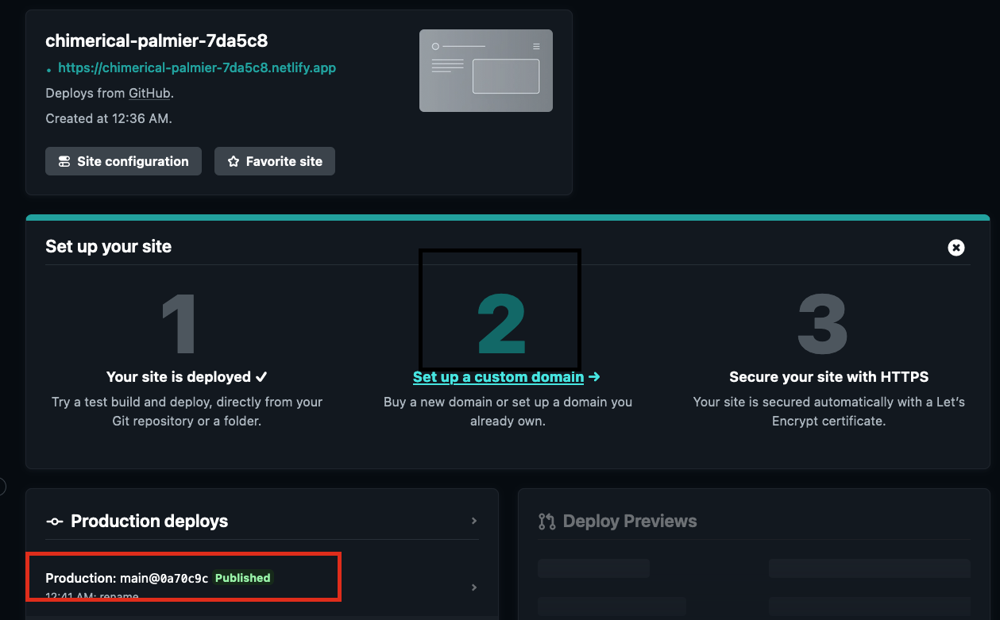
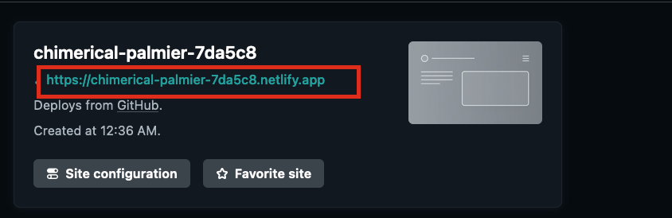

+++
title = 'Hugo + Netlify + Githubでブログを公開する'
date = 2023-12-02T00:59:37+09:00
draft = false
categories = ['Engineering']
tags = ['Hugo', 'Netlify', 'Github']
+++
## 概要
Hugoで作ったサイトをGithubで管理、Netlifyでビルドした手順を0から作れるよう記載します。  
この方式にすると手元でMarkDownで書いたブログをGithubにPushするだけで簡単に公開できるようになります。

## 流れ
1. Hugoでサイトを生成
2. Githubにプッシュ
3. Netlifyでデプロイ

## Hugoで静的サイトを生成
まずはHugoをインストールします。
```shell
brew install hugo
```

blogの雛形を作成します。
```shell
hugo new site my-blog
```

ブログに適応するテーマをsubmoduleとして追加します。
```shell
cd my-blog
git init

# テーマをgithubのsubmoduleとして追加
git submodule add https://github.com/theNewDynamic/gohugo-theme-ananke.git themes/ananke
```

hugo.tomlに記載することでテーマを適応する。
```shell
echo "theme = 'ananke'" >> config.toml
```

サーバを起動させます。
```shell
hugo server
```

起動ログの `Web Server is available at http://localhost:51517/ (bind address 127.0.0.1)` のような記述の `http://localhost:51517/` にアクセスすればローカルに起動した静的サイトが閲覧できます。

###  Tips
* Hugoのテーマを変えたい場合は、[Hugo Themas](https://themes.gohugo.io/) から好きなものを選んで変えてください。
  * これは後からでも変えられるのでとりあえずNetlifyでビルドするところまで走り切るのがおすすめ。
* Tomlファイルの書き方は [Configure Hugo](https://gohugo.io/getting-started/configuration/) に記載されています。 

<br>

## Githubにpush

[Github](https://github.com/) にリポジトリを作成。<br>
作成後以下のコマンドを実行し、サイトをpushします。
```shell
cd my-blog
echo .hugo_build.lock >> .gitignore
git add .
git commit -m "first commit"
git branch -M main

# <user name>は自分のユーザー名に置き換えてください。
# 今回はmy-blogというリポジトリを作成している例です。
git remote add origin git@github.com:<user name>/my-blog
git push -u origin main
```

pushが完了するとGithubのUI上でソースコードが閲覧できる状態になっています。


## Netlifyでデプロイ
[netlify](https://www.netlify.com/) へアクセスし、デプロイを行う。  
[Hugoの公式で案内](https://gohugo.io/hosting-and-deployment/hosting-on-netlify/) があるのでこちらを参考に連携を行う。

指示に従いデプロイを完了すると以下のようにDeployの結果が `published` になる。




サイト上に表示されたURLをクリックするとデプロイされたサイトにアクセスできる。



これでデプロイまではおしまい。  
以降は変更を加えてmainにpushするだけで自動デプロイが走り、サイトの内容が更新されるようになる。