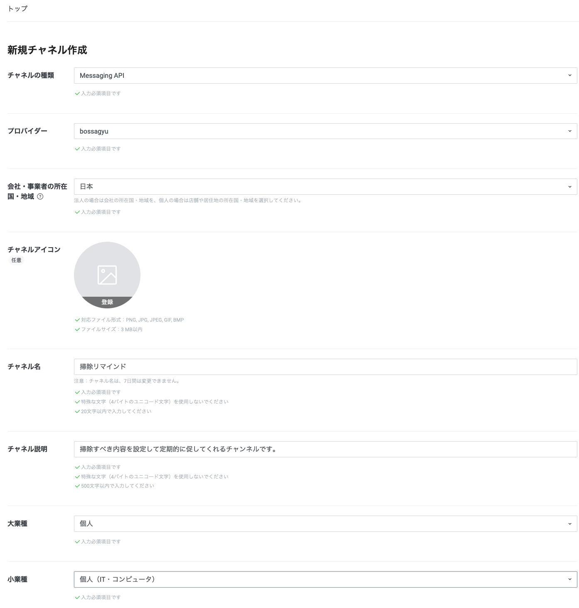
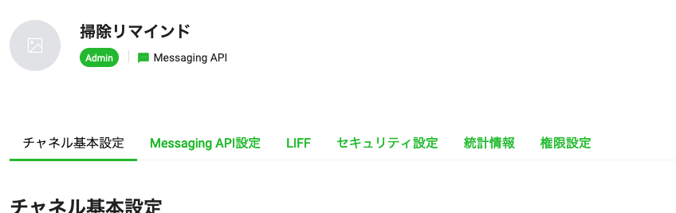

+++
title = 'LINE Messaging APIの登録と使い方'
date = 2023-12-07T09:37:00+09:00
draft = false
+++

# LINE Messaging APIの登録と使い方

## 概要
LINEのBotを利用してアプリケーションを作ってみようと考えたのでまずはBotを利用できる状態にする。  
本ページでは一番最初にLINE Message APIの登録の方法とcurlでコマンドラインからメッセージを送る方法を紹介します。

## Messaging APIを利用する
[LINE Developers](https://developers.line.biz/console/) にログインしてプロバイダーを作成する。


プロバイダーとは([説明](https://developers.line.biz/ja/docs/line-developers-console/overview/#provider))
```
LINE Developersサイトでは、サービスを提供し、ユーザーの情報を取得する開発者個人、
企業、または団体等をサービス提供者（LINEミニアプリではサービス事業主）と呼びます。
```

なので好きな文字列を入れる。

そのまま新規チャンネルを作成する。


このまま作成ボタンを押すと新規チャンネルが作成される



# コマンドラインからポストをする
Messaging API設定からQRコードを読みこんで友達追加する。

Messaging API設定から「チャンネルアクセストークン(長期)」を取得
チャンネル基本設定から「あなたのユーザーID」取得


```shell
TOKEN="<チャンネルアクセストークン(長期)>"
ID="<あなたのユーザーID>"
UUID=$(uuidgen | tr "[:upper:]" "[:lower:]")

curl -v -X POST https://api.line.me/v2/bot/message/push \
-H 'Content-Type: application/json' \
-H "Authorization: Bearer ${TOKEN}" \
-H "X-Line-Retry-Key: " \
-d "{
    \"to\": \"${ID}\",
    \"messages\":[
        {
            \"type\":\"text\",
            \"text\":\"Hello, world1\"
        }
    ]
}"
```

レスポンスが帰ってきて、LINEのトーク画面でBotからの投稿が行われていれば成功！