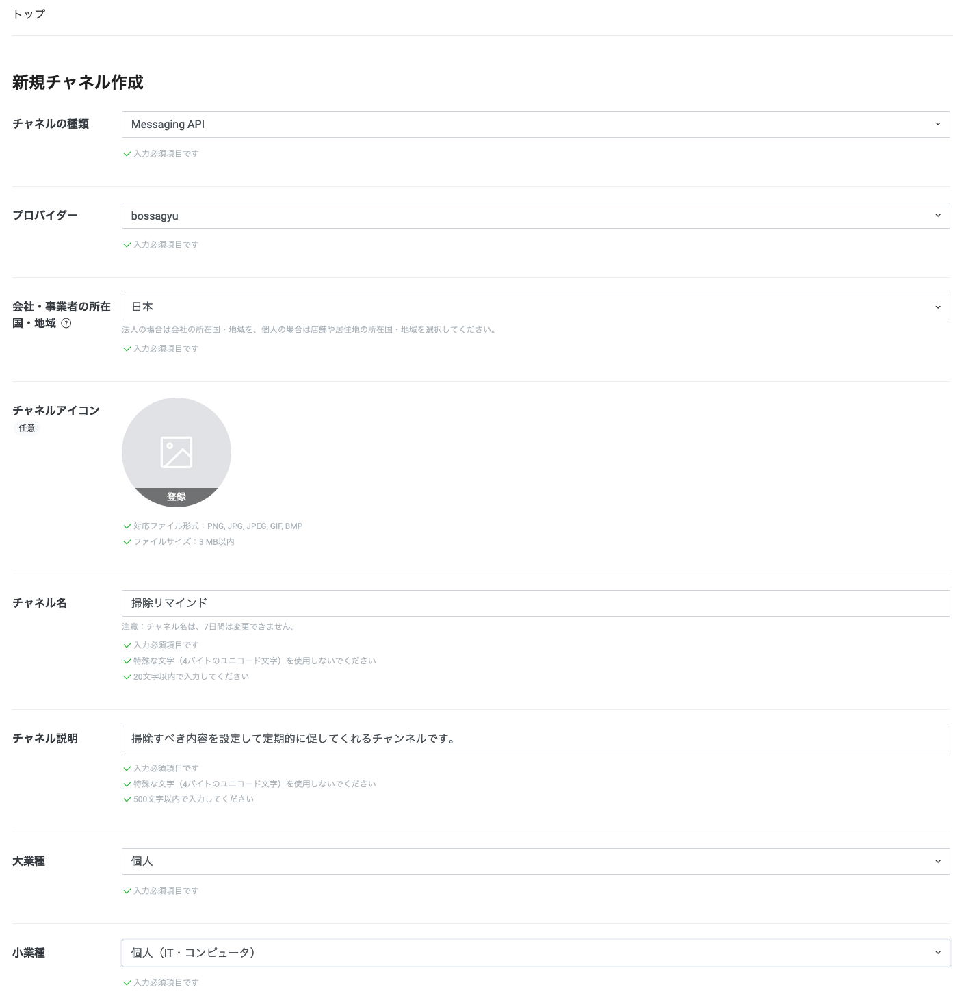

+++
title = 'Registering and Using the LINE Messaging API'
description = 'How to register for LINE Messaging API and send messages with curl. Step-by-step guide from provider creation to channel setup and Bot messaging.'
date = 2023-12-07T09:37:00+09:00
lastmod = 2023-12-07T09:37:00+09:00
draft = false
categories = ['Engineering']
tags = ['LINE BOT', 'LINE API']
+++

## Overview
I thought of creating an application using LINE's Bot, so first, I will make the Bot usable.  
This page introduces how to register for the LINE Messaging API and how to send messages from the command line using curl.

## Using the Messaging API
Log in to [LINE Developers](https://developers.line.biz/console/) and create a provider.


A provider is ([Explanation](https://developers.line.biz/ja/docs/line-developers-console/overview/#provider))
```
On the LINE Developers site, a service provider refers to individuals, companies, or organizations that provide services and obtain user information (service proprietor in LINE Mini Apps).
```

So, you can enter any string you like.

Then, create a new channel.


Clicking the create button will establish a new channel.


# Posting from the Command Line
Add friends by reading the QR code in the Messaging API settings.

Obtain the 'Channel Access Token (Long-lived)' from the Messaging API settings.
Get 'Your User ID' from the channel basic settings.


```shell
TOKEN="<Channel Access Token (Long-lived)>"
ID="<Your User ID>"
UUID=$(uuidgen | tr "[:upper:]" "[:lower:]")

curl -v -X POST https://api.line.me/v2/bot/message/push \
-H 'Content-Type: application/json' \
-H "Authorization: Bearer ${TOKEN}" \
-H "X-Line-Retry-Key: " \
-d "{
    \"to\": \"${ID}\",
    \"messages\":[
        {
            \"type\":\"text\",
            \"text\":\"Hello, world1\"
        }
    ]
}"
```

If a response is returned and you see a post from the Bot in your LINE chat, it's a success!