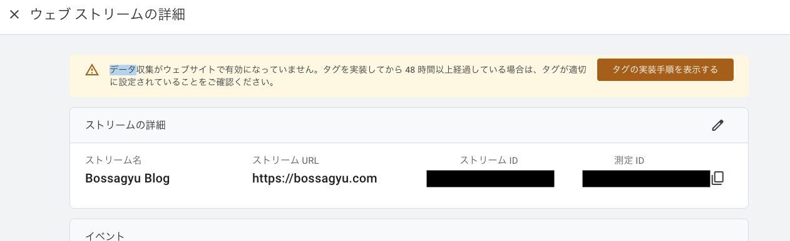

+++
title = 'HugoでGoogle Analyticsの設定をする方法'
date = 2023-12-09T18:09:42+09:00
draft = false
categories = ['Engineering']
tags = ['Hugo', 'SEO', 'Google Analytics']
+++

## 概要
HugoをでGoogle Analyticsを設定する方法をサクッと解説します。

## 実現までの流れ
1. Google Analyticsへの登録
2. トラッキングIDの取得
3. Hugoの設定にトラッキングIDを追加

## Google Analyticsの登録
[[GA4] アナリティクスで新しいウェブサイトまたはアプリのセットアップを行う](https://support.google.com/analytics/answer/9304153?hl=ja)
に従い登録を行います。  
データストリームを追加すると、トラッキングIDが取得できるのでメモしておきます。

※ トラッキングIDは日本語訳の影響か、測定IDという表示になっています。

## Hugoの設定にトラッキングIDを追加
### tomlに設定を追加
config.tomlに`googleAnalytics = トラッキングID`を追加します。
```toml
baseURL = 'https://bossagyu.com'
languageCode = 'ja-jp'
title = 'Bossagyu Blog'
theme = 'hugo-bearcub'
googleAnalytics = "G-1234ABCDEF"
# ↑ この行を追加、トラッキングIDは自分のものに変更してください。
```

### トラッキングコードを埋め込む
テンプレートによってはtomlの設定を入れるだけで読めるものもあるみたいですが、
私の使用している[bearcub](https://github.com/clente/hugo-bearcub/tree/main)のテンプレートは対応してなかったので、
自分でヘッダにトラッキングコードを読み込むように追加します。

コードスニペットについては[まくまく Hugo ノート](https://github.com/clente/hugo-bearcub/tree/main)を参考にさせていただきました。

トラッキングコードを読むために `layouts/partials/analytics.html` を作成する。
```html
{{ if not .Site.IsServer }}
{{ with .Site.GoogleAnalytics }}
<!-- Google tag (gtag.js) -->
<script async src="https://www.googletagmanager.com/gtag/js?id={{ . }}"></script>
<script>
    window.dataLayer = window.dataLayer || [];
    function gtag(){dataLayer.push(arguments);}
    gtag('js', new Date());

    gtag('config', '{{ . }}');
</script>
{{ end }}
{{ end }}
```

ページヘッダで `analytics.html` を読み込むようにする。

```shell
# テンプレートの内容をコピーしてきてオーバーライドする
cp themes/hugo-bearcub/layouts/_default/baseof.html layouts/_default/baseof.html 
vim layouts/_default/baseof.html 
```

baseof.htmlに`{{- partial "analytics" . -}}` を追加する。
```html
<!DOCTYPE html>
<html lang="{{ with .Site.LanguageCode }}{{ . }}{{ else }}en-US{{ end }}">

<head>
  {{- partial "analytics" . -}}
  <meta http-equiv="X-Clacks-Overhead" content="GNU Terry Pratchett" /
```

上記ソースコードを追加した状態で、再度ビルドするとGoogle Analyticsにデータが送信されるようになります。

## tips

こちらの対応をしても、Google Analyticsにデータが連携されていないように見える場合は、タグの追加がうまくいっていない可能性があります。  
まずはタグがちゃんと入っているかの切り分けをするために、googleデベロッパーツールを開きトラッキングがhtml内に含まれているか確認してみるとよいです。