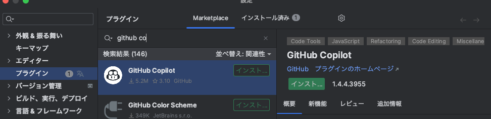

+++
title = 'IntellijでのGithub Copilotの使い方'
date = 2023-12-11T22:45:40+09:00
draft = false
categories = ['Engineering']
tags = ['copilot', 'intellij']
+++

## 概要
Github CopilotをIntellijで使う方法を解説します。
合わせてショートカットのチートシートを記載します。

## 実現までの流れ
1. Github Copilotの登録
2. Intellijの設定
3. Github Copilotの利用
4. まとめ

## Github Copilotの登録
[Github Copilot](https://copilot.github.com/) のリンクからGithub Copilotに登録します。

## Intellijの設定
IntellijのプラグインからGithub Copilotをインストールします。

インストールが完了したら、Intellijを再起動します。

## Github Copilotの利用
Intellijでコードを書いていると、Github Copilotがコードを補完してくれます。

macのショートカットの一覧は以下のとおりです。

| ショートカット | 機能             |
| --- |----------------|
| `tab` | コードを補完する       |
|`Option` + `]` | 次の補完候補を表示する    |
|`Option` + `[` | 前の補完候補を表示する    |
|`Command` + `→` | 提案の次の単語のみ受け入れる |

## まとめ
IntellijでGithub Copilotを利用する方法を解説しました。  
この記事はGithub Copilotを利用して書いており、Markdownでのブログ作成でもかなり補完してくれるので、気になる人は試してみてください。