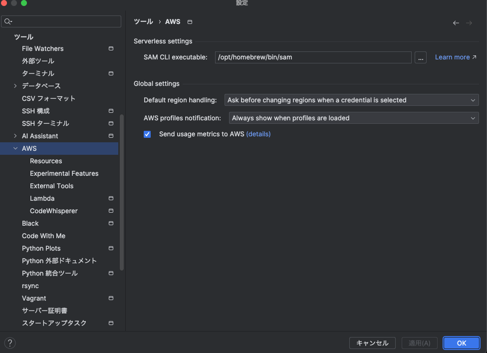
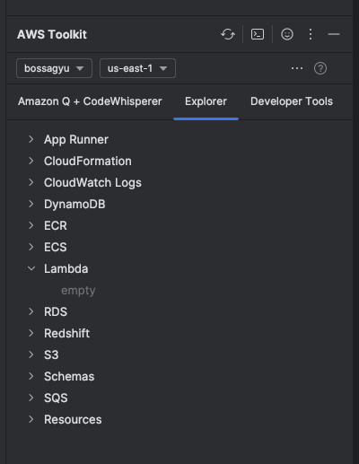
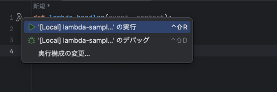

+++
title = 'Efficient Lambda Development with AWS Toolkit in IntelliJ'
description = 'How to develop Lambda functions with AWS Toolkit in IntelliJ. Covers Docker and AWS CLI setup, Lambda creation, and local execution steps.'
date = 2023-12-12T22:40:05+09:00
draft = false
categories = ['Engineering']
tags = ['IntelliJ', 'AWS', 'Lambda']
+++
## Overview
This article explains how to efficiently develop Lambda functions using the AWS Toolkit in IntelliJ.

## Steps to Implementation
1. Preliminary Preparation
2. Installing AWS Toolkit
3. Configuring AWS Toolkit
4. Developing Lambda
5. Executing Lambda Locally
6. Summary

## Preliminary Preparation

### Installing Docker
AWS Toolkit in IntelliJ uses Docker to run Lambda.  
Prior to proceeding, please install Docker by referring to [these instructions](https://docs.docker.jp/docker-for-mac/install.html).

### Installing AWS CLI
Install AWS CLI (SAM).  
For installation, refer to [these instructions](https://docs.aws.amazon.com/ja_jp/cli/latest/userguide/install-cliv2-mac.html).

In IntelliJ, set the path for SAM CLI executable under `File -> Settings -> Tools -> AWS Toolkit`.  
In my case, as I installed it through brew, I set the following path.  


## Installing AWS Toolkit
Install the AWS Toolkit via IntelliJ plugins.
Refer to [this guide](https://www.jetbrains.com/help/idea/managing-plugins.html#install_plugin) for plugin installation.

## Configuring AWS Toolkit
To use AWS Toolkit, you need to set up your AWS credentials.

Set up AWS credentials through AWS Explorer.  


Obtain and configure your Access Key ID and Secret Access Key from the AWS console.
Once configured, AWS resources should appear in AWS Explorer.  


Note: In this image, the region is set to `us-east-1`. Please adjust according to the region where you intend to create your Lambda.

## Developing Lambda
Create a code snippet like the following.

lambda-sample.py

```python
def lambda_handler(event, context):
    print("Hello World")
    return "Hello World!"
```

Create a Lambda through AWS Explorer.  


Select Create Lambda Function and input the necessary values.  
For the Handler, enter `<filename>.<function name>` from your code snippet.  


This completes the creation of your Lambda.

## Executing Lambda Locally
The Toolkit also allows you to execute Lambda locally.


Selecting Run will execute the Lambda locally.

## Summary
This article provided a guide on efficiently developing Lambda using AWS Toolkit in IntelliJ.
Developing in IntelliJ and executing locally can significantly improve development efficiency.