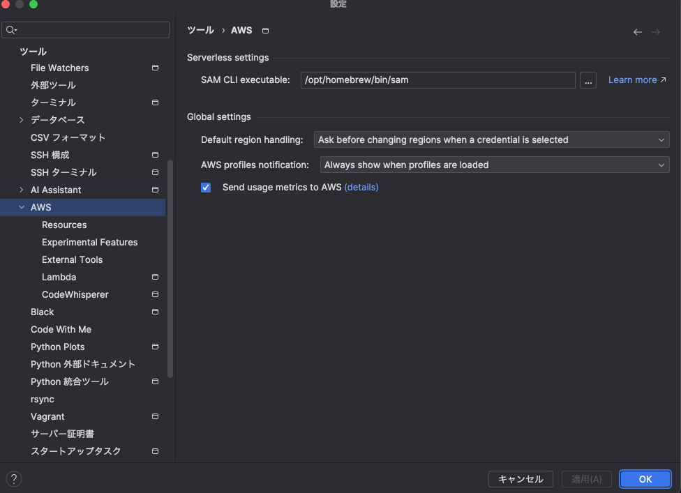
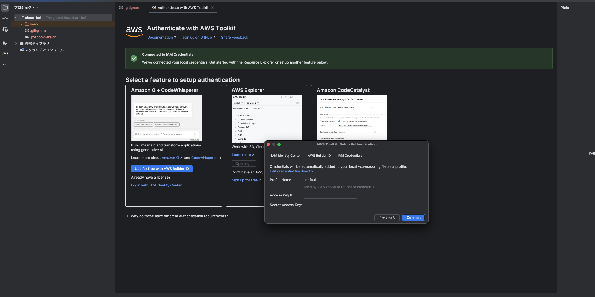
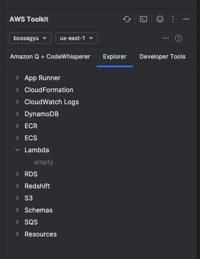
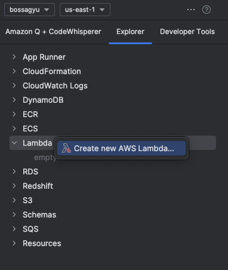
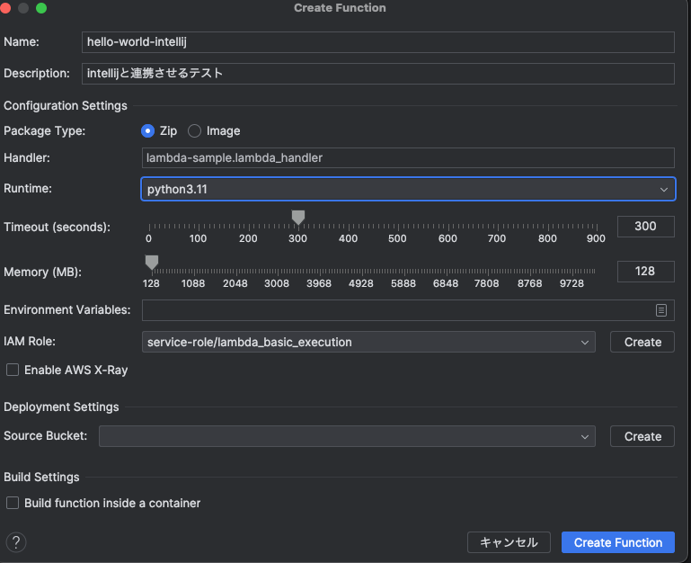
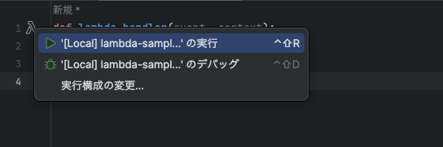

+++
title = 'IntellijでAWS Toolkitを使ってLambdaを効率よく開発する'
description = 'IntelliJでAWS Toolkitを使ってLambda関数を開発する方法を解説。Docker・AWS CLIの準備からLambda作成、ローカル実行までの手順を紹介します。'
date = 2023-12-12T22:40:05+09:00
draft = false
categories = ['Engineering']
tags = ['IntelliJ', 'AWS', 'Lambda']
+++
## 概要
IntellijでAWS Toolkitを使ってLambdaを効率よく開発する方法を解説します。

## 実現までの流れ
1. 事前準備
2. AWS Toolkitのインストール
3. AWS Toolkitの設定
4. Lambdaの開発
5. Lambdaをローカルで実行
6. まとめ

## 事前準備

### dockerのインストール
intellijで利用するAWS Toolkitでは、Lambda動作させるためにDockerを使用します。  
このため事前に [こちら](https://docs.docker.jp/docker-for-mac/install.html)を参考にDockerをインストールしておいてください。

### AWS CLIのインストール
AWS CLI(SAM)をインストールします。  
インストール方法は [こちら](https://docs.aws.amazon.com/ja_jp/cli/latest/userguide/install-cliv2-mac.html) を参考にしてください。

IntellijにSAM CLI executableのパスを `File -> Settings -> Tools -> AWS Toolkit` から設定します。  
私の環境ではbrewでインストールしたので、以下のパスを設定しました。


## AWS Toolkitのインストール
IntellijのプラグインからAWS Toolkitをインストールします。
プラグインのインストールは [こちら](https://www.jetbrains.com/help/idea/managing-plugins.html#install_plugin) を参考にしてください。

## AWS Toolkitの設定
AWS Toolkitを利用するためにはAWSの認証情報を設定する必要があります。

AWS ExplorerからAWSの認証情報を設定します。


Access Key IDとSecret Access KeyをAWSのコンソールから取得し、設定します。
設定が完了したら、AWS ExplorerにAWSのリソースが表示されるようになります。


この画像ではリージョンが `us-east-1` になっていますが、Lambdaを作成するリージョンに合わせてください。

## Lambdaの開発
以下のようなコードスニペットを作成します。

lamda-sample.py
```python
def lambda_handler(event, context):
    print("Hello World")
    return "Hello World!"
```

AWS ExplorerからLambdaを作成します。  



Create Lambda Functionを選択し、必要な値を入力します。  
Handlerにはコードスニペットの `<ファイル名>.<関数名>` を入力してください。  


これでLambdaの作成が完了しました。

## Lambdaをローカルで実行
またToolkitを利用すると、Lambdaをローカルで実行することができます。


Runを選択すると、Lambdaがローカルで実行されます。

## まとめ
IntellijでAWS Toolkitを使ってLambdaを効率よく開発する方法を解説しました。
Intellijで開発してローカルで実行できるので、開発効率がかなり上がります。
