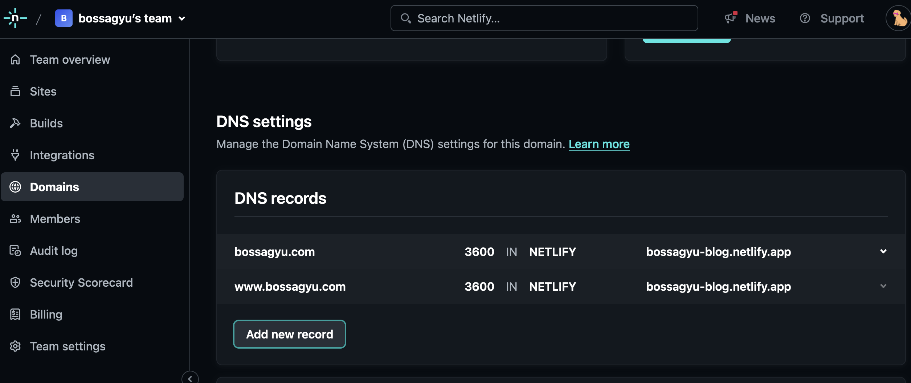
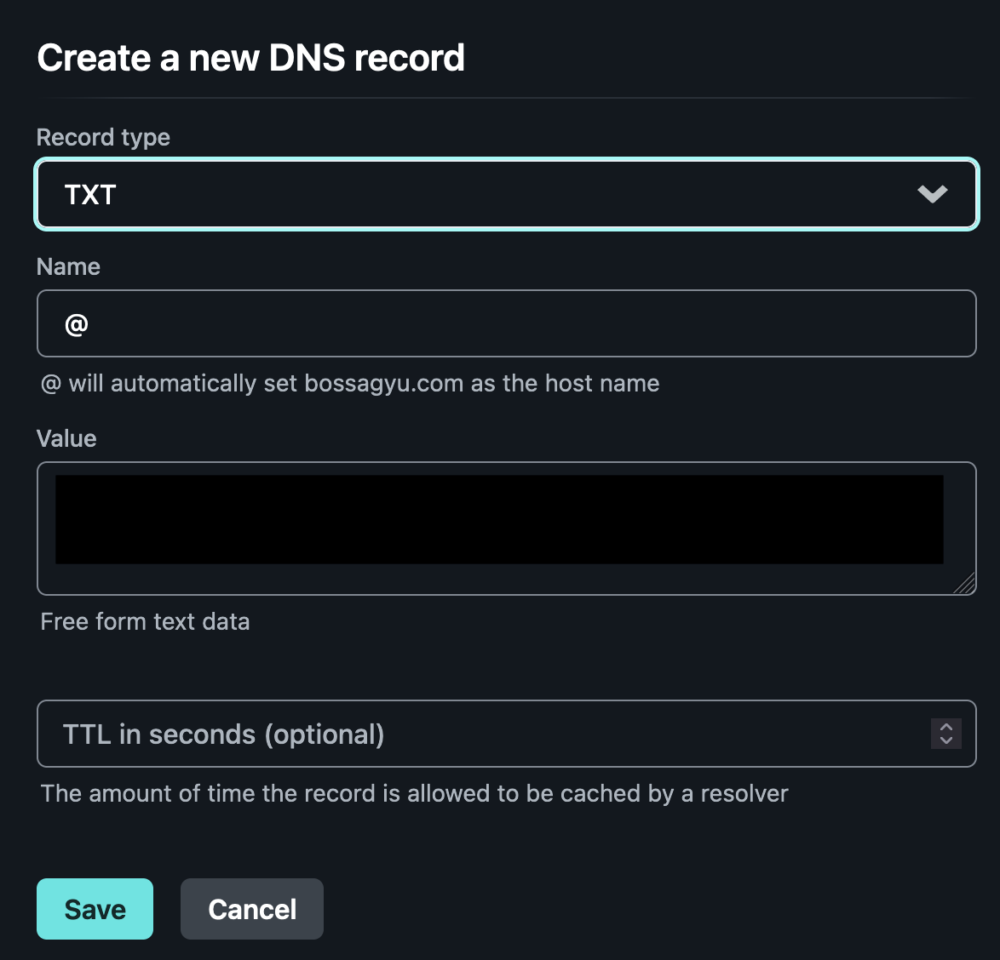
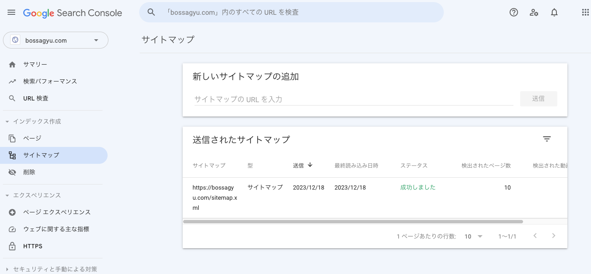

+++
title = 'Using Google Search Console to Make Your Blog Searchable on Google'
date = 2023-12-18T19:10:04+09:00
draft = false
categories = ['Engineering']
tags = ['google search console', 'seo', 'blog']
+++

## Overview

To appear in Google searches, it's not enough just to apply SEO strategies; your site must first be recognized by Google. This article explains how to make your own custom domain blog appear in Google search results using Google Search Console.

## Steps to Implementation
1. Registering with Google Search Console
2. Verifying Domain Ownership
3. Registering the Sitemap
4. Requesting Index Registration
5. Summary

## Registering with Google Search Console
Register on [Google Search Console](https://search.google.com/search-console/welcome).

Choose your domain and enter the URL.  


## Verifying Domain Ownership

A screen like the following will appear to verify DNS ownership.  
(The TXT record content is blacked out for privacy.)  


You can verify ownership by adding a string specified by Google to your domain's TXT record.
Go to your domain's DNS settings and add a TXT record.

In my case, I acquired the domain through Netlify, so I went to Netlify's DNS settings.
Navigate to `Domains -> Domain Settings -> DNS Records` and add the TXT record.  


Copy the content displayed on Google Search Console and paste it into the Value field.  
(The Value part is blacked out for privacy.)  


Wait for DNS updates, which can take a few hours depending on the provider.

You can check DNS propagation from the command line.
```shell
dig -t txt bossagyu.com
```

Afterward, press the verify ownership button on Google Search Console.  
This completes the verification process, and your domain will be registered with Google Search Console.

## Registering the Sitemap
Registering a sitemap informs Google about the structure of your site, facilitating the crawling process.
For blogs created with Hugo, the sitemap is available at `/sitemap.xml`, which you should register.

From the left menu of Google Search Console, select 'Sitemaps' and add your sitemap.  



## Requesting Index Registration
Even if your site is registered in the sitemap, it can take time for Google to crawl and index it.
In my case, I requested index registration after waiting several days without being indexed.

Search for the URL you want to register in Google Search Console, and click on 'Request Indexing' found on the right side of the search result.  


This requests index registration.
It took a few hours for the index to be registered after clicking.

## Summary
This article explained how to make your custom domain blog searchable using Google Search Console.  
It's a waste not to have your blog appear in Google searches after all the effort of creating it, so give it a try.