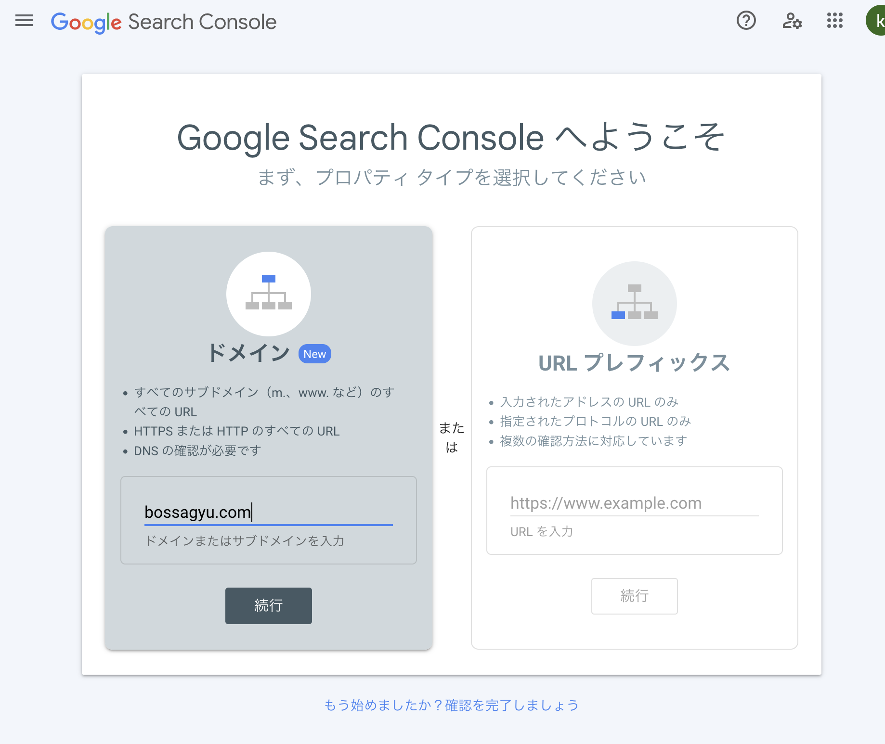
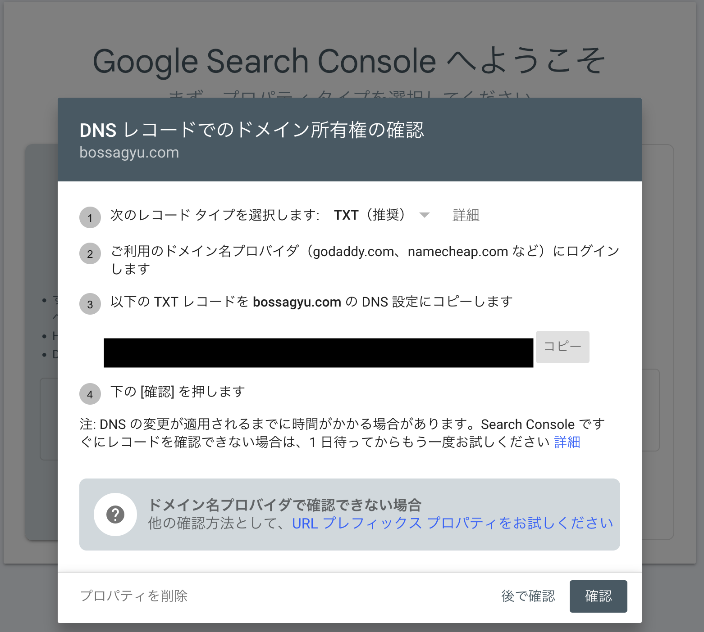
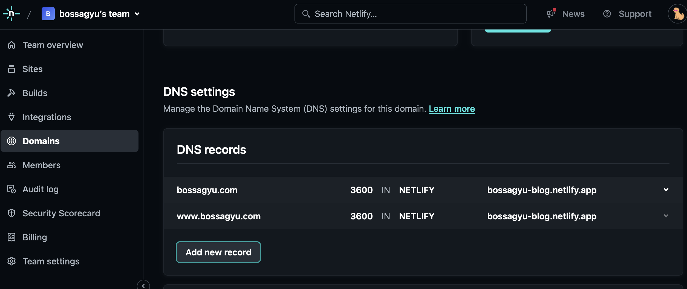
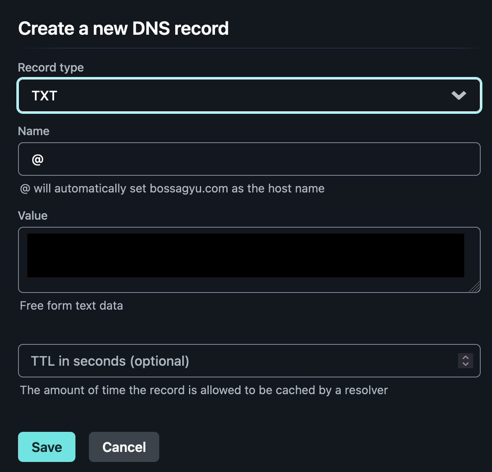
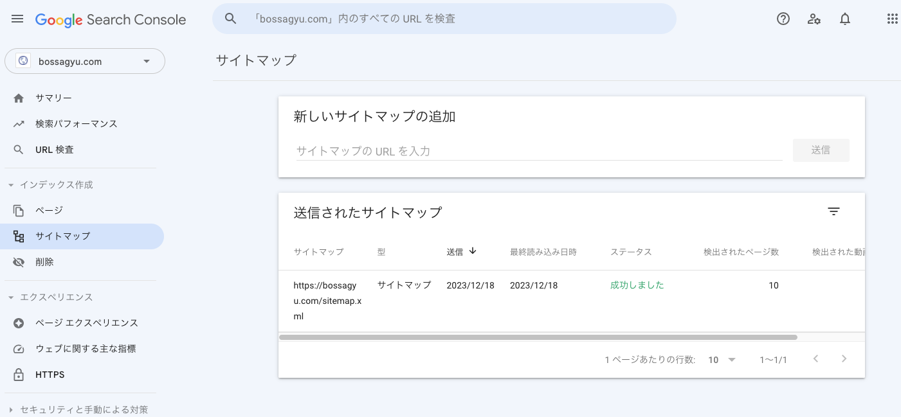
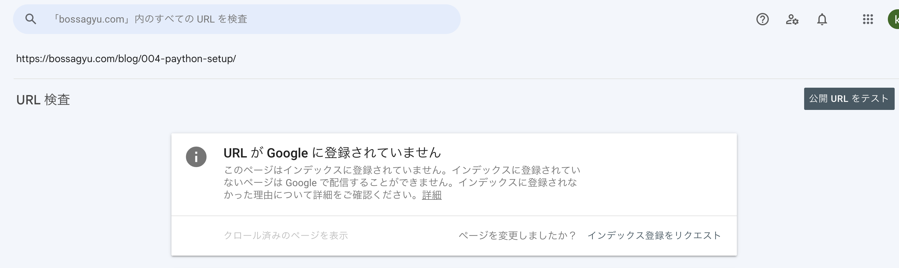

+++
title = 'Google Search Consoleを用いてブログをGoogle検索の対象にする方法'
description = 'Google Search Consoleでブログを検索対象にする方法を解説。ドメイン所有権の確認、サイトマップ登録、インデックス登録リクエストの手順を詳しく説明します。'
date = 2023-12-18T19:10:04+09:00
lastmod = 2023-12-18T19:10:04+09:00
draft = false
categories = ['Engineering']
tags = ['google search console', 'SEO', 'blog']
+++

## 概要

Google検索で引っかかるようにするために、SEO対策を行いましょうとありますが、まずはGoogle検索に認識されないと話になりません。
この記事では、Google Search Consoleを用いて自身が作成した独自ドメインのブログが、Google検索の対象となる方法を解説します。

## 実現までの流れ
1. Google Search Consoleの登録
2. ドメインの所有権の確認
3. サイトマップの登録
4. インデックス登録をリクエスト
5. まとめ

## Google Search Consoleの登録
[Google Search Console](https://search.google.com/search-console/welcome)に登録します。

ドメインを選択肢、URLを入力します。  



## ドメインの所有権の確認

以下のような画像が表示されDNSの所有権を確認します。  
(念のためTXTレコードの内容は黒く塗りつぶしています。)


ドメインのTXTにGoogleが指定した文字列を追加することで、所有権を確認することができます。
ドメインのDNSの設定画面に移動し、TXTレコードを追加します。

私の場合はNetlifyでドメインを取得しているので、NetlifyのDNSの設定画面に移動します。
`Domains -> Domain Settings -> DNS Records` に移動し、TXTレコードを追加します。


レコードの内容はGoogle Search Consoleに表示されているものをコピーしてValueに貼り付けます。  
(Valueの部分は黒く塗りつぶしています。)


DNSの反映を待ちます。ものによっては数時間かかる場合があります。

DNSの反映はコマンドラインからでも確認できます。
```shell
dig -t txt bossagyu.com
```

その後、Google Search Consoleの所有権の確認を押します。  
これで所有権の確認が完了し、Google Search Consoleにドメインが登録されます。

## サイトマップの登録
サイトマップを登録することで、Googleにサイトの構造を伝え、サイトのクロールを促進することができます。
Hugoで作成したブログの場合は、`/sitemap.xml`にサイトマップが作成されているので、これを登録します。

Google Search Consoleの左側のメニューから「サイトマップ」を選択し、サイトマップを追加します。



## インデックス登録をリクエスト
サイトマップに登録されていても、Googleがクロールして、その後インデックスが登録されるまでには時間がかかります。
私の場合は数日待ってもインデックスが登録されなかったので、インデックス登録をリクエストしました。

Google Search Consoleの検索窓で登録したいURLを検索し、検索結果の右側にある「インデックス登録をリクエスト」を押します。


これでインデックス登録をリクエストできます。
クリックしてから数時間でインデックスが登録されました。

## まとめ
Google Search Consoleを用いて自身が作成した独自ドメインのブログが検索に引っかかるようにする方法を解説しました。  
せっかくブログを作成したのに、Google検索に引っかからないのはもったいないので、ぜひ試してみてください。

## 関連記事

- [Hugo + Netlify + Githubでブログを公開する](/blog/001-hugo-netlify-build/) - ブログの初期構築
- [HugoでGoogle Analyticsの設定をする方法](/blog/003-google-analytics/) - アクセス解析
- [Lighthouseの使い方の紹介](/blog/009-light-house/) - パフォーマンス計測