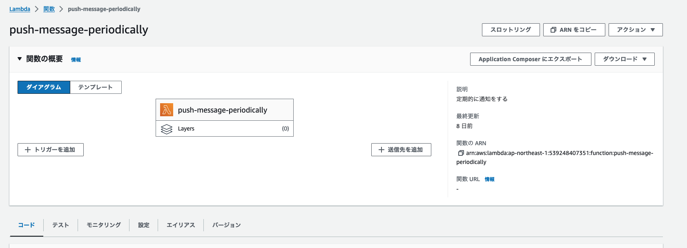
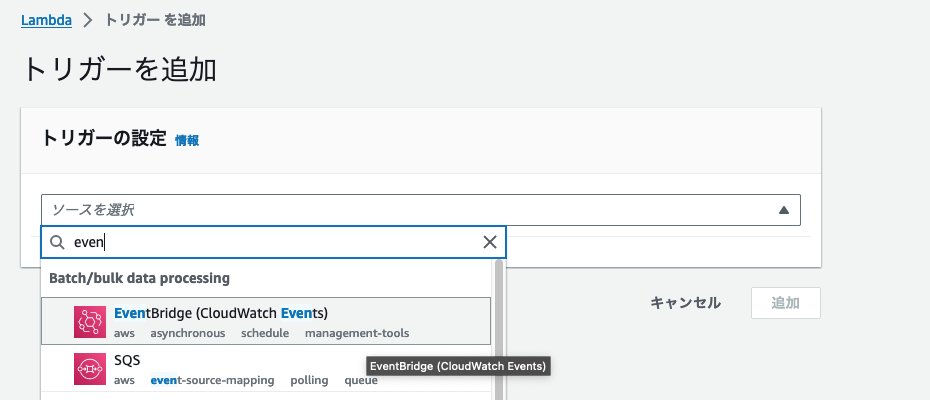
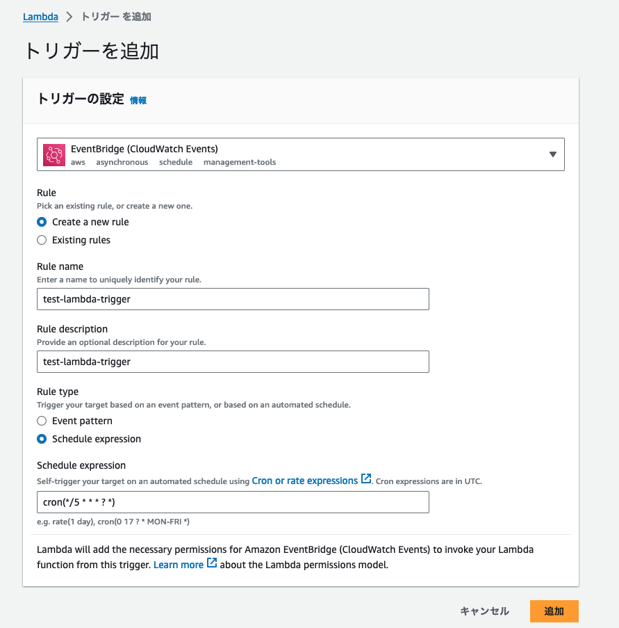
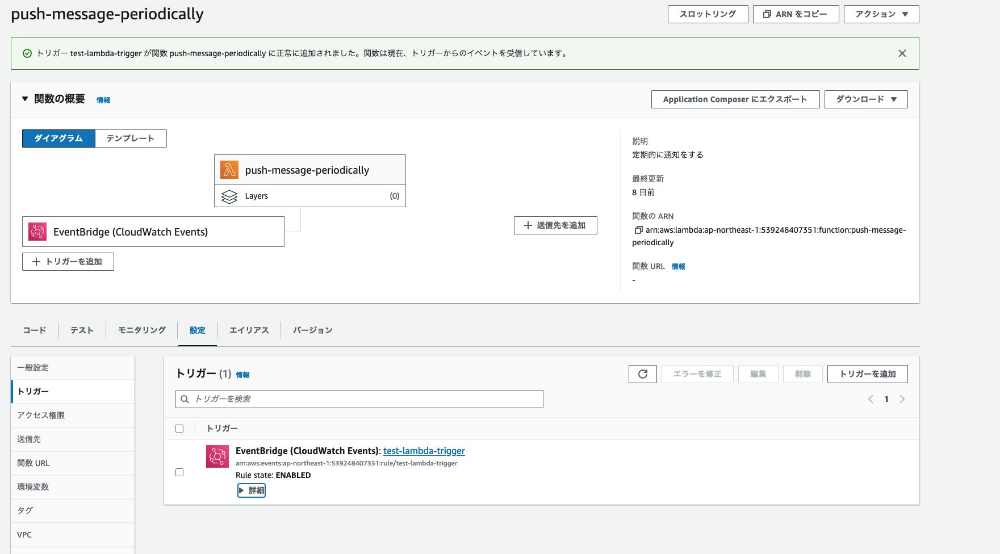
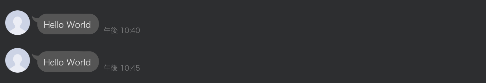

+++
title = 'Scheduling Lambda Functions Regularly Using AWS EventBridge'
date = 2023-12-21T23:03:13+09:00
draft = false
+++

## Overview
This article explains how to schedule regular executions of Lambda functions using AWS EventBridge.

## Prerequisite
It is assumed that the Lambda function has already been created.

## Steps
Select the Lambda function and choose 'Add trigger'.  

Select 'EventBridge' from the triggers.  

The rule creation screen will appear. Configure the settings.  
For this example, I set it to execute every 5 minutes using a cron expression.  
For cron syntax, refer to the [Schedule type on EventBridge Scheduler](https://docs.aws.amazon.com/scheduler/latest/UserGuide/schedule-types.html#cron-based) page.  

Once configured, EventBridge will be added to the triggers in the Lambda function diagram.  

As an aside, I created and tested a Function to send messages to LINE.  
Now, it sends notifications every 5 minutes like this.

## Summary
This article explained how to schedule Lambda functions regularly using AWS EventBridge.  
Keep in mind that leaving the configured EventBridge running can incur charges, so delete it if it's no longer needed.