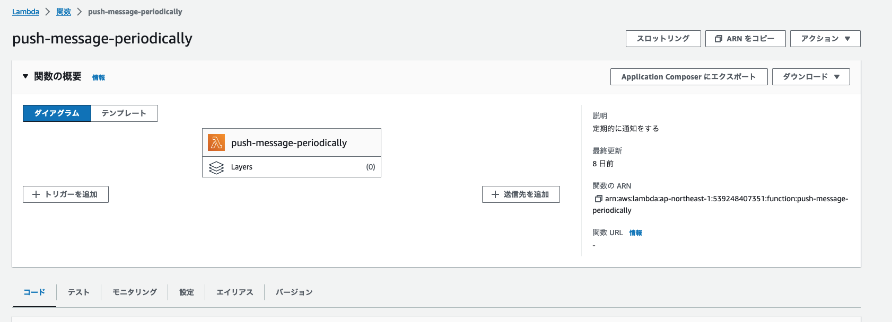

+++
title = 'AWS EventBridgeを用いてLambdaを定期実行する方法'
date = 2023-12-21T23:03:13+09:00
draft = false
categories = ['Engineering']
tags = ['aws', 'lambda', 'eventbridge']
+++

## 概要
AWS EventBridgeを用いてLambdaを定期実行する方法を解説します。

## AWS EventBridgeとは
AWS EventBridgeは、AWSのサービス間でイベントを受け渡すためのサービスです。
EventBridgeを利用することで、イベント駆動型のアーキテクチャを構築することができます。

詳細な説明は [AWS公式ドキュメント](https://docs.aws.amazon.com/ja_jp/eventbridge/latest/userguide/eb-what-is.html) を参照してください。

## 前提
Lambda関数についてはすでに作成されていることを前提としています。
Lambda関数の作成方法については、[AWA Labda 開始方法](https://aws.amazon.com/jp/lambda/getting-started/) を参照して作成してください。

## 手順
EventBridgeで実行する予定のLambda関数を選択し「トリガーを追加」を選択します。  

トリガーから「EventBridge」を選択します。  

トリガーの選択を行うと、ルールの作成画面が表示されるので設定します。  
今回はcron形式で5分ごとに実行するように設定しています。  
cronのsyntaxについては [Schedule type on EventBridge Scheduler](https://docs.aws.amazon.com/scheduler/latest/UserGuide/schedule-types.html#cron-based) のページを参考にしてください。  

設定が完了するとLambda関数のダイアグラムのトリガーにEventBridgeが追加されます。  

ちなみに私はLINEにメッセージを通知するFunctionを作って動かしてみました。  
こんな感じで5分に1回通知がくるようになりました。

## まとめ
AWS EventBridgeを用いてLambdaを定期実行する方法を解説しました。
今回設定したEventBridgeについてはこのまま放置しておくと、課金が発生するので、不要になったら削除しておきましょう。