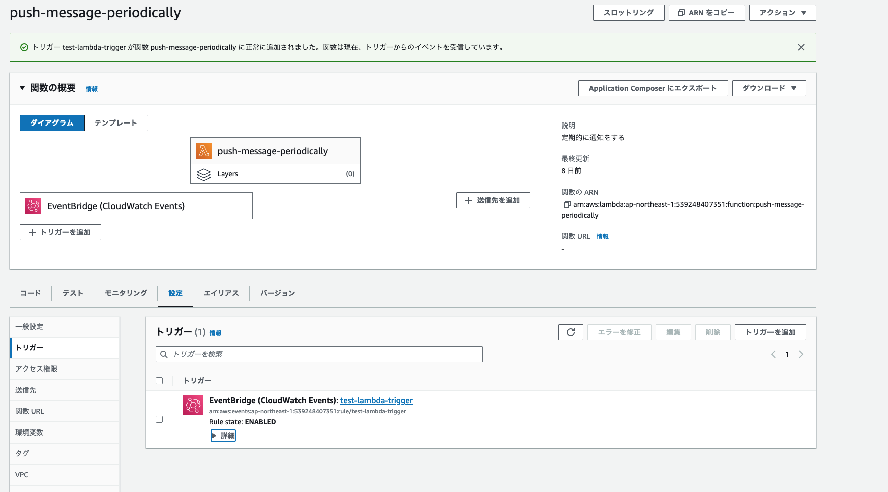

+++
title = 'AWS EventBridgeを用いてLambdaを定期実行する方法'
description = 'AWS EventBridgeでLambdaを定期実行する方法を解説。cron式の書き方、JSTタイムゾーン設定、コスト、よくあるハマりポイントまで実践的に説明します。'
date = 2023-12-21T23:03:13+09:00
draft = false
categories = ['Engineering']
tags = ['AWS', 'Lambda', 'eventbridge', 'serverless']
+++

## 概要

AWS EventBridgeを用いてLambdaを定期実行する方法を解説します。

私はこの仕組みを使って、LINE Botに定期的にリマインド通知を送る機能を実装しました。
たとえば「毎朝7時に掃除のリマインドを送る」といった処理を、サーバーを用意せずに実現できます。

## AWS EventBridgeとは

AWS EventBridgeは、AWSのサービス間でイベントを受け渡すためのサービスです。
主な用途は以下の2つです。

| 用途 | 説明 |
|------|------|
| スケジュール実行 | cron式やrate式で定期的にLambdaを実行 |
| イベント駆動 | S3へのファイルアップロードなどをトリガーにLambdaを実行 |

今回はスケジュール実行の方法を解説します。

## 実際のユースケース

EventBridge + Lambdaの定期実行は、以下のようなケースで役立ちます。

- **リマインド通知**: 毎日決まった時間にSlackやLINEに通知
- **バッチ処理**: 毎時データを集計してDBに保存
- **ヘルスチェック**: 5分ごとに外部APIの死活監視
- **クリーンアップ**: 毎日深夜に古いログを削除

私の場合は、[掃除リマインダーBot](/blog/045-clean-bot/)で毎時ユーザーへの通知判定を行うために使っています。

## 前提

Lambda関数についてはすでに作成されていることを前提としています。
Lambda関数の作成方法については、[AWS Lambda 開始方法](https://aws.amazon.com/jp/lambda/getting-started/) を参照して作成してください。

## 手順

### 1. トリガーを追加

EventBridgeで実行する予定のLambda関数を選択し「トリガーを追加」を選択します。


### 2. EventBridgeを選択

トリガーから「EventBridge (CloudWatch Events)」を選択します。


### 3. スケジュールを設定

トリガーの選択を行うと、ルールの作成画面が表示されるので設定します。


### 4. 設定完了

設定が完了するとLambda関数のダイアグラムのトリガーにEventBridgeが追加されます。



## cron式の書き方

EventBridgeのcron式は6つのフィールドで構成されます。

```
cron(分 時 日 月 曜日 年)
```

### よく使うパターン

| 実行タイミング | cron式 |
|---------------|--------|
| 毎日9時（UTC） | `cron(0 9 * * ? *)` |
| 毎日9時（JST = UTC+9） | `cron(0 0 * * ? *)` |
| 毎時0分 | `cron(0 * * * ? *)` |
| 5分ごと | `cron(0/5 * * * ? *)` |
| 平日のみ毎朝9時（UTC） | `cron(0 9 ? * MON-FRI *)` |
| 毎月1日の0時（UTC） | `cron(0 0 1 * ? *)` |

### 注意: タイムゾーンはUTC

EventBridgeのcron式は**UTC基準**です。日本時間（JST）で設定したい場合は9時間引いてください。

例: 毎朝7時（JST）に実行 → `cron(0 22 * * ? *)` （前日の22時UTC）

## 実際に動かしてみた結果

私はLINEにメッセージを通知するFunctionを作って動かしてみました。
5分に1回通知がくるようになりました。


テストの際は短い間隔（5分など）で設定して動作確認し、本番では適切な間隔に変更するのがおすすめです。

## コストについて

EventBridge + Lambdaの組み合わせは非常に低コストです。

| サービス | 無料枠 | 超過時の料金 |
|----------|--------|-------------|
| EventBridge | 無料 | スケジュールルールは無料 |
| Lambda | 月100万リクエスト無料 | $0.20/100万リクエスト |

個人開発のリマインダーBot程度なら、ほぼ無料で運用できます。

## ハマりポイント

### 1. タイムゾーンの罠

前述の通り、EventBridgeはUTC基準です。「毎朝9時」と設定したつもりが「夕方18時」に動いていた、というのはよくある失敗です。

### 2. 初回実行のタイミング

cron式を設定した直後は、次のスケジュールまで待つ必要があります。
すぐにテストしたい場合は、Lambdaのテスト機能を使いましょう。

### 3. 削除を忘れずに

テスト用に作成したEventBridgeルールを放置すると、Lambdaが実行され続けます。
不要になったルールは必ず削除しましょう。

## まとめ

AWS EventBridgeを用いてLambdaを定期実行する方法を解説しました。

- EventBridgeはスケジュール実行とイベント駆動の2つの用途がある
- cron式はUTC基準なので、JSTで設定したい場合は9時間引く
- 個人開発レベルならほぼ無料で運用可能
- 不要になったルールは削除を忘れずに

サーバーレスで定期実行を実現できるので、リマインダーBotやバッチ処理などに活用してみてください。

## 関連記事

- [掃除リマインダーBotの使い方](/blog/045-clean-bot/)
- [掃除リマインダーBotの技術解説](/blog/046-clean-bot-technical/)