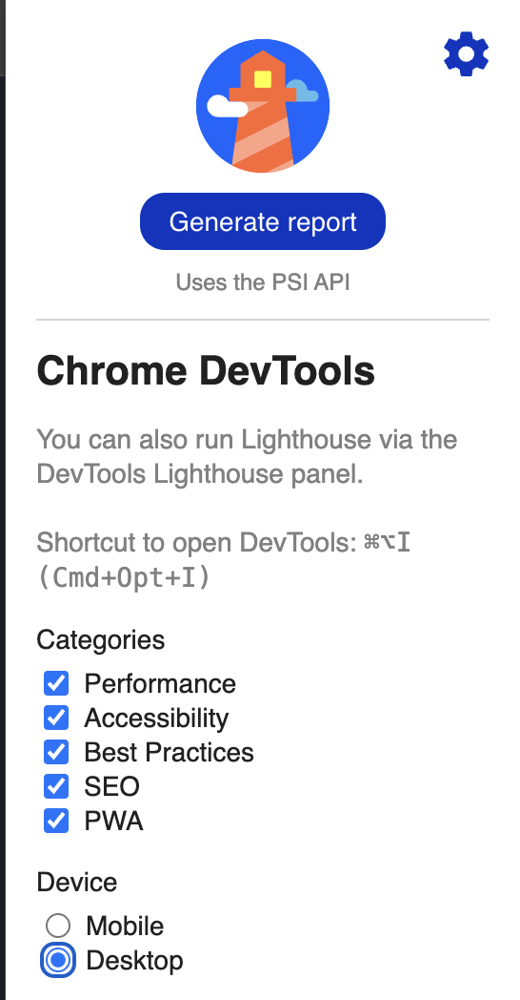
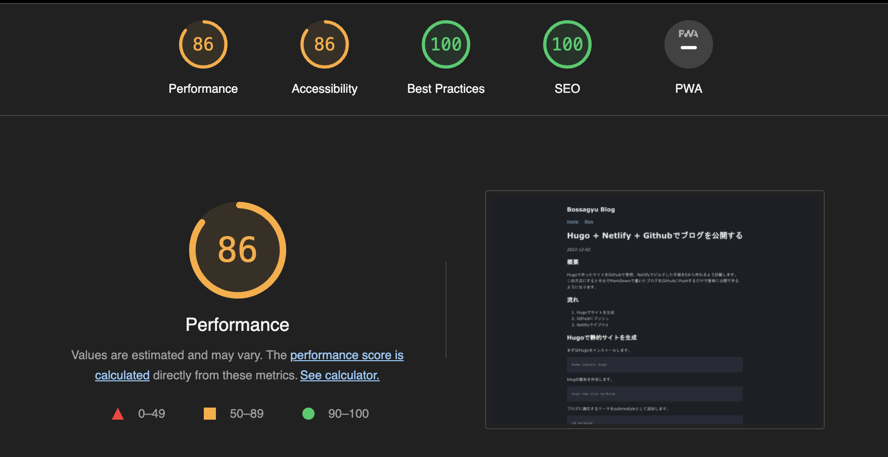
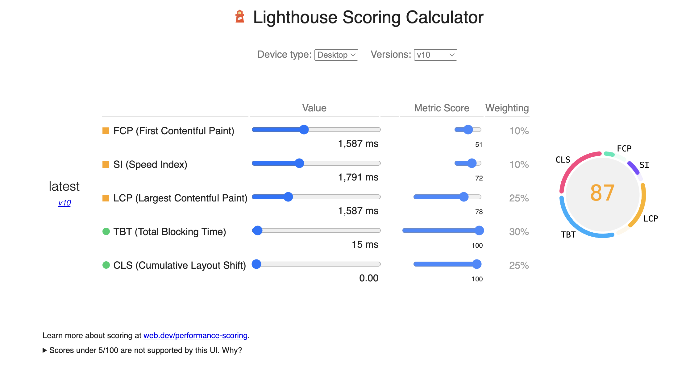
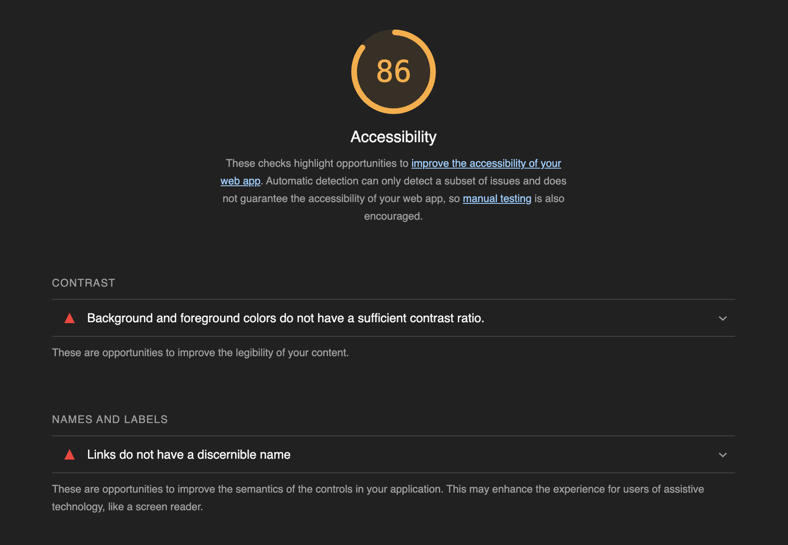
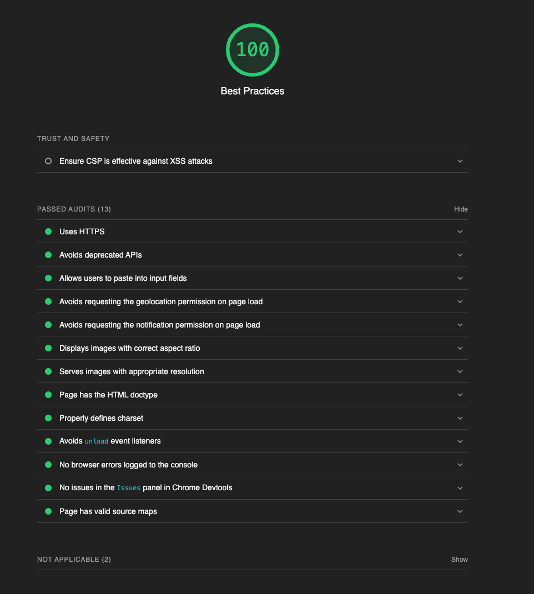
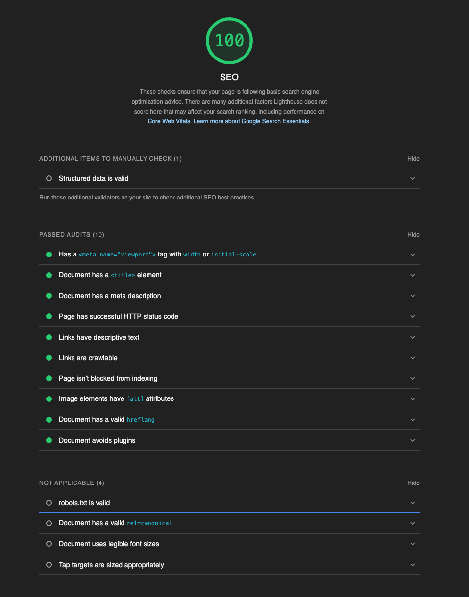

+++
title = 'Introduction to Using Lighthouse'
date = 2023-12-22T23:08:00+09:00
draft = false
+++

## Overview
This article explains how to measure your blog's performance using Lighthouse.

## What is Lighthouse?
Lighthouse is a performance measurement tool for websites provided by Google. It's available as a Google Chrome extension and can be used by installing the plugin.

## Installing Lighthouse
Install Lighthouse from the Chrome Web Store.  

Open the site you want to analyze and click on the Lighthouse icon.  

Click on Generate report to start the analysis.  
This time, I ran it on my [blog page](https://bossagyu.com/blog/001-hugo-netlify-build/).  

The results are displayed as follows, taking about 1 minute to complete.  

## Interpreting the Results
### Performance
Evaluates web performance, like page loading and image display speeds. Clicking the See calculator link takes you to more details.  

### Accessibility
Checks whether all users can access content and navigate efficiently within the site. Scrolling down shows areas flagged by Accessibility.  

It points out weak color contrast in the code snippets and missing descriptions in links.

However, the flagged content is not from my writing but depends on the template, so to fix this, it would be necessary to override the Hugo template.

### Best Practices
Tests the integrity of web pages. You can view the testing items in the results.  

### SEO
You can check if the page is optimized for search engine result rankings.  

### Progressive Web App
Checks if the loading speed of web pages on smartphones is optimized and if it's suitable for PWAs. This wasn't checked in this case.

## Summary
The article explained how to measure the performance of a blog using Lighthouse.
Especially for SEO, as it affects visibility in Google search results, it's important to address these issues adequately.