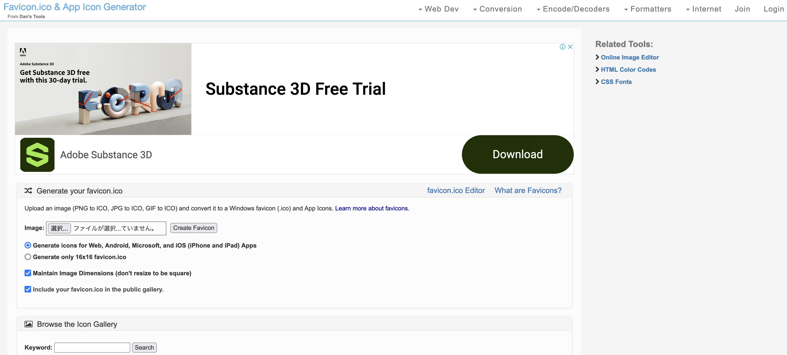

+++
title = 'Faviconを作ってHugoで表示する方法'
date = 2023-12-24T22:14:39+09:00
draft = false
+++

## 概要
Faviconを簡単に作る方法を解説します。
また、HugoでFaviconを表示する方法も解説します。

## Faviconとは
Faviconとは、ウェブサイトのブックマークやタブ、ホーム画面などに表示されるアイコンのことです。
Googleより検索結果に表示されるための[faviconのガイドライン](https://developers.google.com/search/docs/appearance/favicon-in-search?hl=ja#guidelines)が公開されており、
こちらに従うことで検索結果に表示されるようになります。


## Faviconの作成
Faviconを作成するには、以下のサイトを利用します。

* [Favicon.ico & App Icon Generator](https://www.favicon-generator.org/)

サイトにアクセスすると、以下のような画面が表示されます。  


faviconを作成したいサイトのURLを入力し、Generate Faviconをクリックします。
その後表示される画面で、「Download the generated favicon」のリンクをクリックすると、faviconがダウンロードできます。

## HugoでFaviconを表示する
HugoでFaviconを表示するには、themeによっても違うますが、 [bearcub](https://github.com/clente/hugo-bearcub/tree/main) の場合は
以下のようにtomlに設定するだけでfaviconが表示できます。

```shell
[params]
  favicon = "images/favicon.ico"
```

## まとめ
Faviconを作成する方法と、HugoでFaviconを表示する方法を解説しました。  
Faviconは、ブログのブックマークやタブ、ホーム画面などに表示されるので、作成しておくと良いでしょう。