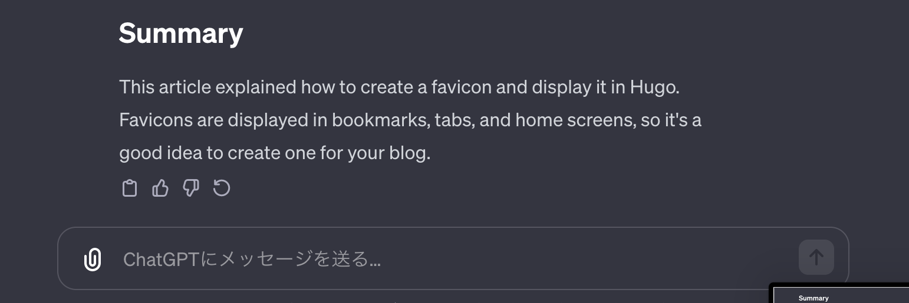

+++
title = 'Using ChatGPT to Make a Hugo Blog Multilingual'
description = 'How to make a Hugo blog multilingual using ChatGPT. Covers Markdown translation prompts, config.toml settings, and directory structure for i18n support.'
date = 2023-12-31T20:46:36+09:00
lastmod = 2023-12-31T20:46:36+09:00
draft = false
categories = ['Engineering']
tags = ['Hugo', 'ChatGPT', 'multilingual']
+++

## Overview
This article explains how to use ChatGPT to make a blog created with Hugo multilingual.

## Translating Articles into English with ChatGPT
You can translate articles written in Markdown into English using [ChatGPT](https://chat.openai.com/). When doing so, use the following prompt to ensure that the format remains intact:

```text
Please translate this Markdown into English without altering its format.
Ensure that no extraneous output is included.
Present the translated content in a format that can be easily copied.
```

Paste your article in Japanese, and ChatGPT will output the translated Markdown. You can copy the output directly by clicking the copy button at the bottom left of the output.



It is highly recommended to use GPT-4 instead of GPT-3.5, despite the subscription cost. GPT-4 significantly outperforms GPT-3.5 in providing accurate responses, making it useful for purposes beyond just translation.

## Making Hugo Multilingual
Here are the steps to make your Hugo site multilingual.

### Creating Configuration Files
Add the following settings to your config.toml:

```toml
# Set the default language, without this setting English is assumed default.
defaultContentLanguage = "jp"

[languages]
  # Set configurations for each language
  [languages.jp]
    title = "Bossagyu Blog"
    languageName = "ja-jp 🇯🇵"
    LanguageCode = "ja-jp"
    contentDir = "content"  # Directory for Japanese blog articles
      [languages.jp.params]
  
  [languages.en]
    title = "Bossagyu Blog"
    languageName = "en-US 🇺🇸"
    LanguageCode = "en-US"
    contentDir = "content.en" # Directory for English blog articles
      [languages.en.params]
```
With the above settings, you can write Japanese articles in the `content` directory and English articles in the `content.en` directory to support multiple languages.

The final directory structure will look like this:

```text
project/
├── content/
│   ├── index.md
│   └── blog/
│       ├── index.md
│       └── article1.md
└── content.en/
    ├── index.md
    └── blog/
        ├── index.md
        └── article1.en.md
```
In the English directory, naming files as `article-name.en.md` identifies them as English versions of the default language articles, and language switch icons will be added to the articles. For the articles, just copy and paste the translations from ChatGPT.

## Summary
This article explained how to make a Hugo blog multilingual using ChatGPT. Utilizing ChatGPT simplifies the translation process. Multilingual support can help reach audiences outside Japan, increasing readership.

Since it's low-cost and efficient, it's worth giving it a try.