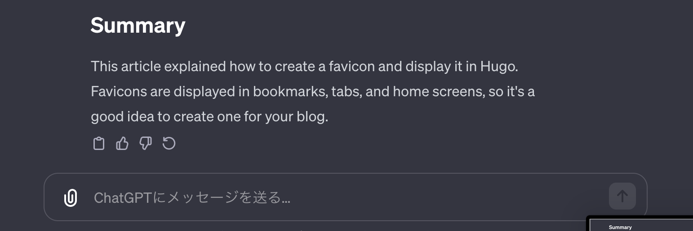

+++
title = 'ChatGPTを利用してHugoで作ったブログを多言語対応する方法'
description = 'ChatGPTを使ってHugoブログを多言語対応する方法を解説。Markdownの英語化プロンプトとHugoのconfig.toml設定、ディレクトリ構成を詳しく説明します。'
date = 2023-12-31T20:46:36+09:00
lastmod = 2023-12-31T20:46:36+09:00
draft = false
categories = ['Engineering']
tags = ['Hugo', 'ChatGPT', 'multilingual']
+++

## 概要
この記事では、ChatGPTを利用してHugoで作ったブログを多言語対応する方法を説明します。

## GhatGPTを利用して記事を英語化する方法
Markdownで書かれた記事を[ChatGPT](https://chat.openai.com/)に英語化させます。
英語化を実施するにあたって、なるべき体裁を崩さないようにするために、以下のようなプロンプトをChatGPTへ入力します。

```text
マークダウンを体裁を崩さずに英語にしてください。
マークダウン以外の余分な出力は行わないでください。
英語化された内容をそのままコピーできる形で出力してください。
```

その後、日本語で書いた記事をそのまま貼り付けると、英語化されたMarkdownが出力されます。
出力結果の左下のコピーボタンから出力結果をコピーすれば、英語化は完了です。



また、ChatGPTを利用する際はGPT3.5ではなく、課金をしてGPT4を利用することを強くおすすめします。
GPT4は月々お金がかかりますが、GPT3.5と比べて圧倒的に正しい回答を返す確率が高いので、英語化以外の用途にも使えます。


## Hugoで多言語対応する方法
Hugoで多言語化を行うための設定方法を記載します。

### 設定ファイルの作成
config.tomlに以下のような設定を追加します。

```toml
# デフォルトの言語を設定、設定しない場合英語がデフォルト判定されます。
defaultContentLanguage = "jp"

[languages]
  # 言語ごとに設定を変更します
  [languages.jp]
    title = "Bossagyu Blog"
    languageName = "ja-jp 🇯🇵"
    LanguageCode = "ja-jp"
    contentDir = "content"  # 日本語ブログ記事を格納するディレクトリ
      [languages.jp.params]
  
  [languages.en]
    title = "Bossagyu Blog"
    languageName = "en-US 🇺🇸"
    LanguageCode = "en-US"
    contentDir = "content.en" # 英語ブログ記事を格納するディレクトリ
      [languages.en.params]
```
上記のような設定を行うことで、`content`ディレクトリに日本語の記事を、`content.en`ディレクトリに英語の記事を書くことで多言語対応が可能となります。

最終的なディレクトリ構成は以下のような形になります。

```text
project/
├── content/
│   ├── index.md
│   └── blog/
│       ├── index.md
│       └── article1.md
└── content.en/
    ├── index.md
    └── blog/
        ├── index.md
        └── article1.en.md
```
また英語化したディレクトリの中には `記事名.en.md` の拡張子とすることで、デフォルト言語に対する英語の記事として認識され、記事に言語変換用のアイコンが出力されるようになります。
記事についてはGhatGPTを用いて英語化したものをコピー&ペーストするだけでOKです。

## まとめ
この記事では、ChatGPTを利用してHugoで作ったブログを多言語対応する方法を説明しました。
ChatGPTを利用することで、英語化を簡単に行うことができます。
また、多言語対応することで記事を日本以外の国にもリーチでき、より多くの人に記事を読んでもらえます。

ローコストで多言語対応できるのでぜひやってみましょう。