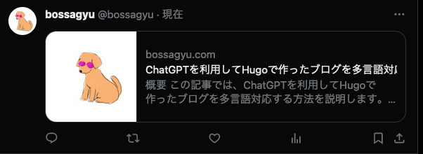

+++
title = 'Setting Up Twitter Social Cards'
description = 'How to set up Twitter Social Cards for a Hugo blog. Covers Summary Card vs Large Image types, theme-specific settings, and debugging tools.'
date = 2024-01-06T21:45:12+09:00
lastmod = 2024-01-06T21:45:12+09:00
draft = false
categories = ['Blog']
tags = ['Hugo', 'Twitter', 'Social Card']
+++

## Overview
This article explains how to set up Twitter Social Cards for a blog created with Hugo.

## What is a Twitter Social Card?
A Twitter Social Card is an image that is displayed when an article is shared on Twitter. The image below is an example of a Twitter Social Card.



There are several types of Twitter Social Cards, including:

* Summary Card
* Summary Card with Large Image
* App Card
* Player Card

For sharing blog posts, the most commonly used types are Summary Card and Summary Card with Large Image.

For more details on each card type, refer to Twitter's [official documentation](https://developer.twitter.com/en/docs/twitter-for-websites/cards/overview/abouts-cards).

## How to Set Up Twitter Social Cards
There are two main methods to set up Twitter Social Cards:

* Setting up through the theme
* Setting up independently of the theme

### Setting Up Through the Theme
Some themes allow you to set up Twitter Social Cards directly.

For this example, I'll use the [Stack](https://themes.gohugo.io/hugo-theme-stack/) theme that I'm using. In Stack, you can configure Twitter Social Cards in `config.toml` as follows:

```toml
[opengraph.twitter]
site = ""
card = "summary" # summary or summary_large_image

[defaultImage.opengraph]
enabled = true
local = false
src = "/images/share.webp" # Path to the default image you want to set
```

### Setting Up Independently of the Theme
If your theme doesn’t support Twitter Social Card settings, you will need to implement it yourself.

Hugo’s official [template for implementation](https://github.com/gohugoio/hugo/blob/master/tpl/tplimpl/embedded/templates/twitter_cards.html) is available, which you can use for an easy setup.

## Troubleshooting
If the settings don’t seem to work, it might be due to incorrect implementation or the meta tags not being properly set. In such cases, use the [debugging tool](https://cards-dev.twitter.com/validator) provided by Twitter to check if the settings have been correctly applied.

## Summary
This article explained how to set up Twitter Social Cards for a blog created with Hugo. Setting up Social Cards can enhance the visibility of your shared articles on Twitter, potentially attracting more readers, so it's definitely worth doing.

## Related Articles

- [Publishing a Blog with Hugo + Netlify + Github](/en/blog/001-hugo-netlify-build/) - Blog initial setup
- [Using Google Search Console to Make Your Blog Searchable on Google](/en/blog/007-google-search-console/) - SEO setup