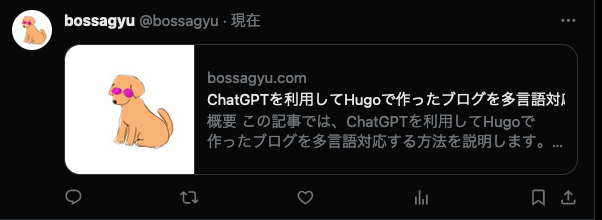

+++
title = 'Twitter Social Cardの設定方法'
date = 2024-01-06T21:45:12+09:00
draft = false
categories = ['Blog']
tags = ['Hugo', 'Twitter', 'Social Card']
+++

## 概要
この記事では、Hugoで作ったブログにTwitter Social Cardを設定する方法を説明します。

## Twitter Social Cardとは
Twitter Social Cardとは、Twitterで記事をシェアした際に表示される画像のことです。
以下のような画像がTwitter Social Cardです。



Twitter Social Cardは、以下の種類があります。

* Summary Card
* Summary Card with Large Image
* App Card
* Player Card

この中でもブログのシェアを行う場合は、Summary Card か Summary Card with Large Image を利用することが多いです。

そのれぞれのカードがどのようなものかについてはTwitterの[公式ドキュメント](https://developer.twitter.com/en/docs/twitter-for-websites/cards/overview/abouts-cards)を参照してください。

## Twitter Social Cardの設定方法
Twitter Social Cardの設定方法は、以下の2つの方法があります。

* テーマによる設定
* テーマに依存しない設定

### テーマによる設定
テーマによっては、Twitter Social Cardの設定を行うことができます。

今回は私が採用している[Stack](https://themes.gohugo.io/hugo-theme-stack/)を例に説明します。

Stackでは、`config.toml` 対して以下のような設定を行うことでTwitter Social Cardの設定が可能です。

```toml
[opengraph.twitter]
site = ""
card = "summary" # summary or summary_large_image

[defaultImage.opengraph]
enabled = true
local = false
src = "/images/share.webp" # デフォルトで設定したいimageのパス
```

### テーマに依存しない設定
テーマによっては、Twitter Social Cardの設定を行うことができません。
自前で実装して、設定を行う必要があります。

Hugoの公式で[実装のテンプレート](https://github.com/gohugoio/hugo/blob/master/tpl/tplimpl/embedded/templates/twitter_cards.html)が公開されていますので、それを利用することで容易に実装することが可能です。

## うまくいかない場合
うまくいかない場合はうまく設定が反映されていない、megaタグが正しく設定されていない可能性があります。
Twitterから提供されている[デバッグツール](https://cards-dev.twitter.com/validator)を利用して、設定が正しく反映されているか確認してみましょう。

## まとめ
この記事では、Hugoで作ったブログにTwitter Social Cardを設定する方法を説明しました。
Social Cardを設定することで、Twitterで記事をシェアした際に、より多くの人に記事を読んでもらうことができますのでぜひ設定しましょう。