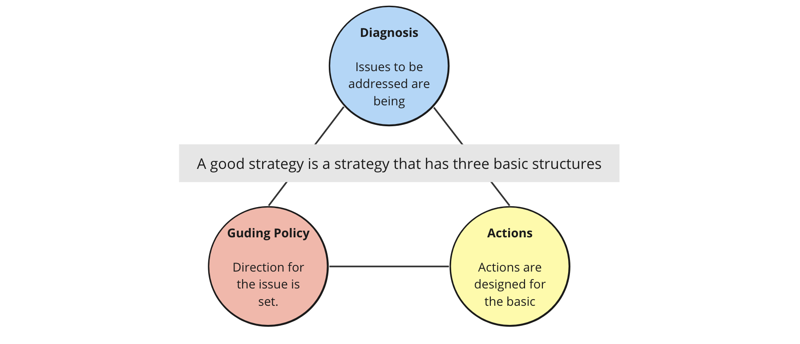

+++
title = 'How to Create a Product Strategy'
description = 'How to create an effective product strategy based on "Good Strategy Bad Strategy." Covers the three core elements: diagnosis, guiding policy, and coherent actions.'
date = 2024-01-08T21:55:15+09:00
lastmod = 2024-01-08T21:55:15+09:00
draft = false
categories = ['Management']
tags = ['strategy']
+++

## Overview
This article summarizes how to create a good product strategy, based on the book "Good Strategy Bad Strategy."

## Background
As a product owner in my job, I took over a product from the previous owner. The product lacked a clear strategy and direction, prompting me to develop a new product strategy.

While developing the strategy, I realized that the term "strategy" is interpreted in various ways by different people, often used loosely in many contexts. To understand what constitutes a good strategy, I referred to "Good Strategy Bad Strategy."

## What is a Good Strategy?

A good strategy identifies critical points where concerted efforts can significantly boost the effect of one’s actions. A strategy should show the direction for an organization to move forward.

A good strategy has three basic structures:

* Diagnosis
* Guiding Policy
* Actions



### Diagnosis
Diagnosis involves assessing the situation to identify the key challenges to address. A good diagnosis separates crucial issues from the complex mix of problems and simplifies them.

Most of the strategy work lies in figuring out what is happening. Gathering information is crucial. Although the book criticizes consultants' frameworks, I find them useful in organizing information after thorough collection.

In creating my product strategy, I used SWOT analysis and Impact Mapping to organize the current situation and the impact of existing strategies.

For more on these methods, refer to the following resources:

* [SWOT Analysis](https://www.innovation.co.jp/urumo/swot/)
* [Impact Mapping](https://amzn.asia/d/0FygsZ4)

### Guiding Policy

The guiding policy outlines how to approach the challenges identified in the diagnosis. A good policy is not about goals or visions but about how to face challenges and exclude other options. It focuses efforts on a decisive point to achieve a significant effect.

A good strategy clearly shows where resources will be allocated according to the strategy.

In my case, I defined the product direction based on the current situation and vision, focusing on specific target segments and values to offer.

### Actions

Actions are a coherent set of steps designed to execute the guiding policy. A strategy coordinates all actions to implement the policy effectively.

A good strategy includes guidelines for implementing actions.

### My Strategy

Based on the above, I developed the following strategy (partially obscured as it was for my company):

```text
Reduce the new user cost of using xx function.
```

This simple strategy meets the three basic structures of a good strategy:

* Diagnosis
    * Identified increasing new users of xx as critical for the company's benefit.
* Guiding Policy
    * Decided to lower the onboarding cost to acquire new users.
* Actions
    * Prioritized several approaches to realize the policy.
    * Although it could have included more action-oriented words, I decided on the above.

## What is a Bad Strategy

Finally, let's touch on common patterns of bad strategies:

Characteristics of a Bad Strategy:

* Vague
    * Uses jargon or industry terms to obscure simple facts.
* Avoids Significant Problems
    * Strategy should overcome difficult challenges and obstacles.
    * Strategies focusing only on attainability are bad.
* Confuses Goals with Strategy
    * For instance, a 10% revenue increase is a goal, not a strategy.
* Sets Wrong Strategic Objectives
    * Strategies set without sufficient investigation of causes and surroundings.

## Summary

This article summarized how to create a good product strategy based on "Good Strategy Bad Strategy." Creating a good strategy might not happen at once. However, not having a strategy is like running blindly, unable to judge whether actions are successful or not.

It's important to start with a basic strategy, constantly observe surroundings, and update the strategy to define the direction for your product and organization.