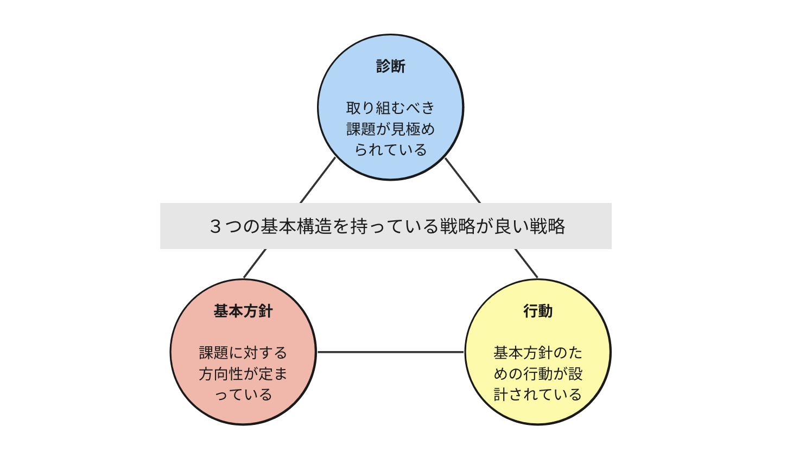

+++
title = 'プロダクト戦略の作り方'
description = '良いプロダクト戦略の作り方を「良い戦略、悪い戦略」をベースに解説。診断・基本方針・行動の3つの基本構造と悪い戦略の特徴を紹介します。'
date = 2024-01-08T21:55:15+09:00
draft = false
categories = ['Management']
tags = ['strategy']
+++

## 概要
良いプロダクト戦略の作り方について、「良い戦略、悪い戦略」という書籍をベースにまとめました。

## 背景
業務でプロダクトオーナーとして、前プロダクトオーナーからプロダクトを引き継ぎました。  
引き継いだプロダクトにはプロダクト戦略がなく、プロダクトの方向性が定まっていない状態であったため、今後プロダクトをどうするかを含めて、プロダクト戦略を作成しました。

プロダクト戦略を作成するにあたって、そもそも「戦略」というものが人によって様々な意味に解釈されており、なんでも「戦略」という言葉を使ってしまう傾向があると常々感じていました。
そこで、プロダクト戦略を作成するにあたって、どのような戦略を作成すれば良いのかを知るために、「良い戦略、悪い戦略」を読みました。

## 良い戦略とは

良い戦略とは、こちらの打つ手の効果が一気に高まるようなポイントを見つけ、そこに狙いを絞って手持ちのリソースを集中させることで、効果を最大化することができる戦略です。
戦略とは組織が前に進むためにどのようにしたら良いかを示すものである必要があります。

良い戦略は、以下の3つの基本構造を持っています。

* 診断
* 基本方針
* 行動



### 診断
診断とは、状況を診断し取り組むべき課題を見極めることです。  
良い診断は死活的に重要な問題点をより分け、複雑に絡み合った状況を明快に整理することができます。

戦略を立てる作業の多くは、今何が置きているのかを洗い出すことにあります。まずは情報を集めることが何よりも大切です。  
本書ではコンサルが提案するようなフレームに割り当てるだけではまともな戦略はできない。とこき下ろしていますが情報をしっかりと集めた上でフレームに割り当て整理することを診断の段階で行うことは有意義だと私は考えています。  

実際に私がプロダクト戦略を作成するにあたって、SWOT分析でプロダクトの置かれる状況を、インパクトマッピングを用いて現状の施策が一体誰にどのような影響を与えるのかの整理を行いました。  
それぞれのやり方については、以下の記事や書籍を参照してください。

* [SWOT分析](https://www.innovation.co.jp/urumo/swot/)
* [インパクトマッピング](https://amzn.asia/d/0FygsZ4)

### 基本方針

基本方針とは、診断で見つかった課題にどう取り組むか、大きな方向性と総合的な方針を示すことです。  
良い基本方針とは、目標でもビジョンではない、何曲に立ち向かう方法を固め、他の選択肢を排除することが基本方針である。と本書では述べられていました。  
決定的な一点に努力を集中させることによって、大きな効果を上げることができます。

このため良い戦略の中には、その戦略に従うことによって何に対してリソースを割くのかがはっきりと分かるようになっていることが大切です。  

私が戦略を立てた際には、インパクトマッピングで整理した内容をベースに、プロダクトの置かれた現状やビジョンをもとに勘案し、プロダクトの方向性を決めました。  
リソースを選択する意味では、どのターゲットのセグメントに対して、どのような価値を提供するのかを明確にすることを意識しました。

### 行動

基本方針を実行するために設計された一貫性のある一連の行動のことです。
戦略が存在することですべての行動をコーディネートして方針を実行することができます。

このため、良い戦略は、行動を実行するための指針が含まれていることが大切となります。

### 私が立てた戦略

上記をベースに私が立てた戦略は以下となりました。  
会社で立てた戦略ですので、一部ぼかして書いています。

```text
xx機能の利用者の新規利用コストを低減する
```
かなりシンプルなものになりましたが、以下のように良い戦略の3つの基本構造を満たしていると考えています。

* 診断
  * プロダクトの状況、課題をベースに考えたときにxxの新規利用者を増やすことが会社の利益につながると考えました。
* 基本方針
  * 新規利用者を確保するために導入コストを下げるという基本方針を定めました。
* 行動
  * 基本方針を実現するためにいくつかのアプローチを用意し優先順位をつけました。
  * ここについては行動を連想できるようなワードを戦略に含められればと考えましたが上記対応としました。

## 悪い戦略とは

最後に陥りがちな悪い戦略のパターンについて書いておきます。

悪い戦略の特徴

* 空疎である
  * わかり切っていることを専門用語や業界用語で煙に巻くような内容
* 重大な問題に取り組まない
  * 本来困難な課題を克服し、障害を乗り越えるためのものが戦略である。
  * 達成容易性のみを考えた戦略は悪い戦略である。
* 目標と戦略と取り違えている
  * 売りあげ10%向上など。それはただの目標である。
* 間違った戦略目標を掲げている
  * 十分な周辺・原因の調査がなく戦略を掲げている状態。

## まとめ

今回は、良いプロダクト戦略の作り方について、「良い戦略、悪い戦略」という書籍をベースにまとめました。
一回でいきなり良い戦略は立てられないと考えています。ただ、戦略のない環境はただ闇雲に走っているだけなのでそれが成功したのか失敗したのかすら判断することができない最低の状態です。  
最初は下手な戦略でも良いので、良い戦略とは何かを意識しつつ常に周りの状況を観察しながら、戦略をアップデートしプロダクトと組織の方向性を定めていくことが大切だと思います。

