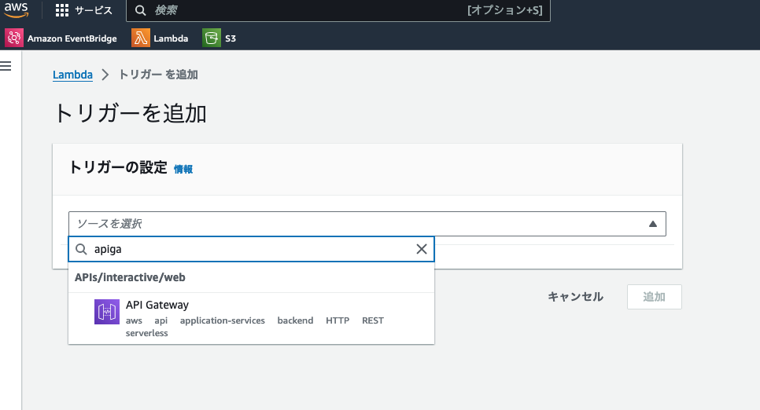
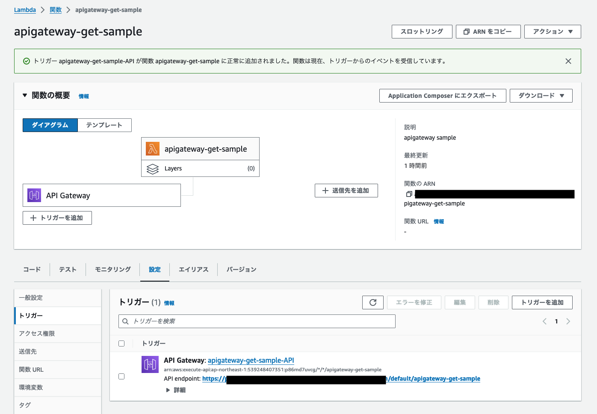

+++
title = 'Integrating AWS API Gateway with Lambda'
description = 'How to integrate AWS API Gateway with Lambda. Covers REST API vs HTTP API selection, proxy integration setup, and trigger configuration steps.'
date = 2024-01-13T18:06:52+09:00
lastmod = 2024-01-13T18:06:52+09:00
draft = false
categories = ['Engineering']
tags = ['AWS', 'API Gateway', 'Lambda']
+++

## Overview

Integrating AWS API Gateway with Lambda enables you to call Lambda functions from API Gateway. This article introduces how to integrate AWS API Gateway with Lambda.

## Prerequisites
It is assumed that the Lambda function has already been created. If not, please refer to the following article for creation:

- [Creating an AWS Lambda function](https://docs.aws.amazon.com/ja_jp/lambda/latest/dg/getting-started.html)

## Deciding How to Integrate API Gateway with Lambda

When integrating API Gateway with Lambda, you need to consider the following two points:

1. The request format for API Gateway
2. Whether to use Proxy Integration or Non-Proxy Integration

### Request Format for API Gateway

You can choose from the following formats:

* REST API
* HTTP API
* WebSocket API

If you choose to use the REST API format, you will need to decide between REST API and HTTP API. While REST API has more features, it is more expensive than HTTP API. HTTP API is a good choice for simpler requirements.

For a detailed comparison, please refer to the [official documentation](https://docs.aws.amazon.com/apigateway/latest/developerguide/http-api-vs-rest.html).

## Proxy vs. Non-Proxy Integration

Using Proxy Integration standardizes the format of the response returned from Lambda. It is generally recommended to use Proxy Integration.

* [Setting up Lambda Proxy Integrations in API Gateway](https://docs.aws.amazon.com/ja_jp/apigateway/latest/developerguide/set-up-lambda-proxy-integrations.html)

## Configuration

After creating the Lambda function, select "Add Trigger."  


Choose API Gateway.  


Configure the trigger addition as shown below.


Once configured successfully, the screen should look like this.  


Access the `API endpoint` listed with a tool like curl to execute the Lambda function.

```shell
$ curl https://xxxxxxxxx.execute-api.ap-northeast-1.amazonaws.com/default/apigateway-get-sample

"Hello from Lambda!"%
```

## Summary

This article introduced how to integrate AWS API Gateway with Lambda. By integrating with API Gateway, you can externally invoke Lambda functions at any time.

## Related Articles

- [Efficient Lambda Development with AWS Toolkit in IntelliJ](/blog/006-intellij-lamda-setup/)
- [How to Schedule Lambda Functions with AWS EventBridge](/blog/008-aws-eventbrdge/)
- [Building a Cleaning Reminder Bot with AWS Lambda + LINE](/blog/046-clean-bot-technical/)