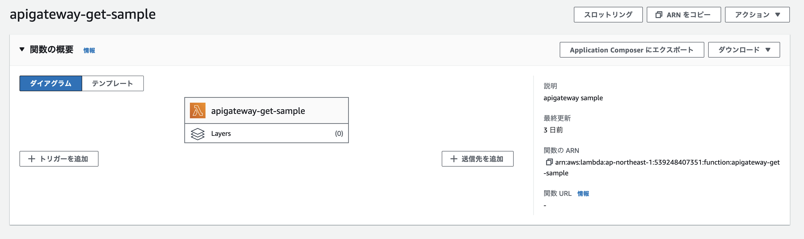
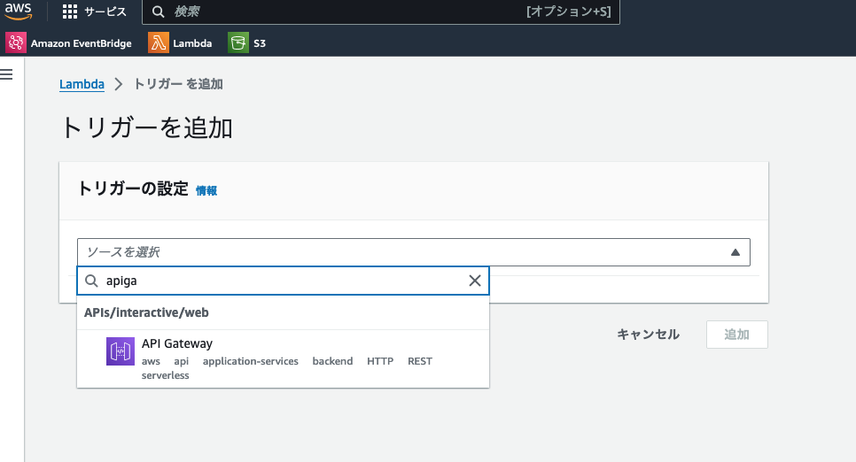
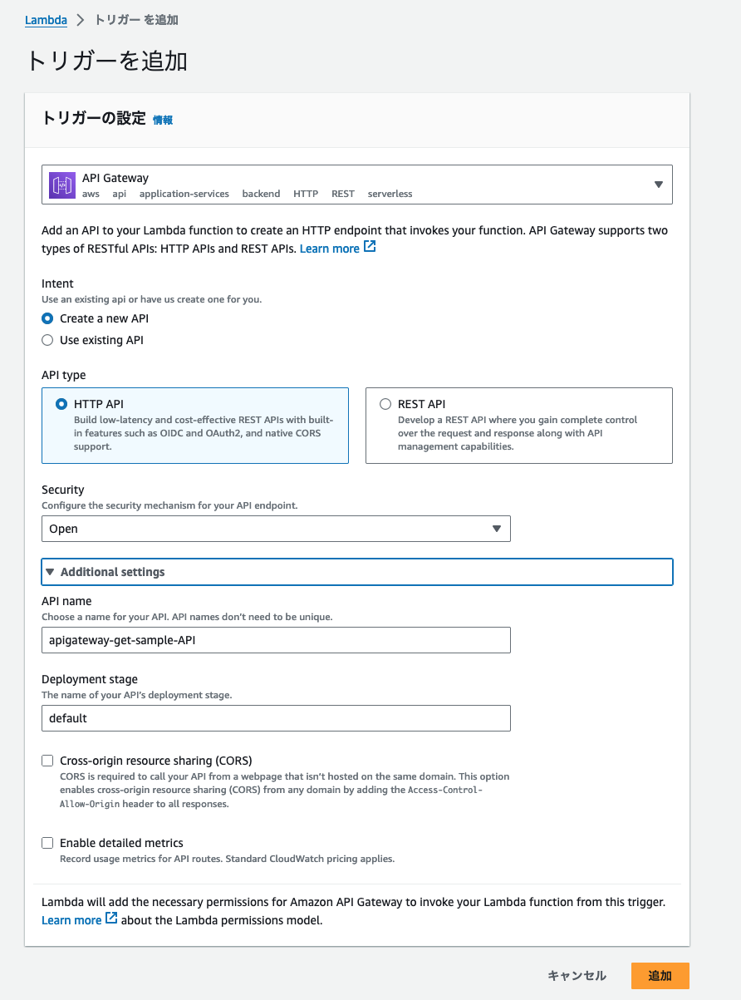
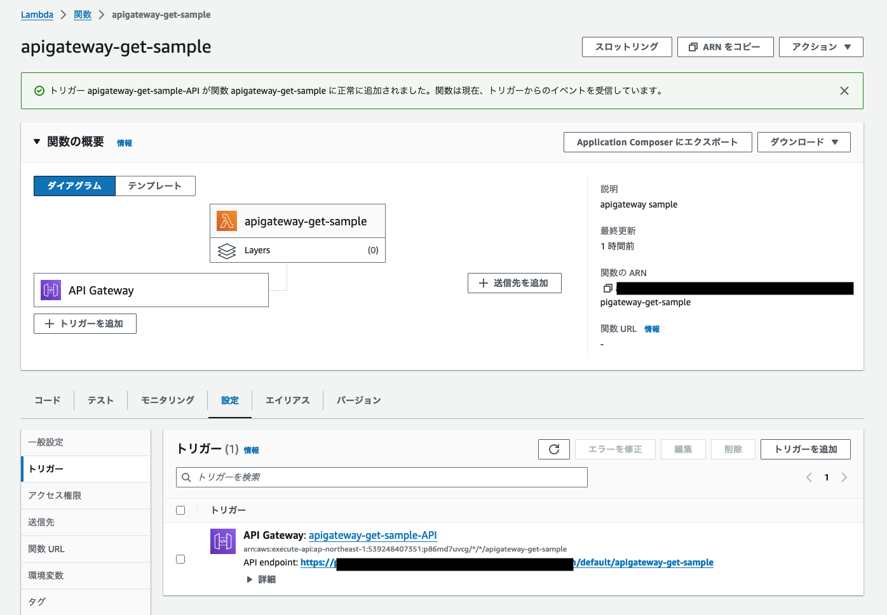

+++
title = 'AWS API GatewayとLambdaを連携させる方法'
date = 2024-01-13T18:06:52+09:00
draft = true
+++

## 概要

AWS API GatewayとLambdaを連携させることで、API GatewayからLambdaを呼び出すことができます。
本記事AWS API GatewayとLambdaを連携させる方法を紹介します。

## 前提条件
Lambda関数については作成されていることを前提としています。
作成していない場合は、下記記事を参考に作成してください。

- [AWS Lambdaを作成する方法](https://docs.aws.amazon.com/ja_jp/lambda/latest/dg/getting-started.html)

## どの形式でAPI GatewayとLambdaを連携させるかを考える

API GatewayとLambdaを連携させるに当たってどのような方式で連携させるか以下の2点について考える必要があります。

1. API Gatewayのリクエスト形式について
2. プロキシ統合が非プロキシ統合か

### API Gatewayのリクエスト形式について

以下の形式から選択できます。

* REST API
* HTTP API
* WebSocket API

この内、REST APIの形式で利用する場合は、REST APIかHTTP APIのどちらかを選択することになります。  
REST APIの方が機能が多いですが、HTTP APIと比べコストがかかります。  
特に複雑なことをしないのであればHTTP APIを選択するのが良いと思います。

詳細な比較内容については[公式ドキュメント](https://docs.aws.amazon.com/apigateway/latest/developerguide/http-api-vs-rest.html)で公開されているのでそちらを参照してください。

## プロキシ統合が非プロキシ統合か

プロキシ統合を利用することで、Lambdaから返される値のフォーマットが固定化されます。
基本的にはプロキシ統合を利用することをおすすめします。

* [API Gateway で Lambda プロキシ統合を設定する](https://docs.aws.amazon.com/ja_jp/apigateway/latest/developerguide/set-up-lambda-proxy-integrations.html)


## 設定

Lambda関数を作成したら、トリガー追加を選択します。  


API Gatewayを選択します。  


トリガーを追加の画面で以下のように設定を行います。


設定がうまくいくと以下のような画面になります。  


`API endpoint` に記載のエンドポイントにcurlなどでアクセスするとLambda関数が実行されます。

```shell
$ curl https://xxxxxxxxx.execute-api.ap-northeast-1.amazonaws.com/default/apigateway-get-sample

"Hello from Lambda!"%
```

## まとめ

本記事ではAWS API GatewayとLambdaを連携させる方法を紹介しました。
API Gatewayと連携させることで外部から任意のタイミングでLambda関数を呼び出すことができるようになります。

