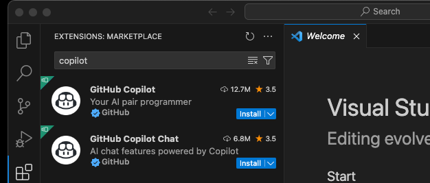
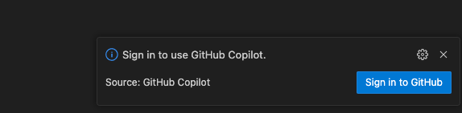
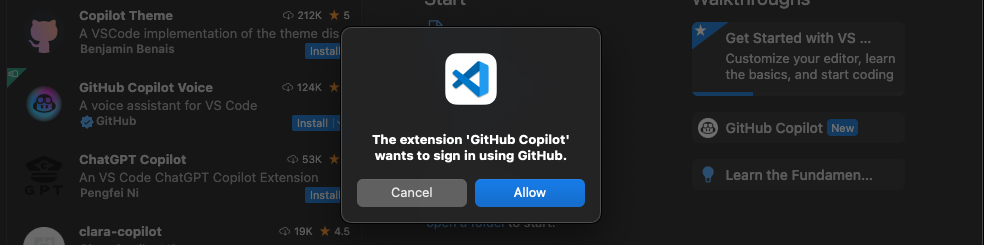
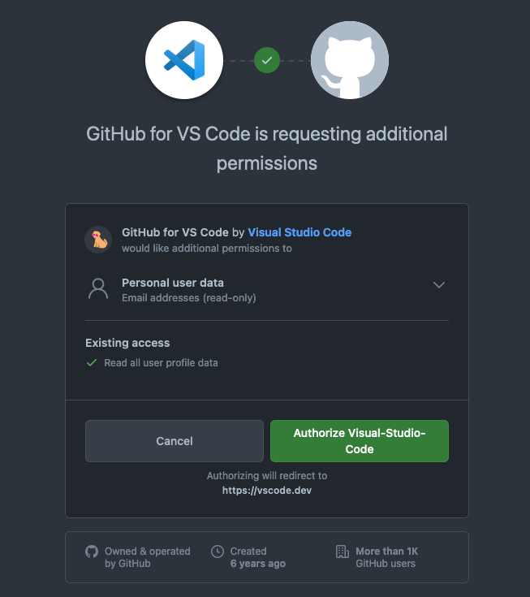

+++
title = 'VSCodeでGithub Copilotを使いこなす完全ガイド'
date = 2024-02-04T22:34:51+09:00
draft = false
categories = ['Engineering']
tags = ['VSCode', 'Copilot', 'GitHub Copilot', 'Chat tool']
+++

## 概要
この記事では、VSCodeでGithub Copilotを設定して使う方法から、Markdownでの活用、Chat toolの使い方まで網羅的に説明します。
前提としてGithub Copilotのアカウントが必要です。

## VSCodeでGithub Copilotを使えるようにするまで
### 拡張機能をインストール
まずは、VSCodeに拡張機能をインストールします。
VSCode を開き、左メニューの四角形が4つあるアイコンをクリックし、検索用テキスト入力に「copilot」と入力します。
「install」をクリックし、インストールを開始してください。

### GitHubとの連携
installをクリックし、installが完了すれば以下のような画面が表示されるので、「Sign in to GitHub」をクリックします。

GitHubのアカウントへのアクセスを要求されるので「Allow」で許可します。

「Authorize Visual Studio Code」をクリックし、許可します。

これでGithub CopilotとVSCodeの連携が完了し、使えるようになりました。

## 使い方
基本的には、コードを書いていくだけで自動的に補完されるようになります。
補完内容が提案されるので以下のショートカットを使いながらコードを書いていくと良いでしょう。

### チートシート
| 機能                            | キー                  |
|---------------------------------|----------------------|
| 提案を受け入れる                 | Tab                  |
| 提案を拒否する                   | Esc                  |
| Copilotを開く                    | Ctrl + Enter         |
| 次の提案                         | Alt/Option + ]       |
| 前の提案                         | Alt/Option + [       |
| インラインCopilotをトリガーする   | Alt/Option + \\      |

## Markdownファイルでの補完を有効にする

Github Copilotは、デフォルトではMarkdownファイルでの補完が無効になっています。
ブログ執筆などでMarkdownを使う場合は、有効化しておくと便利です。

### 設定方法

1. VSCodeでGitHub Copilotのプラグインのページを開きます
2. 歯車アイコンをクリックし、設定を開きます
3. 設定画面で `markdown` が `false` になっているので `true` に変更します

これでMarkdownファイルでもCopilotの補完が効くようになります。
このブログもGithub Copilotで補完を行いながら書いており、かなり効率化できています。

## Chat toolを使ってさらに便利に

Github Copilot Chatには「Chat tool」という機能があり、チャット内で様々なタスクを実行できます。

### Chat toolの実行方法

基本的には `#<command> <args>` の形式でコマンドを入力します。

### 代表的なChat toolのコマンド

| コマンド | 機能 |
|---------|------|
| `#codebase` | 現在のワークスペースを全部検索する |
| `#selection` | 現在のエディタで選択しているコードをコンテキストとしてプロンプトに追加する |
| `#terminal_selection` | 現在のターミナルで選択している部分をコンテキストとしてプロンプトに追加する。エラーが出たときにターミナルの出力を参照するのに便利です。 |
| `#fetch_webpage` | URLを指定してwebページからコンテンツを取得してコンテキストとしてプロンプトに追加する |

他にも便利なコマンドがあるので、公式ドキュメントを参照してください。
- [Github Copilot Chat tools](https://code.visualstudio.com/docs/copilot/reference/copilot-vscode-features#_chat-tools)

## まとめ
VSCodeでGithub Copilotを設定して使う方法について説明しました。

- **基本設定**: 拡張機能のインストールとGitHub連携
- **ショートカット**: Tab/Escで提案の受け入れ・拒否
- **Markdown対応**: 設定でmarkdownをtrueに変更
- **Chat tool**: `#codebase`や`#selection`でコンテキストを追加

Github Copilotはソースコードだけではなく文章にも補完を行ってくれます。
ぜひ活用してみてください。
