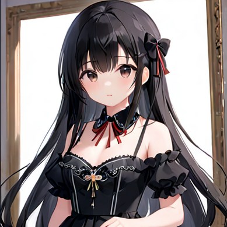
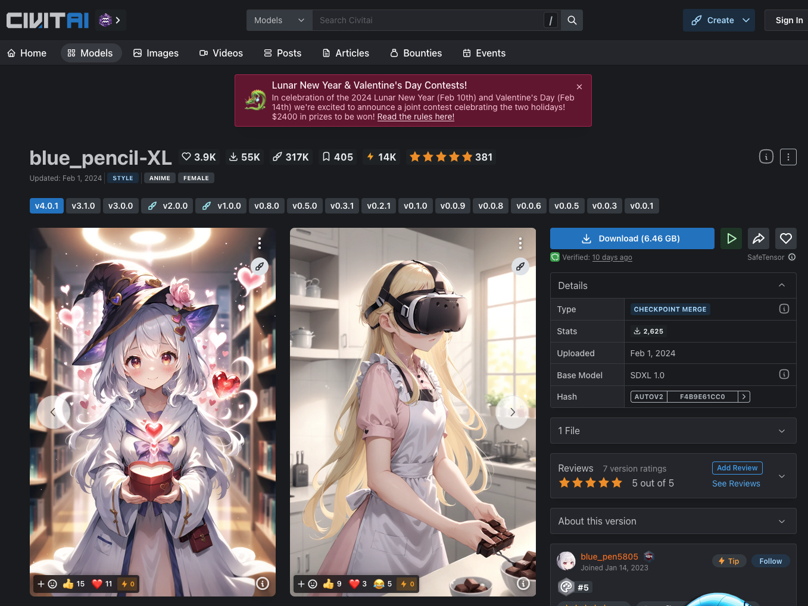
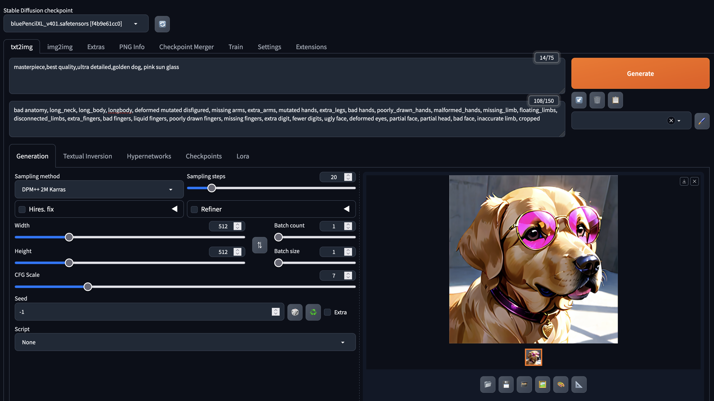

+++
title = 'MacでStable Diffusion Web UIを使う方法'
description = 'MacにStable Diffusion Web UIをインストールしてローカルで画像生成する方法を解説。Python環境構築からモデル配置、画像生成までの手順を紹介します。'
date = 2024-02-12T11:24:59+09:00
draft = false
categories = ['Engineering']
tags = ['Stable Diffusion', 'AI']
+++

## 概要
この記事ではMacにStable Diffusion Web UIをインストールし、ローカルで利用する方法を紹介します。

## Stable Diffusionとは
Stable Diffusionは、AIを用いた画像処理技術の一つです。
テキストを入力することで、そのテキストに対応する画像を生成することができます。

以下は、Stable Diffusionのアニメ画像を出力できるモデルで、黒髪の少女を出力した例です。



## Stable Diffusionを利用する方法

Stable Diffusionを利用方法は大きく以下の2種類に分かれます。

* [Hugging Face](https://huggingface.co/), [Dream Studio](https://beta.dreamstudio.ai/generate) などのwebアプリケーションを利用する
* ローカルでStable Diffusion Web UIを利用する

本記事では、ローカルでStable Diffusion Web UIを利用する方法を紹介します。
試しに使って見るだけであれば、webアプリケーションを利用するのが簡単ですが、画像を大量に生成する場合は制限があったり、費用がかかったりするので、
ある程度の量を生成する場合はローカルで利用することをおすすめします。

## Stable Diffusion Web UIをローカルで利用する方法
今回はAUTOMATIC1111氏が公開している、[stable-diffusion-web-ui](https://github.com/AUTOMATIC1111/stable-diffusion-webui)を利用します。

1. 動作する環境を整える
2. stable-diffusion-web-uiをインストールする
3. モデルファイルを配置する
4. stable-diffusion-web-uiを起動し画像を生成する

### 1. 動作する環境を整える
まずは、ローカルで動作させるにあたって、Pythonやその他ライブラリが必要であるため、homebrewを利用してインストールします。

homebrewのインストール

```bash
/bin/bash -c "$(curl -fsSL https://raw.githubusercontent.com/Homebrew/install/HEAD/install.sh)"
```

homebrewのパスを通す

```bash
export PATH="$PATH:/opt/homebrew/bin/"
```

関連ライブラリのインストール

```shell
brew install cmake protobuf rust pyenv git wget
```

pyenvを用いて、Python環境のセットアップ。複数のPythonのバージョンを使い分けられるようにします。
このあとにvenvも登場します。pythonの環境の構築については[こちら](https://bossagyu.com/blog/004-python-setup/)の記事を参考にしてください。

```shell
pyenv install 3.10.6
pyenv local 3.10.6
```


### 2. stable-diffusion-web-uiをインストールする
git cloneでリポジトリをクローンします。

```shell
git clone https://github.com/AUTOMATIC1111/stable-diffusion-webui.git
cd stable-diffusion-webui
```

venvで仮想環境を設定、他の環境を汚さないようにします。
```shell
python -m venv venv
source venv/bin/activate
```

これで環境構築は完了です。

### 3. モデルファイルを配置する
次にモデルファイルをダウンロードしてきて、`stable-diffusion-webui/models/Stable-diffusion/` ディレクトリに配置します。  
モデルファイルは以下のサイトからダウンロードできます。

* [Civitai](https://dream-studio.tech/)
* [Hugging Face](https://huggingface.co/models?pipeline_tag=text-to-image&sort=downloads)

今回はCivilaiから `bule_pencil` のモデルをダウンロードしてきて利用してみます。

Civilaiの検索窓に`bule_pencil`と入力し、検索します。  
検索結果から`bule_pencil`を選択し、`Download`ボタンをクリックします。




ダウンロードしたモデルをディレクトリに移します。

```shell
mv ~/Downloads/bluePencilXL_v401.safetensors models/Stable-diffusion/
```

### 4. stable-diffusion-web-uiを起動し画像を生成する
最後に、stable-diffusion-web-uiを起動し、画像を生成します。

```shell
./webui.sh
```

起動したらプロンプトにテキストを入力し、画像を生成します。

1. Stable Diffusion checkpointで先程ダウンロードしたbule_pencilを選択します。
2. promptに生成したい画像の要素を入力します
3. Negative promptに生成してほしくない画像の要素を入れます。
4. Generateをクリックします。



ピンク色のサングラスをかけた犬という意味のテキストを入力してみたところ、ちゃんと出力されました。  
もちろん、他のテキストを入力することで、様々な画像を生成することができます。

## まとめ
この記事ではMacにStable Diffusion Web UIをインストールし、ローカルで利用する方法を紹介しました。
ローカルで利用することで、制限があったり、費用がかかったりするwebアプリケーションを利用するよりも、自由に画像を生成することができます。
