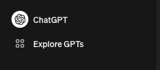
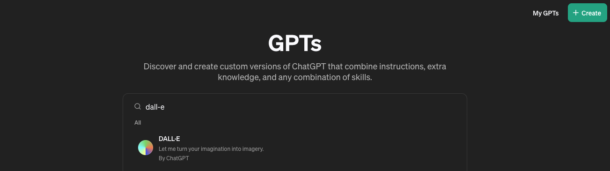
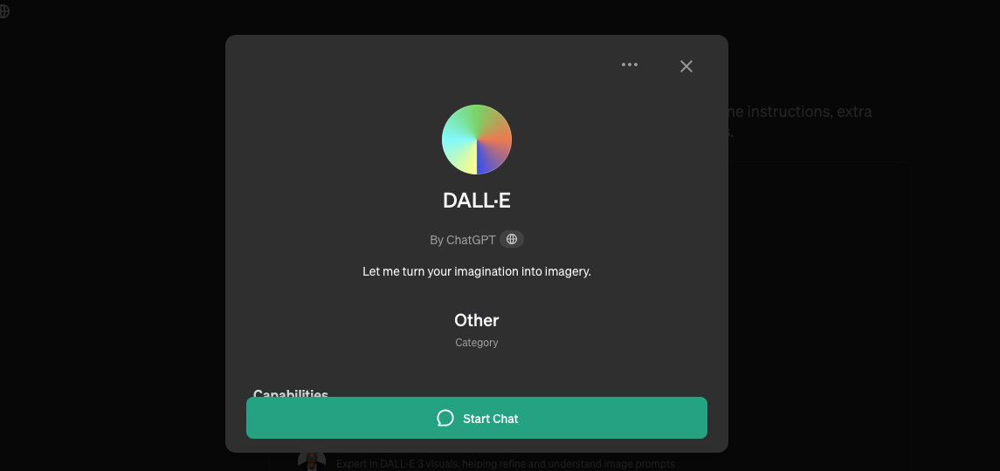
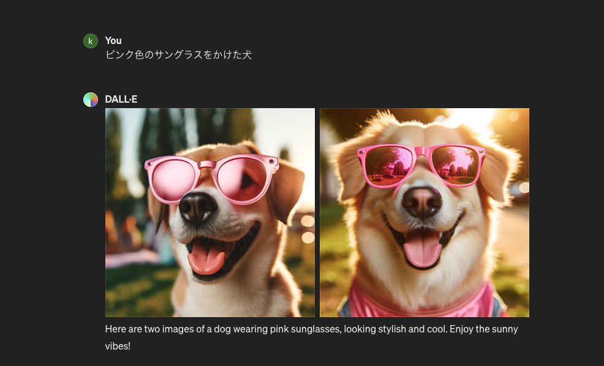
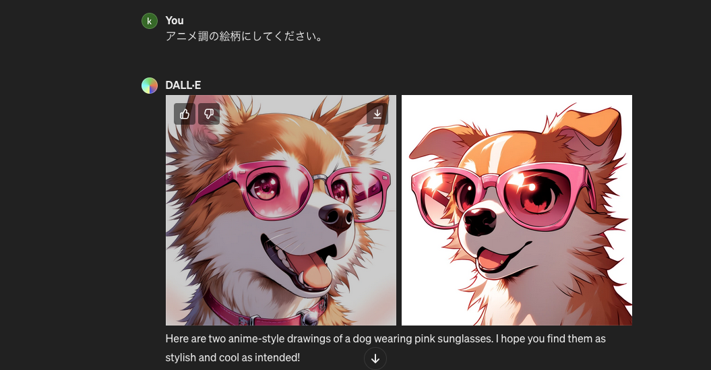
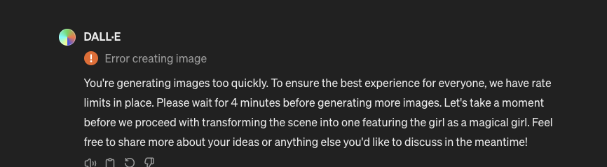

+++
title = 'Generating Images with ChatGPT'
date = 2024-03-31T17:35:07+09:00
draft = false
categories = ['Engineering']
tags = ['ChatGPT', 'Image Generation']
+++

## Overview
Unlike image generation models like Stable Diffusion, ChatGPT can also generate images. This guide explains how to do so.  
For those using the ChatGPT paid plan, images can be generated without any additional fees, allowing for the creation of commercially usable images with minimal effort.

This tutorial utilizes DALL-E, a feature of ChatGPT Plus, to generate images.
For more information on DALL-E3, refer to OpenAI's [official page](https://openai.com/dall-e-3).

## How to Generate Images

Select "Explore GPTs" from the sidebar.

Type `DALL-E` in the search bar and perform a search.

Click on "Start Chat" to begin generating images.

Then, simply enter a description of the image you wish to generate, and the image will be created.

## Generating an Example Image

Let's try generating an image of a dog wearing pink sunglasses, as used in this blog.

For a start, we'll input the prompt "a dog wearing pink sunglasses".

Additionally, like using regular ChatGPT, you can refine the generated image by entering additional prompts.  
This time, let's input "Make it anime-style" as an additional prompt.

You can see it has an anime-style appearance.
By issuing further orders, you can gradually get closer to your desired image.

## Conclusion
This guide has explained how to generate images using ChatGPT.

It's incredibly convenient to be able to generate images easily, but just like with Stable Diffusion, it's quite challenging to get the exact image you want without adjusting the prompts.
The need for prompt refinement seems less critical than with Stable Diffusion, suggesting a possible difference in model performance.

Note that if you overuse this feature, you may receive a message asking you to wait, indicating there may be a limit on the number of generations.
For those with access to a machine source, running Stable Diffusion locally on a Mac might still be the best option.

