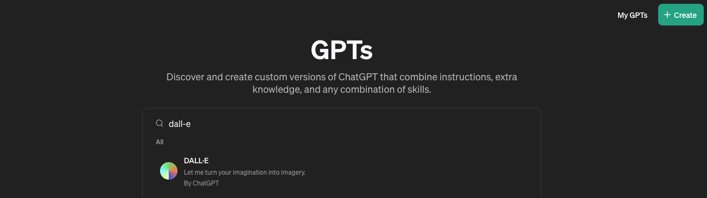

+++
title = 'chatGPTで画像を生成する方法'
date = 2024-03-31T17:35:07+09:00
draft = false
categories = ['Engineering']
tags = ['chatGPT', '画像生成']
+++

## 概要
Stable Diffusionなどの画像生成用のモデルではなく ChatGPTでも画像が生成できるので、生成の方法を説明します。  
ChatGPTの有料プランを利用している人は新たに課金などせずに利用できるので、大きな手間をかけずに商用利用可能な画像を生成できます。

今回は、DALL-Eと呼ばれるChatGPT Plusの機能を利用して画像を生成します。
DALL-E3については OpenAI の[公式ページ](https://openai.com/dall-e-3)を参照してください。

## 画像生成の方法

サイドバーから 「Explore GPTs」を選択

検索窓で `DALL-E` と入力し検索を行う。

`Start Chat` をクリックし、画像生成を開始する。

後は、生成したい画像の説明を入力するだけで画像が生成されます。  

## 実際に画像を生成してみる

このブログで利用されている、ピンク色のサングラスを掛けた犬の画像を生成してみます。

とりあえず `ピンク色のサングラスをかけた犬` というプロンプトで打ってみます。

また、普段のChat GPTを使うように出力された画像に対して追加のプロンプトを入力することで加工できます。  
今回は `アニメ調にしてください` と追加のプロンプトを入力してみます。

アニメ調になっているのがわかります。
このように追加のオーダーをすることでどんどん目的の画像に近づけつつ生成できます。

## まとめ
今回はChatGPTを利用して画像を生成する方法を説明しました。

簡単に画像を生成できるのが非常に便利ですが、Stable Diffusion同様期待する画像を出力することはなかなか難しく、プロンプトを調整する必要があります。
Stable Diffusionを利用したときよりもプロンプトを工夫しなくても良い画像が生成されるので、このあたりはモデルの性能差なのかなと思いました。  

ちなみに、やりすぎると以下のような文章が出力され、待つように言われるので生成回数には制限がついていそうです。
マシンソースがある人はやっぱりローカルmacでStable Diffusionでやるのが良さそうですね。

