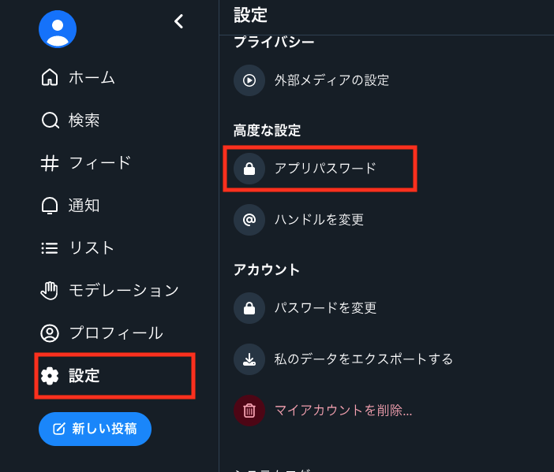
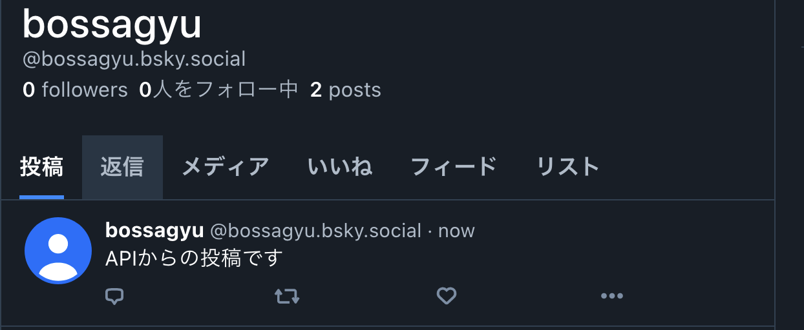

+++
title = 'Using Bluesky API for Automated Posting with Python'
date = 2024-04-07T23:52:09+09:00
draft = false
categories = ['Development']
tags = ['Python', 'Bluesky', 'API']
+++

## Overview

[Bluesky](https://bsky.app/) is a decentralized social network initiated by Jack Dorsey, former CEO of Twitter.  
Built on the [ATProtocol](https://atproto.com/docs), it can be seen as a decentralized version of Twitter, where there is no central authority. The move towards decentralization in social networking might be following the trend seen in finance, from centralized to decentralized cryptocurrencies.

This article compiles methods for executing Bluesky's API using Python.

## Steps to Use Bluesky API

* Generating an API Password
* Setting Up Python Environment
* Script Creation and Execution

## Generating an API Password

To execute the API, you need to generate an API password using your account name.

First, verify your account name displayed on your Bluesky profile, minus the initial `@`. For instance, if my account is `bossagyu.bsky.social`, that's the account name I'll use.


Next, generate the API execution password.

Navigate to `Settings` → `App Passwords` to create the password.



Click `Add App Password`.


After clicking the add button, name your password for management purposes. The name itself is not the password but helps with organization.


Once the password is generated, ensure to copy it as it won't be displayed again. If you forget to copy, simply generate a new one.

## Setting Up the Python Environment

Prepare your Python environment. For setup using venv, refer to [this guide](https://bossagyu.com/blog/004-paython-setup/).

According to the [official documentation](https://atproto.com/docs), Python version 3.7.1 or higher is required.

After setting up your environment, install the ATProtocol library to interact with it.

```shell
$ pip install atproto
```

Verify installation:

```shell
$ pip list | grep atproto            

atproto           0.0.46
```

With this, preparation is complete.

## Script Creation and Execution

Create a script to post on Bluesky.

```python
from atproto import Client

client = Client()

user_name = "bossagyu.bsky.social"
password = "*******" # Enter the generated API password

client.login(user_name, password)
client.send_post(text='Posting via API.')

```
That's all for the script. You can now post to Bluesky using the API.

Let's run it:

```shell
$ python post_bluesky.py
```

Upon execution, the post successfully appears on Bluesky.



## Conclusion

This article covered how to execute Bluesky's API using Python.  
While Bluesky is still under development, unlike Twitter, which has limitations and charges for API use, Bluesky offers a free API, making it an excellent option for those looking to experiment with social networking APIs at no cost.

