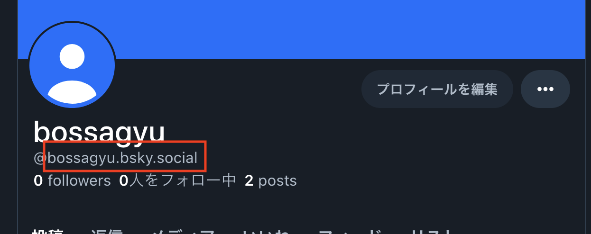
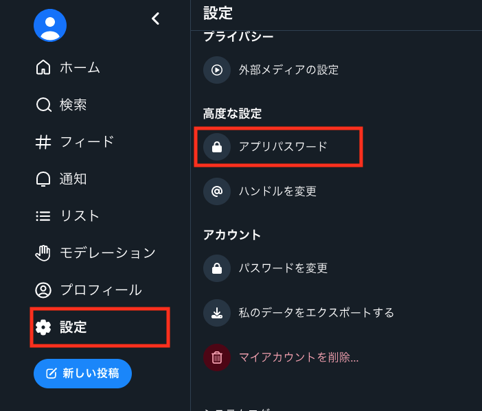
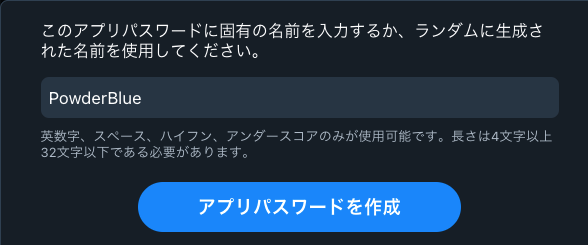
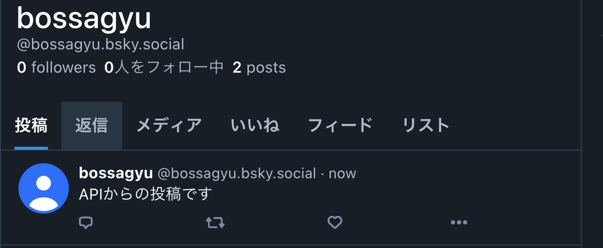

+++
title = 'PythonでBluesky APIを用いて自動投稿する方法'
date = 2024-04-07T23:52:09+09:00
draft = false
categories = ['Development']
tags = ['Python', 'Bluesky', 'API']
+++

## 概要

[Bluesky](https://bsky.app/) とは、旧Twitter社の元CEOであるジャック・ドーシー氏が立ち上げた分散型SNSです。  
[ATProtocl](https://atproto.com/docs) というプロトコルを用いて構築されたSNSで、簡単に言うと中央管理者がいないTwitterのようなものです。  
昨今の中央集権である通貨から分散型である仮想通貨への流れのように、SNSも分散型への流れがあるのかなと感じます。

今回はそんなBlueskyのAPIをPythonを用いて実行する方法をまとめます。

## Bluesky APIを使うまでのステップ

* API実行用パスワードの生成
* Python実行環境の構築
* スクリプトの作成と実行

## API実行用パスワードの生成

APIを実行するためにはアカウント名とAPI実行用のパスワードの発行が必要です。

まずは、APIの実行に利用するアカウント名を確認します。  
アカウント名は、Blueskyにログインした際に画像の箇所に表示される名前となります。  
この際先頭の `@` は不要で、私のアカウントであれば `bossagyu.bsky.social` がアカウント名となります。



次に、API実行用のパスワードを生成します。

API実行用パスワードは `設定` → `アプリパスワード` から生成できます。



その後、`アプリパスワードを追加` をクリックします。


追加ボタンを押すと、パスワードにつける名前を聞かれます。  
これ自体はパスワードとならず管理を容易にすることが目的なので、特にこだわりがなければそのまま作成します。  



パスワードが生成されるので、これをコピーしておきます。  
ちなみに二度と表示されなくなるので、コピーを忘れないようにしましょう。コピーを忘れた場合は再生成すればOKです。

## Python実行環境の構築

Pythonの実行環境をセットアップしてください。  
venvを用いたセットアップについては、[こちら](https://bossagyu.com/blog/004-paython-setup/) にまとめています。  

[公式ドキュメント](https://atproto.blue/en/latest/) によると、Pythonのバージョンは3.7.1以上を利用する必要がありますので注意しておいてください。  

Pythonの実行環境が整えば、ATProtocolを利用するためにライブラリをインストールします。

```shell
$ pip install atproto
```

インストールの確認

```shell
$ pip list | grep atproto            

atproto           0.0.46
```

これで準備は完了です。

## スクリプトの作成と実行

Blueskyに投稿するスクリプトを作成します。

```python
from atproto import Client

client = Client()

user_name = "bossagyu.bsky.social"
password = "*******" # 生成したAPI実行用パスワードを入力

client.login(user_name, password)
client.send_post(text='APIからの投稿です')

```
スクリプトはこれだけで、APIを用いてBlueskyに投稿できます。

それでは実行してみましょう。

```shell
$ python post_bluesky.py
```

実行すると、Blueskyに以下のように無事投稿されました。



## まとめ

今回はPythonを用いてBlueskyのAPIを実行する方法をまとめました。  
Blueskyはまだまだ開発途中のSNSですが、TwitterはAPIを課金しないと使えないなどの制約があるので、無料でAPIを使ってSNSで遊んでみたいという方にはおすすめです。

