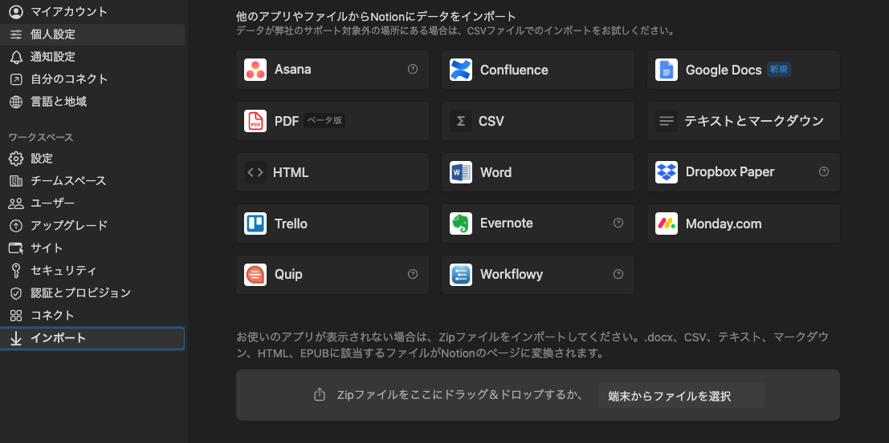

+++
title = 'Migrating from Evernote to Notion'
date = 2024-04-29T19:32:38+09:00
draft = true
categories = ['Engineering']
tags = ['Evernote', 'Notion']
+++

## Overview
As of April 26, 2024, Evernote's Japanese corporation was dissolved, which does not mean Evernote services are ending, but it certainly raises concerns about its future. Given the many restrictions on Evernote's free plan and the cost associated with its premium plan, I considered switching to another note-taking app.

After some deliberation, I chose Notion for the following reasons:
1. It possesses all essential features required for a note-taking app and is a viable alternative to Evernote.
2. Notion's free plan is less restrictive and adequate for my needs, allowing me to cut costs on premium subscriptions.
3. Notion offers an import tool specifically for Evernote, facilitating a low-cost migration.

This article details the process of migrating from Evernote to Notion.

## Migration Process

Notion provides an Evernote import feature, making the migration straightforward:

### Accessing Import Settings
Navigate to `Settings` in the Notion app.

Click `Settings` to access the `Import` option.

After clicking on `Import`, select `Evernote` as the import source.

### Importing Notebooks
Once linked, you can choose the notebooks you wish to import. Here's a critical tip:
While it seems possible to select multiple notebooks for import, doing so may lead to excessively long processing times or even errors. Therefore, it is advisable to import one notebook at a time.

Even when importing one notebook at a time, be prepared for the process to take several hours, depending on the size of the notebook.

### Post-Import Review
After the import, the formatting, images, links, and labels were preserved well, allowing for a seamless transition to Notion.

## Conclusion

This guide outlines the steps to migrate from Evernote to Notion. With Notion's robust free features and straightforward migration process, it's worth considering if you're looking to move away from Evernote.