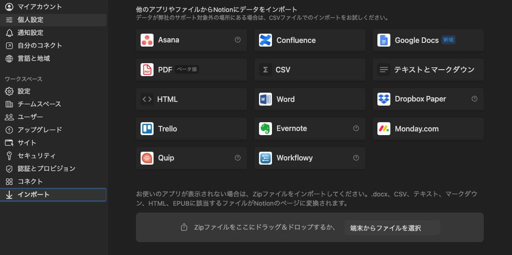

+++
title = 'EvernoteからNotionへの移行方法'
description = 'EvernoteからNotionへ簡単に移行する方法を解説。Notionのインポート機能を使った手順と、ノートブックを一つずつ移行する際の注意点を紹介します。'
date = 2024-04-29T19:32:38+09:00
draft = false
categories = ['Engineering']
tags = ['Evernote', 'Notion']
+++

## 概要
2024年4月26日にEvernoteの日本法人が解散するなど、Evernoteのサービスは終了しないもののいよいよEvernoteの雲行きが怪しくなってきました。  
Evernoteは無料プランに制限が多いため、有料プランを利用しており費用がかさむこともあり、他のノートアプリへの移行を検討しました。  

以下の理由から移行先はNotionを選択しました。 

1. ノートアプリととして基本的な機能を揃えており、Evernoteの代替として十分利用できる。
2. Notionは無料プランの制限がゆるく無料プランで十分使え移行することで有料プランの費用を削減できる。
3. Evernoteからインポートする機能がNotion側で提供されており、移行コストが非常に低い。

今回はEvernoteからNotionへの移行方法をまとめます。

## 移行方法

NotionにはEvernoteからのインポート機能が提供されているため、こちらを利用するだけで簡単に移行ができます。

Notionのアプリのメニューから `設定` を選択します。

設定をクリックすると `インポート` が表示されるので、これをクリックします。  
インポートをクリックすると、インポート元のアプリケーションが表示されるので、ここで `Evernote` を選択します。

連携が完了するとインポートするノートブックが選択できるようになります。

ここでの注意点です！  
ノートブックを複数選択すると一気にインポートできるように見えるのですが、一気にインポートするととんでもない時間がかかった挙げ句エラーが出ることがあります。
このため、ノートブックは一つづつインポートすることをおすすめします。

一つずつインポートした場合でも、ノートの分量が多いと数時間かかったりするので、気長に対応するとよいです。

インポート後は特に体裁が崩れることもなく、画像やリンク、ラベルも正常にインポートされるので問題なく利用ができました。  

## まとめ

EvernoteからNotionへの移行方法をまとめました。
無料で機能が豊富なNotionに簡単に移行できるので、ぜひ移行を検討してみてください。
