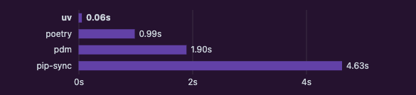

+++
title = "Setting Up a Python Development Environment on Mac with UV"
date = 2025-01-01T14:39:53+09:00
draft = false
categories = ["Engineering"]
tags = ["Python", "uv"]
+++

## Overview
This article introduces how to set up a Python development environment on Mac using UV.

## What is UV?
UV is a package management tool announced in mid-2024.  
It is written in Rust and is characterized by faster performance compared to other package managers.



For official explanations, please refer to [this site](https://docs.astral.sh/uv/).

## Usage

### Installing UV

```shell
curl -LsSf https://astral.sh/uv/install.sh | sh
```

Add UV to your PATH:

```shell
source $HOME/.local/bin/env (sh, bash, zsh)
source $HOME/.local/bin/env.fish (fish)
```

Verify installation:

```shell
uv --version
uv 0.5.13 (c456bae5e 2024-12-27)
```

### How to Use

Create a virtual environment:

```shell
uv venv
```

Activate the virtual environment:

```shell
source .venv/bin/activate
```

Install packages:

```shell
uv pip install <package name>
```

For more details on UV, refer to the [official documentation](https://docs.astral.sh/uv/).

## Summary
This article explained how to set up a Python development environment on Mac.  
As of January 2025, UV is both fast and easy to use, making it a valuable tool for setting up a Python development environment.