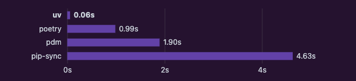

+++
title = 'MacでUVを用いてPythonの開発環境を構築する'
date = 2025-01-01T14:39:53+09:00
draft = false
categories = ['Engineering']
tags = ['Python', 'uv']
+++

## 概要
MacでPythonの開発環境を構築する方法を紹介します。

## uvとは

2024年中旬に発表されたばかりのパッケージ管理ツール。  
Rustで書かれており、他のパッケージ管理マネージャよりも高速であることが特徴です。



公式の説明は [こちら](https://docs.astral.sh/uv/) を参照してください。

## 利用方法

### uvのインストール

```shell
curl -LsSf https://astral.sh/uv/install.sh | sh
```

PATHを通す

```shell
source $HOME/.local/bin/env (sh, bash, zsh)
source $HOME/.local/bin/env.fish (fish)
```

インストールできたことを確認

```shell
uv --version
uv 0.5.13 (c456bae5e 2024-12-27)
```

### 使い方

仮想環境の作成

```shell
uv venv
```

仮想環境のアクティベート

```shell
source .venv/bin/activate
```

パッケージのインストール

```
uv pip install <package name>
```

uvの細かい説明は [公式のドキュメント](https://docs.astral.sh/uv/) を参照してください。


## まとめ

MacでPythonの開発環境を構築する方法を紹介しました。
uvは高速かつ使いやすいので2025年1月時点ではPythonの開発環境構築において有用なツールと言えるでしょう。
