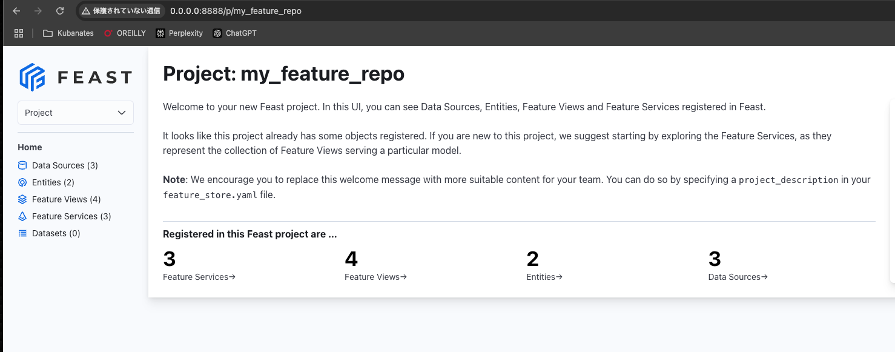
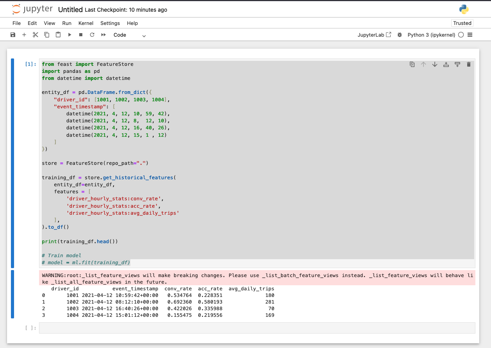

+++
title = 'Running the Feast Tutorial on macOS'
description = 'How to set up Feast Feature Store on macOS. Covers installation, UI launch, training data retrieval, and materialization to the online store.'
date = 2025-01-13T11:49:53+09:00
lastmod = 2025-01-13T11:49:53+09:00
draft = false
categories = ['Engineering']
tags = ['Feast', 'Python']
+++

## Overview
In this article, we’ll follow the [Feast tutorial](https://github.com/feast-dev/feast) and run it on a Mac.

## Prerequisites
Refer to [Setting up a Python development environment on Mac with UV](https://bossagyu.com/blog/032-python-uv/) to prepare your environment. Once you’ve set up UV, install Feast in that environment.

## Installing Feast and Launching the UI

```shell
uv pip install feast==0.40.1
```

> **Note**  
> As of 2025/01/13, there is a known bug in Feast causing the UI to fail on the latest version. ([Issue](https://github.com/feast-dev/feast/issues/4743))

Initialize a Feature Repository:

```shell
feast init my_feature_repo

Creating a new Feast repository in /Users/kouhei/Program/ML/feast/my_feature_repo.
```

You’ll see a new repository like this:

```shell
tree my_feature_repo
.
└── my_feature_repo
    ├── README.md
    ├── __init__.py
    └── feature_repo
        ├── __init__.py
        ├── data
        │    └── driver_stats.parquet
        ├── example_repo.py
        ├── feature_store.yaml
        └── test_workflow.py
```

Apply the repository configuration:

```shell
cd my_feature_repo/feature_repo
feast apply
```

Then launch the Feast UI:

```shell
feast ui
```

Access `http://0.0.0.0:8888/p/my_feature_repo` to see the interface.



## Manipulating Data in Feast

### 1. Creating a Training Dataset
Starting from step 5 in the tutorial, you’ll use Jupyter Notebook. Install it first:

```shell
uv pip install jupyter
```

Launch the notebook:

```shell
jupyter notebook
```

In a Jupyter Notebook, run the following code to create a dataset for training:

```python
from feast import FeatureStore
import pandas as pd
from datetime import datetime

entity_df = pd.DataFrame.from_dict({
    "driver_id": [1001, 1002, 1003, 1004],
    "event_timestamp": [
        datetime(2021, 4, 12, 10, 59, 42),
        datetime(2021, 4, 12, 8, 12, 10),
        datetime(2021, 4, 12, 16, 40, 26),
        datetime(2021, 4, 12, 15, 1, 12)
    ]
})

store = FeatureStore(repo_path=".")

training_df = store.get_historical_features(
    entity_df=entity_df,
    features=[
        'driver_hourly_stats:conv_rate',
        'driver_hourly_stats:acc_rate',
        'driver_hourly_stats:avg_daily_trips'
    ],
).to_df()

print(training_df.head())

# Train model
# model = ml.fit(training_df)
```

Below is an example of the notebook output:



### 2. Materializing the Online Store
To populate the Online Store, run:

```shell
feast materialize 1970-01-01T00:00:00Z 2025-01-04T01:24:24Z
```

> **Note**  
> In the provided sample, the command `feast materialize-incremental $CURRENT_TIME` may not work, so we specify a broader time range here.

```shell
01/04/2025 10:28:40 AM root WARNING: _list_feature_views will make breaking changes. ...
Materializing 2 feature views from 1970-01-01 09:00:00+09:00 to 2025-01-04 10:24:24+09:00 into the sqlite online store.

driver_hourly_stats_fresh:
  0%|                                                                         | 0/5 ...
100%|███████████████████████████████████████████████████████████████| 5/5 ...
driver_hourly_stats:
100%|███████████████████████████████████████████████████████████████| 5/5 ...
```

### 3. Retrieving Data from the Online Store
Use Jupyter Notebook to fetch data from the Online Store:

```python
from pprint import pprint
from feast import FeatureStore

store = FeatureStore(repo_path=".")

feature_vector = store.get_online_features(
    features=[
        'driver_hourly_stats:conv_rate',
        'driver_hourly_stats:acc_rate',
        'driver_hourly_stats:avg_daily_trips'
    ],
    entity_rows=[{"driver_id": 1001}]
).to_dict()

pprint(feature_vector)

# Make prediction
# model.predict(feature_vector)
```

Example output:

```shell
{'acc_rate': [0.5004482269287109],
 'avg_daily_trips': [691],
 'conv_rate': [0.3067885637283325],
 'driver_id': [1001]}
```


We’ve successfully materialized data in the Online Store and fetched it using Feast.

## Summary
We followed the Feast tutorial to prepare training data, materialize that data into the Online Store, and retrieve it. By managing both training and inference datasets in Feast, you can avoid training-serving skew, enhancing the consistency of your ML workflows.

## Related Articles

- [Setting Up a Python Development Environment on Mac with UV](/en/blog/032-python-uv/) (Python environment setup)
- [Setting Up a Local Environment Using Pyenv and venv](/en/blog/004-python-setup/) (traditional Python environment setup)
- [How to Read Parquet Files on macOS](/en/blog/031-read-parquet-file/) (Feast sample data format)
