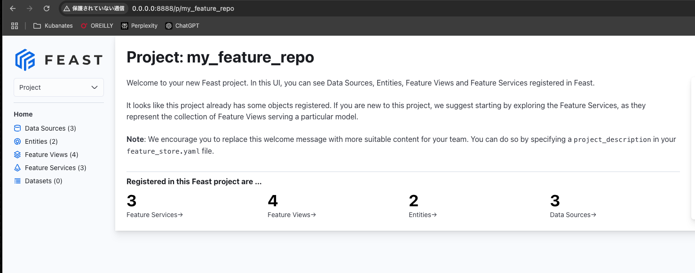
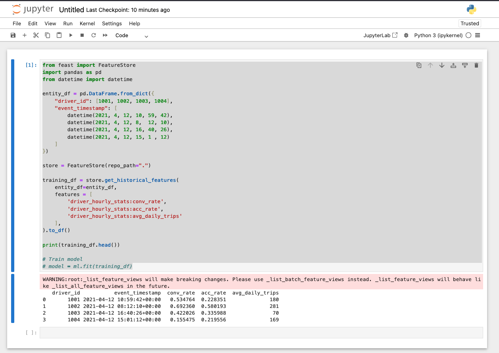

+++
title = 'FeastのチュートリアルをMacで実行する'
description = 'MacでFeast Feature Storeをセットアップする方法を解説。インストールからUI起動、トレーニングデータの取得、オンラインストアへのマテリアライズまで紹介します。'
date = 2025-01-13T11:49:53+09:00
lastmod = 2025-01-13T11:49:53+09:00
draft = false
categories = ['Engineering']
tags = ['Feast', 'Python']
+++

## 概要
今回は[Feastのチュートリアル](https://github.com/feast-dev/feast)を参考に、Macで実行してみます。

## 事前準備
[MacでUVを用いてPythonの開発環境を構築する](https://bossagyu.com/blog/032-python-uv/)を参考にUVを用いて開発できる環境を整えてください。

uvで構築した環境にfeastをインストールする。

## FeastのインストールからUIの起動まで

```shell
> uv pip install feast==0.40.1
```
2025/01/13現在、Feastにバグがあり最新版をインストールするとUIが起動しないので注意してください。([issue](https://github.com/feast-dev/feast/issues/4743))

Feature Repositoryを作成する。

```shell
> feast init my_feature_repo

Creating a new Feast repository in /Users/kouhei/Program/ML/feast/my_feature_repo.
```

以下のようなリポジトリが作成される。

```shell
> tree
.
└── my_feature_repo
    ├── README.md
    ├── __init__.py
    └── feature_repo
        ├── __init__.py
        ├── data
        │    └── driver_stats.parquet
        ├── example_repo.py
        ├── feature_store.yaml
        └── test_workflow.py
```

Feastのチュートリアルの設定を反映する。

```shell
cd my_feature_repo/feature_repo
feast apply
```

Feastのuiを起動する。

```shell
> feast ui
```

http://0.0.0.0:8888/p/my_feature_repo へアクセスするとUIが表示されます。



## Feastへのデータ操作

5.Build a training datasetからは jupyter notebookを使うのでインストールしておきます。

```shell
uv pip install jupyter
```

notebookの起動

```shell
jupyter notebook
```

Jupyter Notebookで以下の内容を実行し、トレーニングに利用するデータセットを準備する。

```python
from feast import FeatureStore
import pandas as pd
from datetime import datetime

entity_df = pd.DataFrame.from_dict({
    "driver_id": [1001, 1002, 1003, 1004],
    "event_timestamp": [
        datetime(2021, 4, 12, 10, 59, 42),
        datetime(2021, 4, 12, 8,  12, 10),
        datetime(2021, 4, 12, 16, 40, 26),
        datetime(2021, 4, 12, 15, 1 , 12)
    ]
})

store = FeatureStore(repo_path=".")

training_df = store.get_historical_features(
    entity_df=entity_df,
    features = [
        'driver_hourly_stats:conv_rate',
        'driver_hourly_stats:acc_rate',
        'driver_hourly_stats:avg_daily_trips'
    ],
).to_df()

print(training_df.head())

# Train model
# model = ml.fit(training_df)
```

NoteBookでの実行結果は以下の通りとなります。



オンラインストアにデータを入れる。  
サンプルで記載されている `feast materialize-incremental $CURRENT_TIME` ではうまく動作しなかったので、データ全体を対象とするように時刻の範囲を設定しています。


```shell
feast materialize 1970-01-01T00:00:00Z 2025-01-04T01:24:24Z

01/04/2025 10:28:40 AM root WARNING: _list_feature_views will make breaking changes. Please use _list_batch_feature_views instead. _list_feature_views will behave like _list_all_feature_views in the future.
Materializing 2 feature views from 1970-01-01 09:00:00+09:00 to 2025-01-04 10:24:24+09:00 into the sqlite online store.

driver_hourly_stats_fresh:
  0%|                                                                         | 0/5 [00:00<?, ?it/s]01/04/2025 10:28:40 AM root WARNING: Cannot use sqlite_vec for vector search
100%|███████████████████████████████████████████████████████████████| 5/5 [00:00<00:00, 1299.11it/s]
driver_hourly_stats:
100%|███████████████████████████████████████████████████████████████| 5/5 [00:00<00:00, 4569.95it/s]
```

Jupyter Notebookを用いてオンラインストアからデータを取得します。

```shell
from pprint import pprint
from feast import FeatureStore

store = FeatureStore(repo_path=".")

feature_vector = store.get_online_features(
    features=[
        'driver_hourly_stats:conv_rate',
        'driver_hourly_stats:acc_rate',
        'driver_hourly_stats:avg_daily_trips'
    ],
    entity_rows=[{"driver_id": 1001}]
).to_dict()

pprint(feature_vector)

# Make prediction
# model.predict(feature_vector)
```

出力結果

```shell
{'acc_rate': [0.5004482269287109],
 'avg_daily_trips': [691],
 'conv_rate': [0.3067885637283325],
 'driver_id': [1001]}
```


Feastのオンラインストアにマテリアラズして、オンラインストアからデータを取得することができました。

## まとめ
本記事では、Feastのチュートリアルを基に、Mac上でFeastを使用してデータを管理する方法を紹介しました。UVを使ったPython開発環境の構築から、Feastのインストール、UIの起動、そしてトレーニングデータの準備やオンラインストアへのデータマテリアライズまで、一連の操作を丁寧に解説しました。  
これにより、Feastを利用してトレーニングデータと推論データの管理を効率的に行うことができ、トレーニングスキューの回避が可能になります。