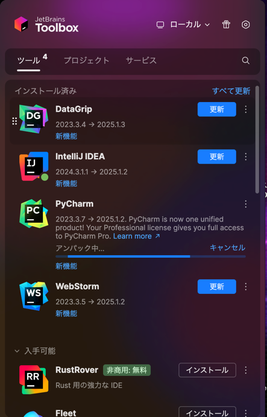

+++
title = 'How to Upgrade JetBrains Products to a Major Version'
description = 'How to upgrade JetBrains products like IntelliJ and PyCharm to a major version. Use JetBrains Toolbox App to update while preserving settings.'
date = 2025-06-12T20:46:53+09:00
draft = false
+++

## Overview
When upgrading major versions of JetBrains products such as IntelliJ or PyCharm, you need to manually download the new version.  
This article explains how to update easily while preserving your settings.

## Installing the JetBrains Toolbox App
When upgrading to a major version of a JetBrains product, it is recommended to use the [JetBrains Toolbox App](https://www.jetbrains.com/toolbox-app/).

Download and install the JetBrains Toolbox App from the link above.

## Update
Launch the JetBrains Toolbox App and select the product you want to update.

In this example, we will update PyCharm. Click on it to start the update.

Once the update is complete, the new version will be installed as shown below.

## Summary
When upgrading to a major version of a JetBrains product, using the JetBrains Toolbox App makes the update process easy.

