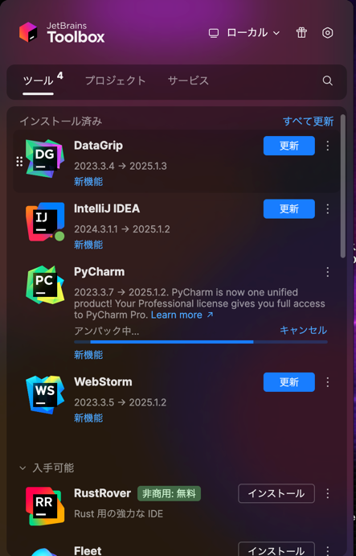

+++
title = 'JetBrains製品のメジャーバージョンを上げる方法'
description = 'IntelliJやPyCharmなどJetBrains製品のメジャーバージョンアップ方法を解説。JetBrains Toolbox Appを使って設定を引き継ぎながら簡単にアップデートする手順を紹介します。'
date = 2025-06-12T20:46:53+09:00
lastmod = 2025-06-12T20:46:53+09:00
draft = false
categories = ['Engineering']
tags = ['JetBrains', 'IntelliJ']
+++

## 概要
IntelliJやPyCharmなどの JetBrains製品のメジャーバージョンを上げる際にサイドダウンロードするが必要になります。
設定を引き継ぎつつなるべく簡単にアップデートする方法について説明します。

## JetBrains Toolbox Appのインストール
JetBrains製品のメジャーバージョンを上げる際は、[JetBrains Toolbox App](https://www.jetbrains.com/toolbox-app/)を利用することをおすすめします。

上記リンクよりJetBrains Toolbox Appをダウンロードし、インストールします。

## アップデート
JetBrains Toolbox Appを起動し、アップデートしたい製品を選択します。

今回はPyCharmをの更新を行うのでクリックすると、アップデートが開始されます。

アップデートが完了すると、以下のように新しいバージョンがインストールされます。

## まとめ
JetBrains製品のメジャーバージョンを上げる際は、JetBrains Toolbox Appを利用することで簡単にアップデートが可能です。
