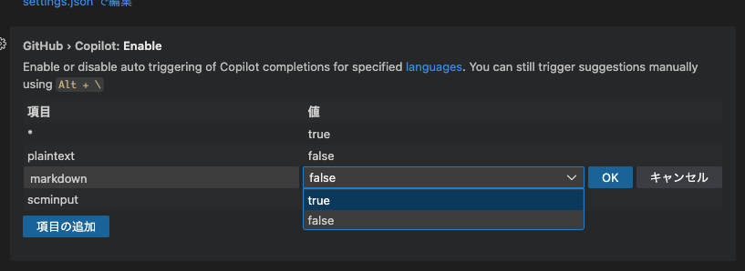

+++
title = 'How to Enable GitHub Copilot for Markdown'
description = 'How to enable GitHub Copilot suggestions for Markdown files in VSCode. A quick settings change to boost your Markdown editing productivity.'
date = 2025-07-21T10:00:00+09:00
lastmod = 2025-07-21T10:00:00+09:00
draft = false
categories = ['Engineering']
tags = ['GitHub Copilot', 'Markdown', 'VSCode']
+++

## Overview
By default, GitHub Copilot is disabled for Markdown files.  
This article explains how to enable GitHub Copilot for Markdown.

## Configuring GitHub Copilot
Open the GitHub Copilot plugin page in VSCode.

Click the gear icon to open the settings.

In the settings screen, change `markdown` from `false` to `true`.  

## Summary
Enabling GitHub Copilot for Markdown makes editing Markdown files more efficient.  
You can enable it easily by changing the settings in VSCode, so give it a try!
