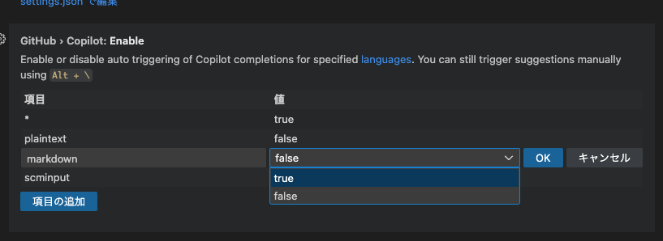

+++
title = 'GitHub CopilotをMarkdownで有効にする方法'
description = 'VSCodeでGitHub CopilotのMarkdown補完を有効にする設定方法を解説。デフォルトで無効になっている設定を変更し、Markdownファイル編集を効率化する手順を紹介します。'
date = 2025-07-21T10:00:00+09:00
lastmod = 2025-07-21T10:00:00+09:00
draft = true
categories = ['Engineering']
tags = ['GitHub Copilot', 'Markdown', 'VSCode']
+++

## 概要
Github Copilotは、デフォルトではMarkdownファイルでの補完が無効になっています。
この記事では、GitHub CopilotをMarkdownで有効にする方法を説明します。

## GitHub Copilotの設定
VSCodeでGitHub Copilotのプラグインのページを開きます。

歯車アイコンをクリックし、設定を開きます。

設定画面で `mardown` が `false` になっているので `true` に変更します。

## まとめ
GitHub CopilotをMarkdownで有効にすることで、Markdownファイルの編集がより効率的になります。
VSCodeの設定を変更するだけで簡単に有効化できるので、ぜひ試してみてください。

## 関連記事

- [VSCodeでGithub Copilotを使いこなす完全ガイド](/blog/017-vscode-copilot/)
- [Github CopilotをChat toolを使って便利に使う方法](/blog/042-github-copilot/)