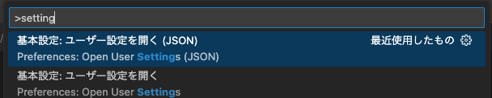
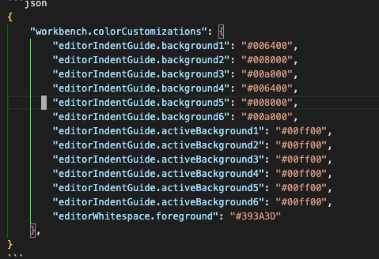

+++
title = 'How to Customize Indent Guides in VSCode'
date = 2025-07-22T21:01:13+09:00
draft = false
categories = ['Engineering']
tags = ['VSCode']
+++

## Overview
In Visual Studio Code (VSCode), you can customize the colors of indent guides.  
This article explains how to change the colors of indent guides.  
While extensions like indent-rainbow often have issues such as guides being cut off, you can achieve this simply by editing the VSCode settings file.

## How to Change the Colors of Indent Guides

### Open the Settings File
Open the VSCode settings file.  
Open the `Command Palette` (Ctrl + Shift + P) and select `Preferences: Open Settings (JSON)`.



### Add Settings
Add the following settings as a reference:
```json
{
    "workbench.colorCustomizations": {
        "editorIndentGuide.background1": "#006400",
        "editorIndentGuide.background2": "#008000",
        "editorIndentGuide.background3": "#00a000",
        "editorIndentGuide.background4": "#006400",
        "editorIndentGuide.background5": "#008000",
        "editorIndentGuide.background6": "#00a000",
        "editorIndentGuide.activeBackground1": "#00ff00",
        "editorIndentGuide.activeBackground2": "#00ff00",
        "editorIndentGuide.activeBackground3": "#00ff00",
        "editorIndentGuide.activeBackground4": "#00ff00",
        "editorIndentGuide.activeBackground5": "#00ff00",
        "editorIndentGuide.activeBackground6": "#00ff00",
        "editorWhitespace.foreground": "#393A3D"
    },
}
```

| Setting                          | Description                                                                 |
|-----------------------------------|-----------------------------------------------------------------------------|
| `editorIndentGuide.background<number>` | Specifies the background color of the indent guide.<br>`<number>` corresponds to the depth of the indent. |
| `editorIndentGuide.activeBackground<number>` | Specifies the background color of the active indent guide.<br>`<number>` corresponds to the depth of the indent. |
| `editorWhitespace.foreground`     | Specifies the color of whitespace characters.                               |

After adding the settings, the colors of the indent guides will be changed as shown in the image below.  


## Conclusion
In VSCode, you can easily customize the colors of indent guides.  
By simply adding the necessary items to the settings file, you can change them to your preferred colors.  
This improves code readability and makes it easier to visually grasp the depth of indents.  
Give it a try!
