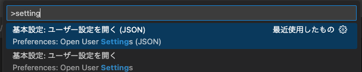

+++
title = 'vscodeのインデントガイドをカスタマイズする方法'
description = 'VSCodeのインデントガイドの色を設定ファイルでカスタマイズする方法を解説。拡張機能なしでインデントの深さごとに色を変更し、コードの可読性を向上させる手順を紹介します。'
date = 2025-07-22T21:01:13+09:00
lastmod = 2025-07-22T21:01:13+09:00
draft = false
categories = ['Engineering']
tags = ['VSCode']
+++

## 概要
Visual Studio Code (VSCode) では、インデントガイドの色をカスタマイズすることができます。
この記事では、インデントガイドの色を変更する方法を説明します。
indent-rainbowのような拡張機能はインデントガイドが途中で切れるなどの問題がありましたが、VSCodeの設定ファイルを編集するだけで実現できます。

## インデントガイドの色を変更する方法

### 設定ファイルを開く
VSCodeの設定ファイルを開きます。
`Command Palette` (Ctrl + Shift + P) を開き、`Preferences: Open Settings (JSON)` を選択します。



### 設定を追加する
以下を参考に設定を追加します。
```json
{
    "workbench.colorCustomizations": {
        "editorIndentGuide.background1": "#006400",
        "editorIndentGuide.background2": "#008000",
        "editorIndentGuide.background3": "#00a000",
        "editorIndentGuide.background4": "#006400",
        "editorIndentGuide.background5": "#008000",
        "editorIndentGuide.background6": "#00a000",
        "editorIndentGuide.activeBackground1": "#00ff00",
        "editorIndentGuide.activeBackground2": "#00ff00",
        "editorIndentGuide.activeBackground3": "#00ff00",
        "editorIndentGuide.activeBackground4": "#00ff00",
        "editorIndentGuide.activeBackground5": "#00ff00",
        "editorIndentGuide.activeBackground6": "#00ff00",
        "editorWhitespace.foreground": "#393A3D"
    },
}
```


| 設定内容                          | 説明                                                                 |
|-----------------------------------|----------------------------------------------------------------------|
| `editorIndentGuide.background<number>` | インデントガイドの背景色を指定します。<br>`<number>` は インデントの深さに対応します。 |
| `editorIndentGuide.activeBackground<number>` | アクティブなインデントガイドの背景色を指定します。<br>`<number>` はインデントの深さに対応します。 |
| `editorWhitespace.foreground`     | 空白文字の色を指定します。                                           |

実際に設定を追加した結果以下の画像のようにインデントガイドの色が変更されます。


## まとめ
VSCodeでは、インデントガイドの色を簡単にカスタマイズできます。
設定ファイルに必要な項目を追加するだけで、好みの色に変更できます。
これにより、コードの可読性が向上し、インデントの深さを視覚的に把握しやすくなります。
ぜひ試してみてください。