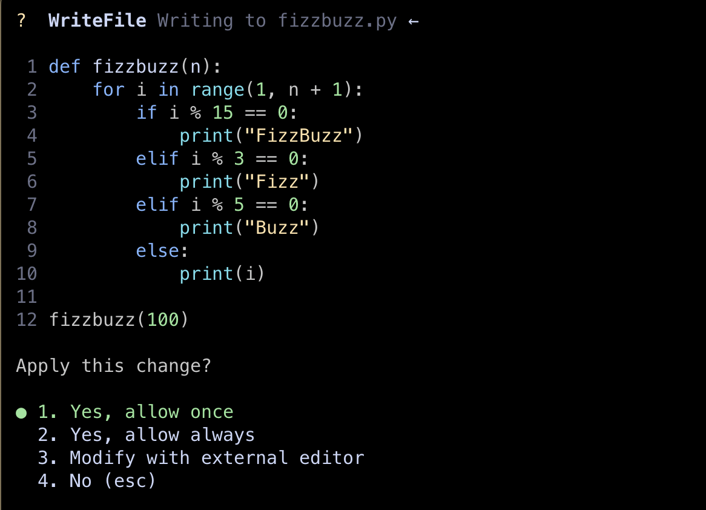

+++
title = 'How to Set Up Gemini CLI on Mac'
date = 2025-07-22T23:21:19+09:00
draft = true
categories = ['Engineering']
tags = ['Gemini CLI', 'AI']
+++

## Overview
This article explains how to set up Gemini CLI.

## How to Set Up Gemini CLI
### 1. Install Gemini CLI

Use Homebrew to install Gemini CLI.

```bash
brew install gemini-cli
```

### 2. Configure Gemini CLI

Run the `gemini` command.

```bash
gemini
```


You can choose to log in or enter an API key to use it.  
This time, we will select "Login with Google" to log in.


The screen transitions to the login page.


Once logged in, Gemini CLI becomes available.


### 3. How to Use Gemini CLI

You can ask questions or request tasks using Gemini CLI.

This time, we will ask it to solve the FizzBuzz problem.

```bash
gemini
```

Type "Please write the code for FizzBuzz" into the Gemini CLI prompt.


After inputting, Gemini will generate the code for you.



## Summary
By setting up Gemini CLI, you can use Gemini AI directly from the terminal.  
This enables efficient development and task management using AI.  
Gemini CLI is very user-friendly and makes terminal work smoother.  
Give it a try!
