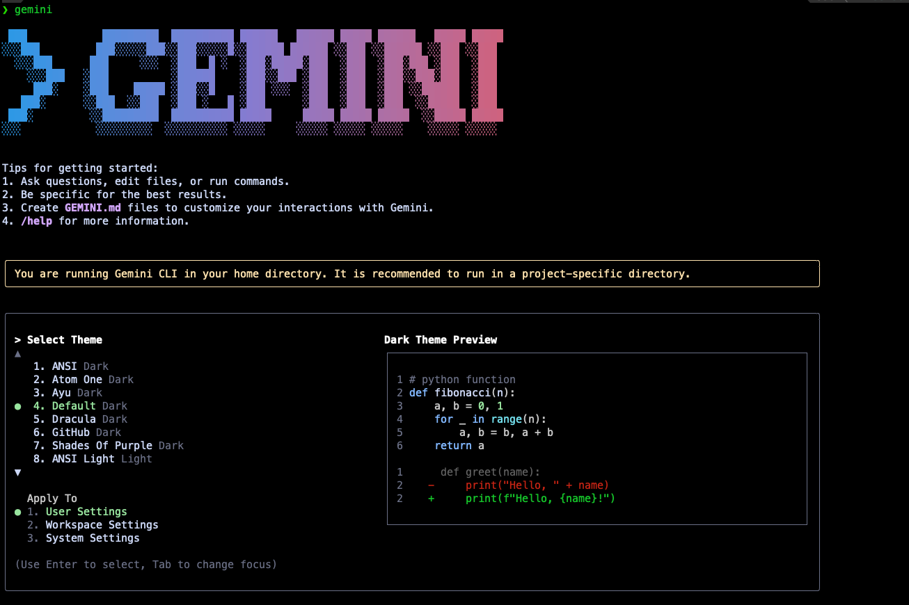
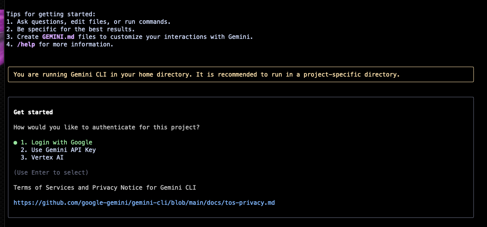
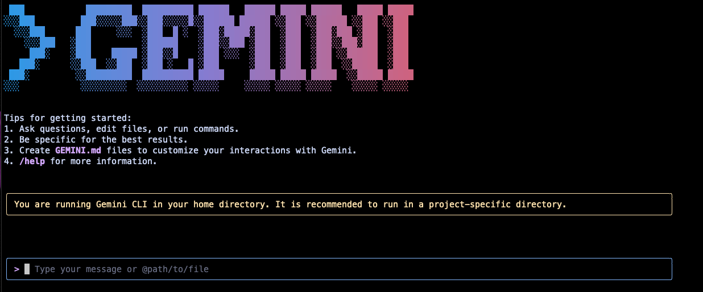
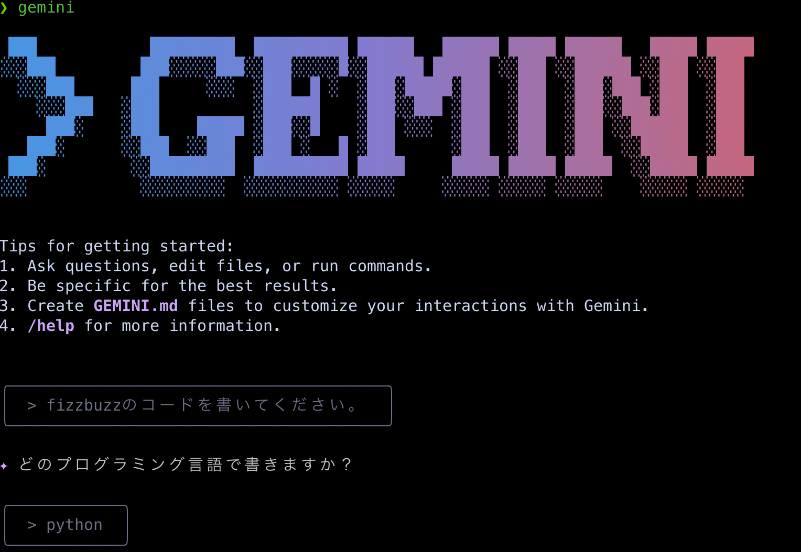
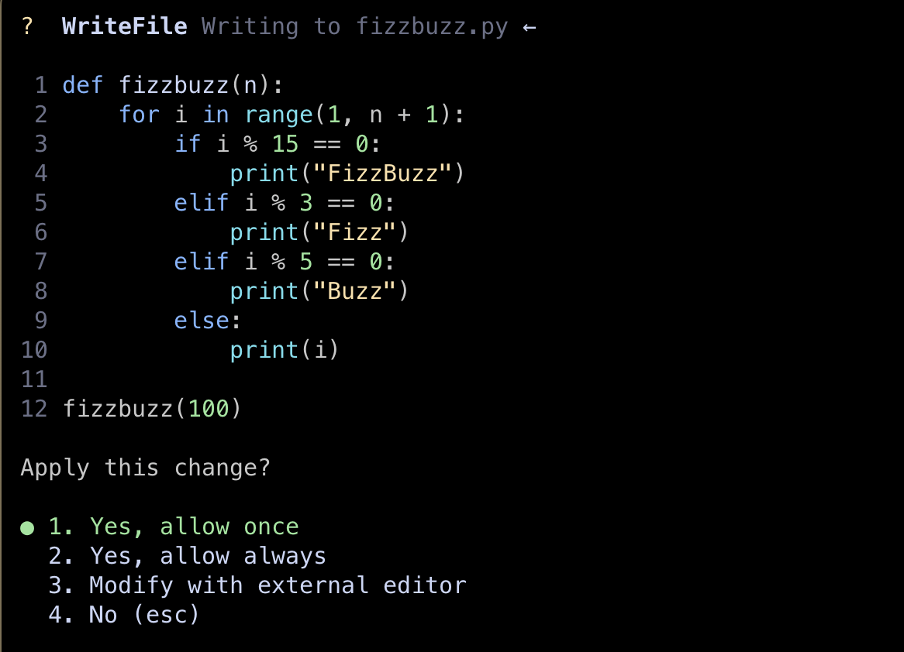

+++
title = 'MacでGemini CLIをセットアップする方法'
date = 2025-07-22T23:21:19+09:00
draft = true
categories = ['Engineering']
tags = ['Gemini CLI', 'AI']
+++

## 概要
Gemini CLIをセットアップする方法を説明します。

## Gemini CLIのセットアップ方法
### 1. Gemini CLIのインストール

Homebrewを使用してGemini CLIをインストールします。

```bash
brew install gemini-cli
```

### 2. Gemini CLIの設定

geminiコマンドを実行しします

```bash
gemini
```


ログインして利用するか、APIキーを入力して利用するかを選択できます。
今回はLogin wiht Googleを選択してログインして利用します。



ログイン画面に遷移するのでアカウント情報を入力します。
ログインが完了すると、Gemini CLIが利用可能になります。



### 3. Gemini CLIの使用方法

Gemini CLIを使用して質問すること作業を依頼することができます。

今回はfizzbuzzの問題を解いてもらいます。

```bash
gemini
```

fizzbuzzのコードを書いてくださいとgemini CLIのプロンプトに入力します。



入力すると実際にgeminiがコードを生成してくれます。



## まとめ
Gemini CLIをセットアップすることで、ターミナル上で直接Gemini AIを利用することができます。
これにより、AIを活用した開発や作業の効率化が可能になります。
Gemini CLIは非常に使いやすく、
ターミナルでの作業をよりスムーズにしてくれます。
ぜひ試してみてください。