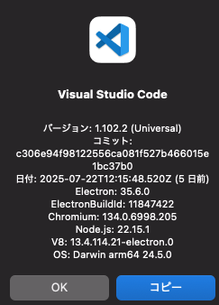

+++
title = 'Visual Studio Codeのアップデート方法'
description = 'MacでVisual Studio Codeをアップデートする手順を解説。GUIでの更新、Homebrewを使ったコマンドラインでの更新、自動アップデート設定、トラブルシューティングまで網羅的に紹介します。'
date = 2025-07-27T18:12:16+09:00
draft = true
categories = ['Engineering']
tags = ['VSCode', 'update']
+++

## 概要

MacでVisual Studio Code（VSCode）のアップデート方法を説明します。
GUIからの手動アップデートに加え、コマンドラインでの更新方法や自動アップデートの設定についても解説します。

## GUIからアップデートする方法

1. VSCodeを起動します。
2. Code → 「更新の確認」を選択します。
   英語の場合は Code → "Check for Updates" を選択します。


更新が始まると以下のような画面になります。


ダウンロードが完了すると「再起動して更新」が表示されます。

再起動後「Visual Studio Codeのバージョン情報」をクリックして、バージョンが上がっていることを確認します。



## コマンドラインからアップデートする方法

Homebrewを使ってVSCodeをインストールしている場合は、ターミナルからアップデートできます。

### 現在のバージョンを確認

```bash
code --version
```

### Homebrewでアップデート

```bash
brew upgrade --cask visual-studio-code
```

Homebrewでインストールしていない場合は、既存のVSCodeをアプリケーションフォルダから削除した上で、以下のコマンドでHomebrewによる管理に切り替えられます。
設定やインストール済みの拡張機能はアカウント同期で復元できるため、削除しても問題ありません。

```bash
brew install --cask visual-studio-code
```

以降は `brew upgrade --cask visual-studio-code` でアップデートが可能になります。

## 自動アップデートの設定

VSCodeにはアップデートの挙動を制御する `update.mode` 設定があります。
設定画面を開き（`Cmd + ,`）、`update mode` で検索すると変更できます。

| 設定値 | 挙動 |
|--------|------|
| `default` | バックグラウンドで自動的にアップデートをダウンロード・インストールします |
| `manual` | アップデートの確認は行いますが、インストールは手動で行います |
| `start` | VSCodeの起動時のみアップデートを確認します |
| `none` | 自動アップデートを完全に無効化します |

settings.jsonで直接設定する場合は以下のように記述します。

```json
{
    "update.mode": "default"
}
```

特別な理由がない限り `default` のままで問題ありません。

## トラブルシューティング

### アップデートが「更新の確認」に表示されない

自動アップデートが無効になっている可能性があります。
設定の `update.mode` が `none` になっていないか確認してください。

### アップデートのダウンロードが失敗する

プロキシやファイアウォールの設定が原因の場合があります。
以下の設定を確認してください。

```json
{
    "http.proxy": "http://proxy.example.com:8080",
    "http.proxyStrictSSL": false
}
```

### アップデート後に拡張機能が動作しなくなった

拡張機能の互換性の問題が考えられます。以下の手順を試してください。

1. コマンドパレット（`Cmd + Shift + P`）を開く
2. 「Extensions: Disable All Installed Extensions」を実行
3. VSCodeを再起動
4. 拡張機能を1つずつ有効化して問題のある拡張機能を特定する

### それでも解決しない場合

VSCodeを再インストールすることで解決する場合があります。

```bash
# Homebrewの場合
brew reinstall --cask visual-studio-code
```

設定やインストール済みの拡張機能はGitHubアカウントやMicrosoftアカウントで同期しておくと、再インストール後に自動で復元されます。

## まとめ

VSCodeのアップデート方法について解説しました。

- **GUI**: Code → 「更新の確認」から数クリックで完了
- **コマンドライン**: `brew upgrade --cask visual-studio-code` で一括更新
- **自動アップデート**: `update.mode` 設定で挙動を制御可能

定期的にアップデートを行うことで、新機能やセキュリティパッチを利用できます。
アップデート後は、必ずバージョン情報を確認して、正しくアップデートが行われたかをチェックしましょう。
