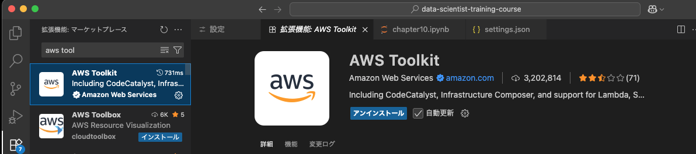
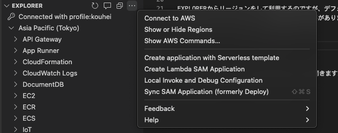
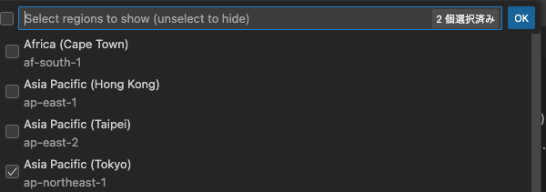

+++
title = 'How to Use AWS Toolkit in Visual Studio Code'
description = 'How to install AWS Toolkit in VSCode and configure Tokyo region (ap-northeast-1). Covers AWS Explorer region switching steps.'
date = 2025-08-11T20:33:30+09:00
draft = false
categories = ['Engineering']
tags = ['VSCode', 'AWS', 'toolkit']
+++

## Overview
This article explains how to use AWS Toolkit in Visual Studio Code (VSCode).

## Installing AWS Toolkit

1. Launch VSCode.
2. Click the Extensions icon in the sidebar on the left.
3. Type "AWS Toolkit" in the search bar and select "AWS Toolkit for Visual Studio Code" from the list.
4. Click the "Install" button to start the installation.

## How to Set the Asia Pacific Tokyo Region

By default, the region is set to us-east-1, so you need to change it to Asia Pacific Tokyo.  
The procedure is a bit tricky, so follow the steps below:

1. In the left sidebar, open "AWS Explorer" and click the hamburger menu.

2. Click `Show or Hide Regions`.
3. From the displayed list, select "Asia Pacific (Tokyo) ap-northeast-1".

Now, you can use AWS Toolkit in the Asia Pacific Tokyo region.
