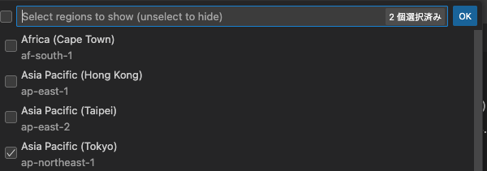

+++
title = 'Visual Studio CodeでAWS Toolkitを使う方法'
description = 'VSCodeにAWS Toolkitをインストールし、東京リージョン(ap-northeast-1)を設定する方法を解説。AWS Explorerでリージョンを切り替える手順を紹介します。'
date = 2025-08-11T20:33:30+09:00
lastmod = 2025-08-11T20:33:30+09:00
draft = false
categories = ['Engineering']
tags = ['VSCode', 'AWS', 'toolkit']
+++

## 概要
この記事では、Visual Studio Code (VSCode) で AWS Toolkit を使用する方法について説明します。

## AWS Toolkitのインストール

1. VSCodeを起動します。
2. 左側のサイドバーから拡張機能アイコンをクリックします。
3. 検索バーに「AWS Toolkit」と入力し、表示されたリストから「AWS Toolkit for Visual Studio Code」を選択します。
4. 「インストール」ボタンをクリックして、インストールを開始します。

## Asia Pacific Tokyoリージョンを設定する方法

EXPLORERからリージョンをして利用するのですが、デフォルトではus-east-1が選択されているため、Asia Pacific Tokyoリージョンを設定する必要があります。
少しわかりにくいので、以下の手順で設定します。

1. 左側のサイドバーから「AWS Explorer」から、ハンバーガーメニューをクリックします。

2. `Show or Hide Regions`をクリックします。
3. 表示されたリストから「Asia Pacific (Tokyo) ap-northeast-1」を選択します。

これで、AWS ToolkitがAsia Pacific Tokyoリージョンで使用できるようになります。
