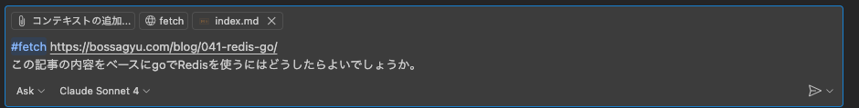

+++
title = 'How to Use GitHub Copilot More Effectively with Chat Tools'
description = 'How to use GitHub Copilot Chat tools in VSCode for better productivity. Covers codebase search, selection, terminal commands, and web page fetching.'
date = 2025-10-07T08:39:41+09:00
lastmod = 2025-10-07T08:39:41+09:00
draft = false
categories = ['Engineering']
tags = ['GitHub Copilot', 'VSCode', 'Chat tool']
+++

## Overview

This article explains how to use Chat Tools to make GitHub Copilot Chat even more powerful.
By using Chat Tools, you can perform various tasks directly within your conversation with Copilot.

## What Are Chat Tools?

Chat Tools are features within GitHub Copilot Chat that allow you to execute special tasks.
For example, you can fetch terminal outputs or retrieve information from URLs—all from within the chat interface.

## How to Use Chat Tools

Here’s how to use Chat Tools in VSCode.

Basically, you can execute them by typing a command in the following format:

```
#<command> <args>
```



That’s all there is to it.

## Common Chat Tool Commands

Below are some of the most useful Chat Tool commands:

| Command               | Description                                                                                                                          |
| --------------------- | ------------------------------------------------------------------------------------------------------------------------------------ |
| `#codebase`           | Searches the entire current workspace.                                                                                               |
| `#selection`          | Adds the currently selected code in the editor as context to the prompt.                                                             |
| `#terminal_selection` | Adds the selected output in the terminal as context to the prompt.<br>Useful when referencing terminal output after an error occurs. |
| `#fetch_webpage`      | Retrieves content from a specified URL and adds it as context to the prompt.                                                         |

There are many more useful commands available—refer to the official documentation for details:

* [GitHub Copilot Chat Tools](https://code.visualstudio.com/docs/copilot/reference/copilot-vscode-features#_chat-tools)

## Summary

In this article, we covered how to use Chat Tools within GitHub Copilot Chat.
By taking advantage of these tools, you can make Copilot even more convenient and powerful—so give them a try!
