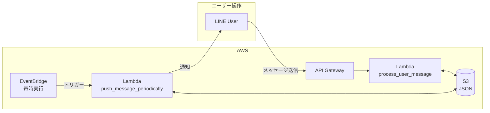

+++
title = 'AWS Lambda + LINE Botで掃除リマインダーを作る'
description = 'AWS Lambda、API Gateway、S3、EventBridgeを使った掃除リマインダーLINE Botの実装解説。SAMによるサーバーレス構成とPythonコードを詳しく紹介します。'
date = 2026-02-07T19:00:00+09:00
lastmod = 2026-02-07T19:00:00+09:00
draft = false
categories = ['Engineering']
tags = ['LINE BOT', 'AWS Lambda', 'Python', 'SAM', 'S3']
+++

## 概要

家族で使える掃除リマインダーLINE Botを作りました。この記事では、その技術的な実装について解説します。

完成したBotはこちら: [掃除リマインダーBot](/blog/045-clean-bot/)

## アーキテクチャ



### 使用サービス

| サービス | 用途 |
|----------|------|
| API Gateway (HTTP API) | LINEのWebhook受信 |
| Lambda | メッセージ処理、定期通知 |
| S3 | ユーザーごとのタスクデータ保存 |
| EventBridge | 定期実行スケジュール |

### なぜこの構成か

- **サーバーレス**: 使った分だけ課金、運用負荷ゼロ
- **S3**: RDSより安価、JSONでシンプルに管理
- **SAM**: Infrastructure as Codeでデプロイ管理

## プロジェクト構成

```
clean-bot/
├── lib/                      # コアモジュール
│   ├── clean_task.py         # タスク状態管理
│   ├── message.py            # コマンドパーサー
│   ├── line.py               # LINE API
│   └── s3_client.py          # S3操作
├── test/                     # テスト
├── line_clean_bot.py         # Lambdaエントリーポイント
├── template.yaml             # SAMテンプレート
└── Makefile                  # 開発コマンド
```

## 実装のポイント

### 1. Lambdaエントリーポイント

2つのLambda関数を用意しています。

```python
# line_clean_bot.py

def process_user_message(event, context):
    """LINEメッセージのWebhookハンドラ"""
    body = json.loads(event.get('body'))

    # ユーザーID or グループIDを取得
    if body['events'][0]['source']['type'] == 'user':
        line_id = body['events'][0]['source']['userId']
    else:
        line_id = body['events'][0]['source']['groupId']

    message = body['events'][0]['message']['text']

    # S3からユーザーデータを取得
    s3client = S3client(BUCKET_NAME)
    obj_key = line_id + '.json'
    if not s3client.check_exist_object(obj_key):
        s3client.update_object(obj_key, '{"tasks": []}')

    # メッセージを処理して返信
    # ...

def push_message_periodically(event, context):
    """定期実行でリマインド通知を送信"""
    current_time = datetime.now() + timedelta(hours=9)  # JST

    s3client = S3client(BUCKET_NAME)
    for obj_list in s3client.list_objects():
        clean_task = CleanTask(s3client.get_object_body(obj_list.key))

        # 通知条件を満たすか判定
        if clean_task.should_notify(current_time):
            # メッセージ送信
            # ...
```

### 2. タスクの期限管理

「前回から何日経過したか」でタスクの期限を判定します。

```python
# lib/clean_task.py

def __evaluate_cleanup_timing(self, task):
    """タスクが期限切れか判定"""
    task_time = datetime.strptime(task['updated_at'], self.date_format)
    return (self.now - task_time).days >= int(task['duration'])

def get_todo_tasks(self):
    """期限切れのタスク一覧を取得"""
    return [task for task in self.tasks
            if not task.get('paused', False)
            and self.__evaluate_cleanup_timing(task)]
```

### 3. 通知判定ロジック

ユーザーが設定した曜日・時間にのみ通知します。

```python
def should_notify(self, current_time):
    """通知すべきか判定"""
    if not self.notification['enabled']:
        return False

    # 曜日チェック
    weekday_map = {0: '月', 1: '火', 2: '水', 3: '木', 4: '金', 5: '土', 6: '日'}
    current_weekday = weekday_map[current_time.weekday()]
    if current_weekday not in self.notification['days']:
        return False

    # 時刻チェック
    if current_time.hour < self.notification['hour']:
        return False

    # 今日すでに通知済みかチェック
    # ...

    return True
```

### 4. コマンドパーサー

シンプルな文字列分割でコマンドを解析します。

```python
# lib/message.py

def get_return_message(self, message, s3client):
    task_operation = self.__get_task_operation_name(message)  # 最初の単語
    task_name = self.__get_task_name(message)                  # 2番目の単語

    if task_operation == '完了':
        for task_name in self.__get_all_task_name(message):
            self.clean_task.update_task_updated_at(task_name)
        s3client.update_object(self.object_keyname, self.clean_task.get_json())
        return "完了しました"

    if task_operation == '追加':
        duration = self.__get_duration(message)  # 3番目の単語
        self.clean_task.add_task(task_name, duration)
        # ...
```

### 5. データ構造（JSON）

ユーザーごとに1つのJSONファイルをS3に保存します。

```json
{
  "tasks": [
    {
      "task_name": "掃除機",
      "updated_at": "2024-01-01 12:00:00",
      "duration": 7,
      "paused": false
    }
  ],
  "notification": {
    "enabled": true,
    "days": ["月", "水", "金"],
    "hour": 7,
    "last_notified_at": "2024-01-01 07:00:00"
  }
}
```

## SAMテンプレート

AWS SAMを使ってインフラを定義します。

```yaml
# template.yaml
AWSTemplateFormatVersion: '2010-09-09'
Transform: AWS::Serverless-2016-10-31

Parameters:
  ChannelAccessToken:
    Type: String
    NoEcho: true
  BucketName:
    Type: String
    Default: your-bucket-name

Globals:
  Function:
    Runtime: python3.11
    Timeout: 300
    Environment:
      Variables:
        CHANNEL_ACCESS_TOKEN: !Ref ChannelAccessToken
        BUCKET_NAME: !Ref BucketName

Resources:
  # メッセージ処理Lambda
  ProcessUserMessageFunction:
    Type: AWS::Serverless::Function
    Properties:
      Handler: line_clean_bot.process_user_message
      CodeUri: .
      Policies:
        - S3CrudPolicy:
            BucketName: !Ref BucketName
      Events:
        ApiEvent:
          Type: HttpApi
          Properties:
            Path: /process_user_message
            Method: ANY

  # 定期通知Lambda
  PushMessagePeriodicallyFunction:
    Type: AWS::Serverless::Function
    Properties:
      Handler: line_clean_bot.push_message_periodically
      CodeUri: .
      Policies:
        - S3CrudPolicy:
            BucketName: !Ref BucketName
      Events:
        ScheduleEvent:
          Type: Schedule
          Properties:
            Schedule: cron(0 * * * ? *)  # 毎時0分
```

## デプロイ方法

### 1. 事前準備

- AWS CLIの設定
- SAM CLIのインストール
- LINE Messaging APIのチャンネルアクセストークン取得

### 2. ビルド & デプロイ

```bash
# ビルド
sam build

# デプロイ
sam deploy --parameter-overrides ChannelAccessToken=your_token
```

### 3. LINE Webhook設定

デプロイ後に出力されるAPIエンドポイントを、LINE DevelopersコンソールでWebhook URLとして設定します。

## ローカル開発

```bash
# ローカルAPIサーバー起動
sam local start-api --env-vars env.json

# テスト実行
curl -X POST http://localhost:3000/process_user_message \
  -H "Content-Type: application/json" \
  -d @events/line_message.json
```

## コスト

月間コストの目安（100ユーザー想定）:

| サービス | コスト |
|----------|--------|
| Lambda | ほぼ無料（無料枠内） |
| API Gateway | ほぼ無料（無料枠内） |
| S3 | 数円/月 |
| **合計** | **数円〜数十円/月** |

## まとめ

- サーバーレス構成で運用コストを最小化
- S3 + JSONでシンプルなデータ管理
- SAMでインフラをコード管理
- 「日数経過」という掃除に適した期限管理

ソースコードは[GitHub](https://github.com/bossagyu/line-clean-bot)で公開しています。

## 関連記事

- [掃除リマインダーBotの使い方](/blog/045-clean-bot/)
- [LINE Messaging APIの登録と使い方](/blog/002-line-messaging-api/)
