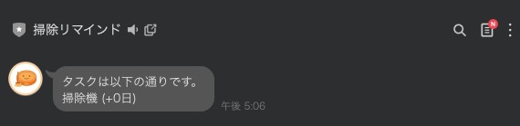
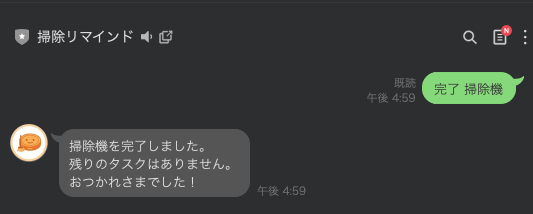

+++
title = '【初心者向け】掃除リマインダーBotの使い方チュートリアル'
description = '掃除リマインダーLINE Botの基本的な使い方を5ステップで解説。友だち追加からタスク完了まで、画像付きで分かりやすく説明します。'
date = 2026-02-07T20:00:00+09:00
draft = false
categories = ['Product']
tags = ['LINE BOT', 'Clean Bot', '掃除', 'チュートリアル']
+++

## このチュートリアルで学べること

掃除リマインダーBotの基本的な使い方を、5つのステップで学びます。

1. 友だち追加
2. タスクを追加する
3. 通知を設定する
4. 通知を受け取る
5. タスクを完了する

所要時間は約5分です。一緒にやってみましょう！

---

## Step 1: 友だち追加

まずはBotを友だちに追加します。

以下のQRコードをLINEで読み取るか、リンクをタップしてください。


[友だち追加はこちら](https://lin.ee/kdwsLys)

友だち追加が完了すると、トーク画面が開きます。


---

## Step 2: タスクを追加する

次に、管理したい掃除タスクを登録します。

トーク画面で以下のように入力して送信してください。

```
追加 掃除機 7
```

これは「**掃除機**を**7日ごと**にリマインドする」という意味です。


Botから「掃除機を追加しました」と返信が来れば成功です。

### ポイント
- 「追加」の後にスペースを入れる
- タスク名は自由（トイレ、お風呂、換気扇など）
- 日数は何日ごとにリマインドするかを指定

---

## Step 3: 通知を設定する

タスクを追加したら、通知を受け取る曜日と時間を設定しましょう。

以下のように入力して送信してください。

```
通知設定 月水金 7
```

これは「**月・水・金**の**7時**に通知する」という意味です。


「通知設定を更新しました」と返信が来れば設定完了です。

### ポイント
- 曜日は続けて入力（月水金、毎日なら月火水木金土日）
- 時間は0〜23の数字で指定

---

## Step 4: 通知を受け取る

設定した曜日・時間になると、期限切れのタスクがあれば通知が届きます。



通知には以下の情報が含まれます。
- タスク名
- 何日超過しているか（例: +3日）

超過日数が多いほど、優先的に掃除すべきタスクです。

---

## Step 5: タスクを完了する

掃除が終わったら、Botに報告しましょう。

以下のように入力して送信してください。

```
完了 掃除機
```



「掃除機を完了しました」と返信が来れば完了です。

タスクの期限がリセットされ、次は7日後に再び通知されます。

### ポイント

- 完了のタスクはスペース区切りで複数複数指定可能です。
  - `完了 掃除機 トイレ`

---

## まとめ

お疲れさまでした！これで基本的な使い方は完了です。

### 覚えておきたいコマンド

| やりたいこと | コマンド |
|-------------|---------|
| タスクを追加 | `追加 [タスク名] [日数]` |
| タスクを完了 | `完了 [タスク名]` |
| 通知を設定 | `通知設定 [曜日] [時間]` |
| 残りタスクを確認 | `残り` |

### 次のステップ

より詳しい機能については、以下の記事をご覧ください。

- [掃除リマインダーBotの全機能紹介](/blog/045-clean-bot/)

ぜひ活用して、掃除を習慣化しましょう！
