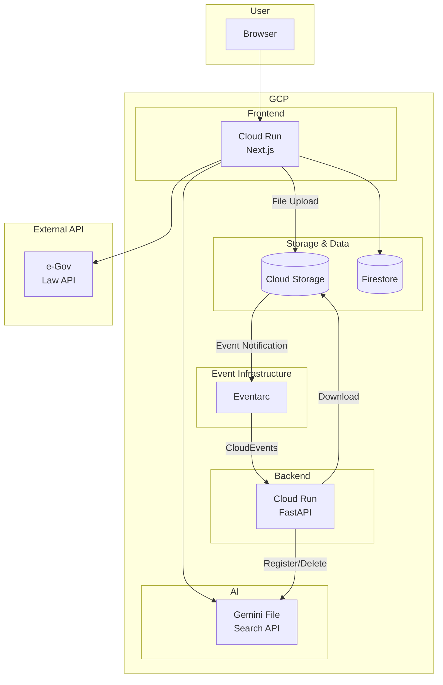

+++
title = 'Designing an Event-Driven Backend to Sync GCS with Gemini File Search API'
description = 'Building a FastAPI backend that automatically syncs Google Cloud Storage files with Gemini File Search API via Eventarc. Covers event-driven architecture design and implementation patterns for extensibility.'
date = 2026-02-15T00:00:00+09:00
lastmod = 2026-02-15T00:00:00+09:00
draft = false
categories = ['Engineering']
tags = ['Python', 'GCP', 'Gemini', 'FastAPI']
+++

## Overview

I participated in the "Law x Digital" Hackathon (3rd edition) hosted by Japan's Digital Agency and developed a cross-source legal document search product called "Lawve." Lawve enables natural language search across e-Gov legal data and user-uploaded documents.

This article focuses on the backend architecture design that I was responsible for. The backend's primary responsibility is to "automatically sync the state of Gemini File Search API whenever files are added to or removed from Google Cloud Storage (GCS)."

## System Architecture

Here is the overall system architecture of Lawve.



### Component Roles

| Component | Role |
|---|---|
| Cloud Run (Next.js) | Frontend: search UI, file upload, search result display |
| Cloud Run (FastAPI) | Backend: syncs Gemini File Search API in response to GCS events |
| Cloud Storage | Document storage, serves as the Single Source of Truth |
| Eventarc | Routes GCS file change events to Cloud Run |
| Gemini File Search API | Provides full-text and semantic search for documents |
| Firestore | Manages document metadata and comments |
| e-Gov Law API | Retrieves legal data |

This article focuses on the backend Cloud Run (FastAPI) design.

## Event-Driven Architecture Design

### Why Event-Driven?

In a legal document search product, documents need to be automatically registered with Gemini File Search API when placed in GCS. While a synchronous API approach from the frontend was an option, I chose an event-driven architecture for the following reasons:

- **Loose coupling**: The frontend only needs to place files in GCS without knowing about the backend
- **Reliability**: Eventarc reliably detects GCS events and delivers them to Cloud Run
- **Tool compatibility**: Files placed via CLI or scripts are synced in the same way

### Event Routing with Eventarc

Eventarc monitors two types of GCS events and routes them to the Cloud Run endpoint.

| Event | Trigger Condition |
|---|---|
| `google.cloud.storage.object.v1.finalized` | When a file is uploaded to GCS |
| `google.cloud.storage.object.v1.deleted` | When a file is deleted from GCS |

The Cloud Run endpoint receives events in CloudEvents format.

```python
@app.post("/")
async def handle_storage_event(request: Request):
    headers = dict(request.headers)
    body = await request.body()
    event = from_http(headers, body)

    result = event_handler.process(event)
    return result
```

### File Upload Processing Flow

When a file is placed in GCS, it is processed through the following flow:

1. **Event reception and path filtering**: Only files with the `file-search/archive/` prefix are processed
2. **Metadata extraction**: Automatically extract `law_id` and `source_type` from the GCS path
3. **Delete existing documents**: Remove documents with the same `source_path` to prevent duplicates
4. **File download**: Download from GCS to a local temporary file
5. **Register with File Search Store**: Upload to Gemini File Search API with metadata

```python
class EventHandler:
    def _handle_event_by_type(self, event_type, bucket_name, file_name):
        if event_type == "google.cloud.storage.object.v1.finalized":
            self._handle_file_upload(bucket_name, file_name)
        elif event_type == "google.cloud.storage.object.v1.deleted":
            self._handle_file_delete(bucket_name, file_name)
```

### File Deletion Processing Flow

When a file is deleted from GCS, the corresponding document is also deleted from Gemini File Search API.

1. **Event reception and path filtering**
2. **Search File Search Store by metadata**: Identify the matching document using the `source_path` metadata
3. **Delete document**: Remove the document from File Search Store

## Integration with Gemini File Search API

### Unified GCP Ecosystem

Lawve adopts a policy of unifying the entire infrastructure on GCP. While other RAG services such as OpenAI and Pinecone were options, I chose Gemini File Search API for its seamless integration with Cloud Run, GCS, and Eventarc.

### File Search Store Overview

Gemini File Search Store is a managed service that vectorizes and indexes registered documents to provide semantic search. The backend performs the following operations:

- **Document registration**: Upload files with metadata
- **Document search**: Search existing documents by metadata
- **Document deletion**: Remove documents that are no longer needed

### Metadata-Based Management

Each document is tagged with three metadata fields for management purposes.

| Metadata | Purpose | Example |
|---|---|---|
| `law_id` | Legal document ID for unique identification | `323AC0000000205` |
| `source_type` | Document classification | `user`, `doc`, `admin` |
| `source_path` | Full GCS path for unique document identification | `gs://bucket/file-search/archive/user/323AC0000000205/medical-law.txt` |

Since `source_path` is the GCS path itself, it uniquely maps GCS files to File Search Store documents.

```python
metadata = {
    "law_id": law_id,
    "source_path": source_path,
    "source_type": source_type
}

custom_metadata = [
    {"key": key, "string_value": value}
    for key, value in metadata.items()
]
```

## Design Patterns for Extensibility

### Path-Based Metadata Extraction

The backend is designed to process any file placed in a specific GCS path, not limited to legal documents. The path convention is as follows:

```
gs://<bucket>/file-search/archive/<source_type>/<law_id>/<file_name>
```

The `source_type` and `law_id` are automatically extracted from the path using a regular expression.

```python
# Path pattern
GCS_PATH_PATTERN = r'file-search/archive/([^/]+)/([^/]+)/.+'

def parse_gcs_path(gcs_path: str) -> Tuple[Optional[str], Optional[str]]:
    match = re.search(GCS_PATH_PATTERN, gcs_path)
    if match:
        return match.group(1), match.group(2)
    return None, None
```

This design allows any type of document, such as internal documents or technical documentation, to be managed through the same mechanism. You can add new classifications simply by changing the `source_type`, and no backend code changes are required as long as the path convention is followed.

### Guaranteeing State Synchronization Between GCS and Gemini File Search API

GCS serves as the Single Source of Truth, and the design principle is to always keep the File Search Store state in sync with GCS.

**Idempotent uploads**: When the same file is re-uploaded, existing documents are deleted before re-registration. This prevents duplicates while supporting content updates.

```python
def process_file_upload(self, bucket_name, file_path):
    source_path = f"gs://{bucket_name}/{file_path}"

    # Check and delete existing documents
    self._delete_existing_documents(source_path)

    # New upload
    law_id = extract_law_id(file_path)
    local_file_path = self.gcs_client.download_to_temp_file(bucket_name, file_path)
    # ...
    success = self.store_client.upload_file(local_file_path, file_path, metadata)
    return success
```

**Cascading deletes**: When a file is deleted from GCS, the corresponding document is automatically removed from the File Search Store. The system searches by `source_path` metadata and deletes the matching document.

```python
def process_file_delete(self, bucket_name, file_path):
    source_path = f"gs://{bucket_name}/{file_path}"

    documents = self.store_client.find_documents_by_source_path(source_path)
    if not documents:
        return False

    return self.store_client.delete_document(documents[0])
```

### Local Download Design

Registration from GCS to Gemini File Search API is done by first downloading to a local temporary file.

```python
def download_to_temp_file(self, bucket_name, file_path):
    _, ext = os.path.splitext(file_path)
    if not ext:
        ext = ".txt"

    temp_fd, temp_path = tempfile.mkstemp(suffix=ext)
    os.close(temp_fd)

    blob.download_to_filename(temp_path)
    return temp_path
```

While direct upload would be simpler, downloading locally first provides the following benefits:

- **Extensibility**: Enables future file transformation steps such as converting Excel to CSV before upload
- **MIME detection**: Preserving the file extension enables accurate MIME type detection
- **Debugging**: Allows inspection of local file contents when issues occur

## Error Handling and Operational Design

### Always Return 200 OK

The Cloud Run endpoint always returns 200 OK to Eventarc requests, even when errors occur.

```python
@app.post("/")
async def handle_storage_event(request: Request):
    try:
        headers = dict(request.headers)
        body = await request.body()
        event = from_http(headers, body)
        result = event_handler.process(event)
        return result
    except Exception as e:
        return {
            "status": "error",
            "message": f"Event processing failed: {str(e)}",
            "note": "Error logged and notified via Slack"
        }
```

This design prevents Eventarc retries. If the endpoint returns 4xx/5xx, Eventarc resends the event, causing the same error to repeat. This results in duplicate Slack notifications and polluted logs. By returning 200 OK and handling errors through Slack notifications and logging, operational issues are avoided.

### Error Monitoring via Slack Notifications

When a File Search Store upload fails, an error notification is sent via Slack Webhook. The notification includes the GCS path and error details, enabling operators to quickly identify the problem.

While this Slack-based monitoring is sufficient for hackathon-scale development, a production environment would require more robust monitoring and recovery mechanisms, such as Cloud Monitoring alerts, Cloud Logging integration, and Dead Letter Queues for reprocessing failed events.

### Lazy Initialization for Client Management

Gemini API clients and GCS clients use lazy initialization.

```python
@property
def client(self) -> Optional[genai.Client]:
    if self._client is None and self.api_key:
        self._client = genai.Client(api_key=self.api_key)
    return self._client
```

This allows the application to start even without API keys configured, making it easier to work in test environments or local development without providing all environment variables.

## Summary

The Lawve backend was built on the following design principles:

- **Loosely coupled automatic sync via event-driven architecture**: Using Eventarc to keep the frontend and backend decoupled while automatically reflecting GCS changes in Gemini File Search API
- **Metadata-driven extensible design**: Automatically extracting metadata from path conventions to support documents beyond legal data
- **GCS as Single Source of Truth**: Idempotent uploads and cascading deletes ensure the GCS and File Search Store states always match

By combining an event-driven architecture with GCP managed services, I was able to build a reliable document synchronization platform with minimal code. The simplicity of making documents searchable just by placing files in GCS was a significant advantage during the time-limited hackathon development.

The source code is available on [GitHub](https://github.com/23-u-don/lawve-backend).

## Related Articles

- [Setting Up a Python Development Environment on Mac with UV](/en/blog/032-python-uv/) (Python environment setup)
- [How to Use the OpenAI Response API](/en/blog/044-openai-response-api/) (using OpenAI API)
