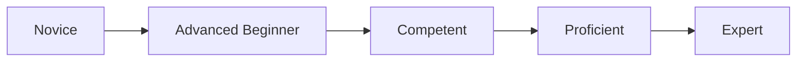
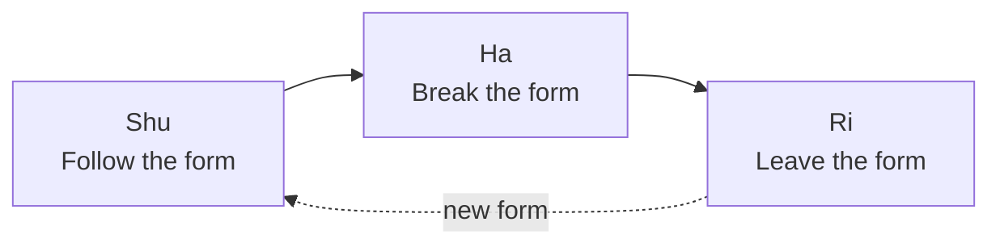
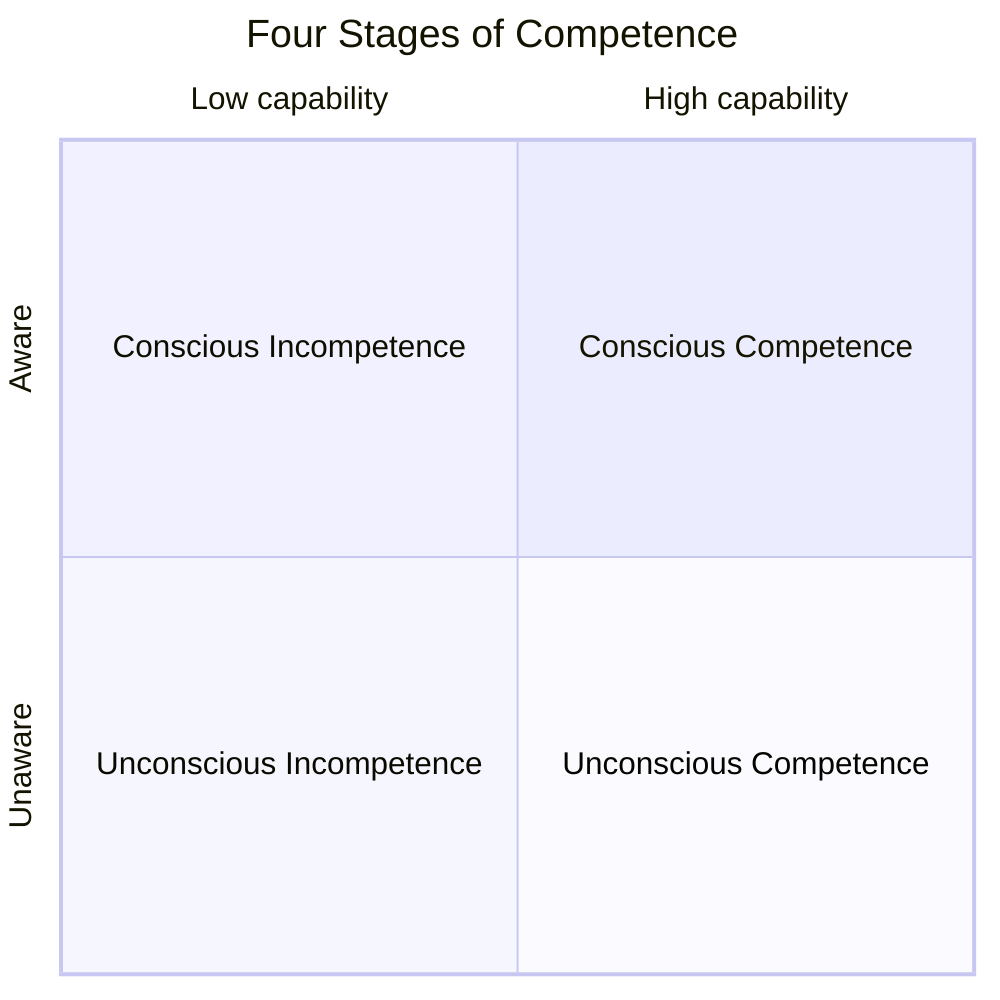

+++
title = 'Three Models of Technical Proficiency: Dreyfus, Shu-Ha-Ri, and the Four Stages of Competence'
description = 'Compare three frameworks for technical proficiency—the Dreyfus model, Shu-Ha-Ri, and the Four Stages of Competence—and explore their characteristics and applications.'
date = 2026-04-19T00:00:00+09:00
draft = false
categories = ["Blog"]
tags = ["Learning", "Mastery", "Dreyfus", "Shu-Ha-Ri"]
+++

## Overview

The process of acquiring a skill is rarely uniform. We start by relying on manuals, then learn to judge based on context, and eventually reach a stage where the right action comes without conscious thought. To capture these gradual changes, many models have been proposed over the decades.

This article introduces three representative frameworks for technical proficiency—the **Dreyfus model**, **Shu-Ha-Ri**, and the **Four Stages of Competence**—and compares their origins, stages, and characteristics. The goal is to offer a toolkit for understanding where we are, designing our next step, and supporting the learning of others.

## Why Understand the Stages of Proficiency

Thinking of proficiency as a set of stages provides three main benefits.

First, **self-awareness**. Knowing which stage you are in clarifies what to work on next. The skills that matter for a beginner (executing procedures correctly) differ greatly from those that matter for a mid-level practitioner (judgment in context). Awareness of stages prevents misdirected effort.

Second, **learning design**. Rather than chasing a vague final goal, stage-based milestones make progress easier to sustain and measure. Many models also suggest that the optimal way to learn changes from stage to stage.

Third, **understanding others**. In mentoring or team leadership, estimating someone's current stage helps you choose the right support and level of challenge.

That said, models are not reality. Real learning is continuous and often uneven across domains. The frameworks below are best used as guideposts for thinking, not as rigid categorizations.

## The Dreyfus Model

### Origin and Background

The Dreyfus model was proposed in 1980 by brothers Stuart E. Dreyfus and Hubert L. Dreyfus at UC Berkeley, in a report titled "A Five-Stage Model of the Mental Activities Involved in Directed Skill Acquisition." Commissioned by the U.S. Air Force Office of Scientific Research, the report drew on pilot training, chess players, drivers, and other skilled practitioners.

Stuart specialized in operations research while Hubert specialized in philosophy (phenomenology). Together they formalized a key insight: the judgments of experts often cannot be reduced to explicit rules.

The model later became popular in software engineering thanks to books such as Andy Hunt's *Pragmatic Thinking and Learning*, and has become a shared vocabulary for discussing engineer growth.

### Five Stages

The Dreyfus model describes the journey from novice to expert in five stages.

**1. Novice**
Detaches from context and follows given rules. Following the rules is itself challenging, leaving little room to see exceptions or the bigger picture. Think of measuring ingredients from a recipe, or operating the pedals and wheel by the manual when learning to drive.

**2. Advanced Beginner**
Begins to notice contextual features through experience, but cannot yet distinguish important features from minor ones, and treats them with equal weight. This is the stage where learners ask many questions and encounter situations their rules don't cover.

**3. Competent**
Selects important information from a pool of signals and can set goals and plans on their own. Rules have become internalized. At the same time, learners begin to sense that "there is no single right answer," and may feel the weight of decision-making.

**4. Proficient**
Grasps situations holistically. Pattern recognition from past similar cases comes first; detailed rule-based reasoning fills in afterward. This is a hybrid stage where intuition and analysis work together.

**5. Expert**
Arrives at answers intuitively, embedded in the situation itself, without explicit rule-following. A seasoned doctor estimates a diagnosis at a glance; a master player narrows candidate moves before deliberate analysis. However, when the environment is unusual, even experts fall back on deliberate analysis.

### Cognitive Shifts Between Stages

The key insight of this model is that as stages progress, the center of cognition shifts from **analysis** to **pattern recognition** to **intuition**. This is not merely a speed-up but a qualitative change in what the practitioner perceives.

Moving up requires more than rule-following—it requires experience in interpreting rules in context. The Dreyfus brothers repeatedly note that mastery is tacit knowledge that textbooks alone cannot teach.

## Shu-Ha-Ri

### Origin and Background

Shu-Ha-Ri (守破離) is a Japanese model of training stages that emerged from traditional arts such as martial arts, tea ceremony, and flower arrangement. It appears explicitly in *Fuhaku Hikki*, a text by the Edo-period tea master Kawakami Fuhaku (1719-1807). Its roots trace back further, to Zeami's (1363-1443) *Fūshikaden* and its idea of *Jo-Ha-Kyū*, and to the teachings of Sen no Rikyū.

A poem often attributed to Rikyū reads, "Keep the forms of rules and manners until you break them, and even when you leave them, do not forget the origin." This line neatly captures the spirit of Shu-Ha-Ri: preserve the form, then break it, then transcend it—without losing its root.

In recent years, Shu-Ha-Ri has been applied to Western practices such as agile development, Scrum adoption, and design pattern learning, becoming a shared vocabulary among Japanese-speaking software professionals.

### Three Stages

Shu-Ha-Ri is a three-stage model built on a master-apprentice relationship.

**Shu (守)**
Practice the forms taught by the master faithfully, without adding personal interpretation. The goal is to imprint the form onto body and mind. The "why" often comes later; what matters first is precise repetition.

**Ha (破)**
Building on the forms absorbed in Shu, the learner incorporates forms from other schools and personal adaptations, breaking the form. This is not mere rebellion but thoughtful comparison and testing. Here, the learner finally feels the reason behind the form.

**Ri (離)**
Leave the form and reach an independent mode of being. This is not discarding the form—by now, the form has become part of the self. Externally, the practitioner appears free and unconstrained. The phrase "do not forget the origin" warns that even at Ri, the root remains in Shu.

### Differences from Western Models

Where the Dreyfus model describes changes in an individual's cognition, Shu-Ha-Ri presumes that **forms are passed within a community**. The form encodes the history of the school and the wisdom of predecessors; inheriting it accurately is the purpose of Shu.

Shu-Ha-Ri also describes how the learner's **agency** changes. Reception dominates in Shu, dialogue and testing in Ha, creation in Ri. The model implies a maturation of the whole person, not only a skill upgrade.

### Modern Applications

- **Learning design patterns**: Apply patterns literally (Shu), adapt them to project context (Ha), and eventually design from first principles without needing patterns (Ri).
- **Scrum adoption**: Start by following the Scrum Guide strictly, then adapt events and roles once the team has matured.
- **Onboarding in general**: As a guide for how a mentor's stance should shift from prescribing procedures to reviewing decisions to co-creating systems.

## The Four Stages of Competence

### Origin and Background

The "Four Stages of Competence" (also known as the Conscious Competence Ladder) is commonly attributed to Noel Burch of Gordon Training International in the 1970s. However, similar ideas are sometimes attributed to Abraham Maslow or Thomas Gordon, so the origin is not entirely settled.

The distinctive feature of this model is that it combines two axes: whether a learner **has a capability**, and whether they are **aware of having or lacking it**. By focusing on awareness as much as ability, the model is particularly good at describing the learner's psychological state.

### Four Stages

The four stages can be organized as a 2x2 matrix.

**1. Unconscious Incompetence**
The learner is not aware of what they cannot do, and thus sees no need to learn. Escape from this stage usually requires external feedback or a vivid encounter with one's own limits.

**2. Conscious Incompetence**
The learner recognizes their inability. This is psychologically the hardest stage, where self-doubt can derail learning. It helps to have an environment that offers small wins and a relationship that makes failure safe.

**3. Conscious Competence**
The learner can perform, but only with deliberate effort and attention. Execution is slow and tiring, yet consistently produces results. Repetition here builds the foundation for the next stage.

**4. Unconscious Competence**
The learner performs naturally, without conscious thought. Attention is freed for other things. A new challenge emerges: because the skill is tacit, it becomes hard to explain "why" to others.

### Psychological Significance and a Fifth Stage

Unlike other models, this one explicitly names the **valley of Conscious Incompetence**. Learning starts with confronting one's incompetence; how well we support learners at this stage largely determines whether they continue.

Some variants add a fifth stage: **Conscious Competence of Unconscious Competence**, sometimes called "reflective competence." This is the state of being able to re-examine one's tacit skill and articulate it for others—a state mentors and teachers aspire to.

## Comparing the Three Frameworks

At first glance the three models look similar, but they focus on different aspects.

| Dimension | Dreyfus Model | Shu-Ha-Ri | Four Stages of Competence |
|-----------|---------------|-----------|---------------------------|
| Number of stages | 5 | 3 | 4 (5 in variants) |
| Focus | Quality of judgment and action | Relationship to form | Combination of ability and awareness |
| Cultural background | Western / phenomenology | Japanese / traditional arts | Western / education psychology |
| Period of formulation | 1980 | Edo period (with older roots) | 1970s |
| Implied learner | An individual cognition changing | A member inheriting form within a community | A self moving between conscious and unconscious |
| Top-stage ideal | Intuitive judgment | Free action beyond form | Automatic, effortless execution |

### Commonalities

Beneath the surface, the models share structural features.

- A direction from **external dependence to autonomy**. Rules, forms, or conscious effort are the starting point; they become internalized over time.
- The top stage is described as **mastery that resists easy verbalization**. Dreyfus's Expert, Shu-Ha-Ri's Ri, and the Four Stages' Unconscious Competence all point to territory beyond explicit instruction.
- Progression is **not linear**. Earlier skills remain as foundations rather than being discarded.

### Differences

The points of focus clearly diverge.

- The **Dreyfus model** focuses on the quality of judgment, tracing the cognitive shift from rule-application to intuitive pattern recognition.
- **Shu-Ha-Ri** focuses on relationship with form and the community that transmits it.
- The **Four Stages of Competence** focuses on states of awareness, especially the pivot of realizing one's own incompetence.

### Which to Use When

- To analyze patterns of behavior and judgment → the **Dreyfus model**
- To describe a learning environment with a master, mentor, or shared form → **Shu-Ha-Ri**
- To support learners psychologically, especially near the valley of doubt → the **Four Stages of Competence**

They complement each other, and it is often useful to view a single learner through multiple lenses.

## Applications: Learning and Product Design

These frameworks are useful not only as knowledge but as tools. Three common applications:

### 1. Designing Your Own Learning

Assess your current stage through multiple models. If you look solid as a Competent on Dreyfus but are still at Conscious Competence on the awareness axis, you have discovered a concrete next step. Noticing that you lack "experience breaking the form" can motivate you to seek exposure to other schools (other teams, tools, or languages).

### 2. Mentoring and Supporting Others

Different stages call for different involvement.

- For novices and the unconsciously incompetent: provide explicit rules and a safe environment for repetition.
- For the consciously incompetent: stack small wins and affirm that failure is part of the process.
- For Competent learners / those at Ha: hand over decision-making responsibility and support through decision reviews.
- For Proficient, Expert, or Ri learners: create opportunities to articulate their tacit knowledge for others.

Misjudging the stage turns help into imposition or detachment. Being stage-aware improves the precision of involvement.

### 3. Product and App Design

These models also inform how we design for users with varying levels of expertise.

- **Onboarding**: Provide explicit guides, step-by-step flows, and constraints for beginners (the Shu stage).
- **Mode switching**: Offer shortcuts and advanced modes for experienced users, and reduce boilerplate hints (Ha and Ri).
- **Supporting Conscious Incompetence**: Users who "don't know what they don't know" benefit from diagnostics and tutorials that point to what needs learning.
- **Feedback that promotes stage transitions**: Rather than just returning errors, show hints for the learner's next step.

Viewing a product through these lenses tends to clarify feature priorities and information architecture.

## Summary

Among the many frameworks describing technical proficiency, the Dreyfus model, Shu-Ha-Ri, and the Four Stages of Competence offer complementary lenses.

- The Dreyfus model captures **changes in the quality of judgment**.
- Shu-Ha-Ri captures **changes in the relationship with form**.
- The Four Stages of Competence captures **the interplay of awareness and ability**.

Models are maps, not the territory. Real learners change continuously, and their stages can vary across domains. Still, a map helps us estimate where we are and choose the next step. Use these frameworks as situation-appropriate tools—for your own learning, your relationships with others, and the products you build.

### References

- Stuart E. Dreyfus, Hubert L. Dreyfus, "A Five-Stage Model of the Mental Activities Involved in Directed Skill Acquisition" (1980, U.S. Air Force Office of Scientific Research)
- Andy Hunt, *Pragmatic Thinking and Learning: Refactor Your Wetware* (2008, Pragmatic Bookshelf)
- Kawakami Fuhaku, *Fuhaku Hikki*
- Zeami, *Fūshikaden*
- Noel Burch, "The Four Stages for Learning Any New Skill" (1970s, Gordon Training International)
